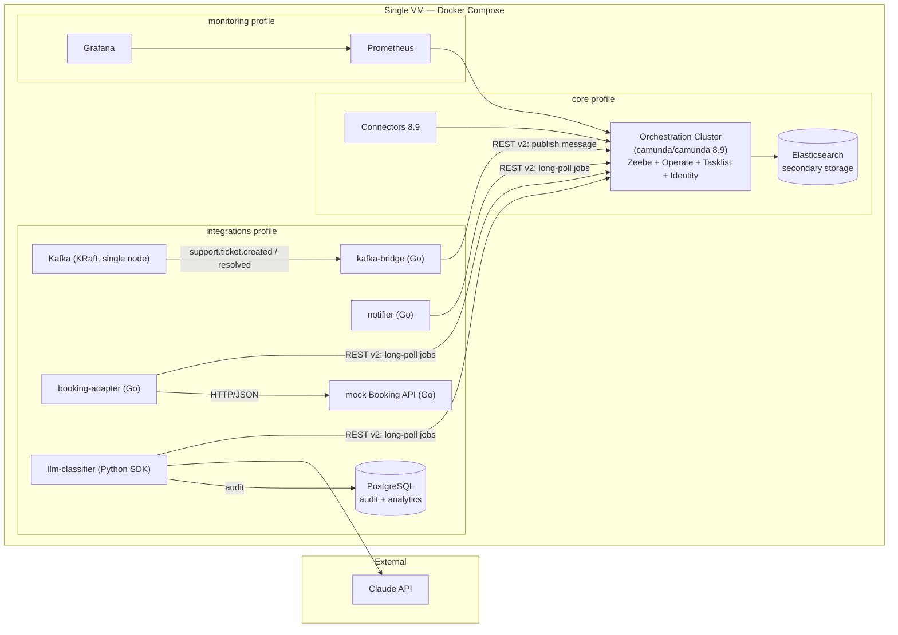

# Camunda Support Automation

Status: in progress — see the phase table.

A customer support automation stand on **Camunda 8.9 Self-Managed**: a BPMN ticket process with
DMN/FEEL routing, an LLM classifier with guardrails (Claude API, JSON Schema validation, keyword
fallback), REST and Kafka integrations, and an operations layer — install, monitoring, backup,
instance migration and a rehearsed minor upgrade. The stand comes up from this repository on a single Docker Compose VM on a single
Docker Compose VM. Architecture decisions live in [`docs/adr/`](docs/adr/).

## Architecture



All clients use the **Orchestration Cluster REST API (v2)** with Basic auth; the gRPC port is not
published. Go workers share a thin REST client in `workers/internal/camunda`.

## Repository layout

```
infra/              Docker Compose, config, disposable upgrade-lab stack
processes/          BPMN models
decisions/          DMN models
forms/              Camunda Forms
connectors/         Connector templates and configuration
workers/            Job workers (Go) + llm-classifier (Python) + shared REST client
services/           Mock Booking API
prompts/            Versioned classifier prompts with labelled test set
tests/              DMN and classification test cases
docs/               Design, ops guides, runbooks, analytics, ADRs
```

## Phases

| # | Phase | Status |
|---|-------|--------|
| 0 | Scope & repo | in progress |
| 1 | Platform | planned |
| 2 | Process v1 happy path | planned |
| 3 | DMN + FEEL | planned |
| 4 | Integrations | planned |
| 5 | LLM classifier with guardrails | planned |
| 6 | Operations | planned |
| 7 | Docs & analytics | planned |
| 8 | Publication | planned |

## Daily status

One line per day: date — phase — done / broken / next.

- 2026-09-21 — Phase 0 — repo scaffolded, ADRs 001–005 accepted / — / start Phase 1 platform setup

## License note

The stand runs **without a Camunda license key**, i.e. as non-production use — the components show
a "Non-Production License" banner, with no functional limits. This project demonstrates
production-grade practices (pinned versions, protected API, backups, monitoring, upgrade
procedure) on a single-node deployment; it is not a production deployment.
