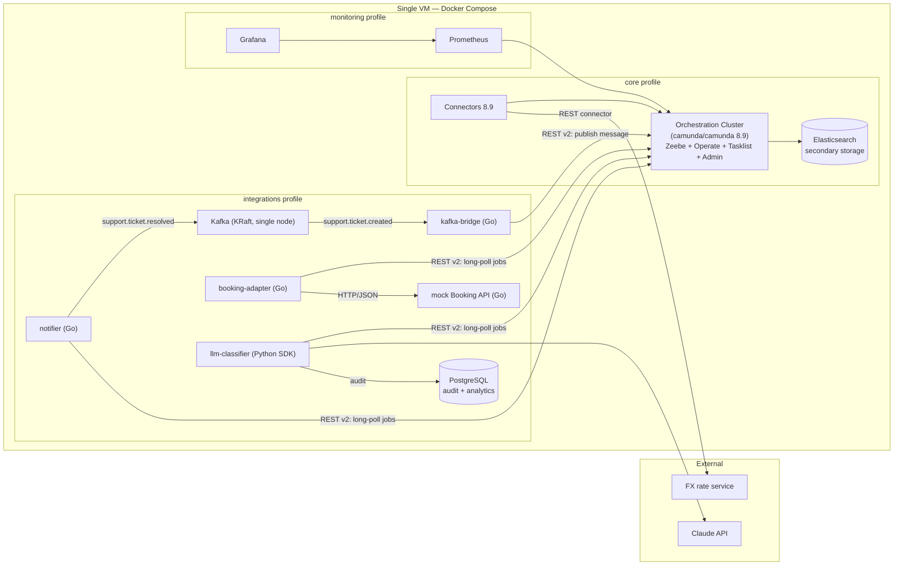

# Camunda Support Automation

Status: Phase 3 done — routing moved from the stub worker into DMN, see below.

Phase 2 — process `support-request-v1` at version 3 (v1 happy path; v2 misrouted
at a single gateway; v3 with a separate needs-review gateway, see
[docs/design/process-v1.md](docs/design/process-v1.md), D2-7), two linked Camunda forms, Python
stub worker, e2e script — 5/5 tickets pass in unattended and manual modes. Screenshots in
[docs/assets/phase-2/](docs/assets/phase-2/): `modeler-support-request-v3.png`,
`operate-process-v1.png`, `operate-process-v3.png`, `operate-t0001-happy-path.png`,
`operate-t0004-waiting-review.png`, `operate-t0004-review-loop.png`,
`operate-t0004-v2-wrong-branch.png`, `tasklist-open-tasks.png`,
`tasklist-review-classification-form.png`, and from the manual run
`tasklist-handle-by-agent-form.png` and `operate-completed-instances.png` (the
handle-by-agent form in Tasklist and the completed instances list in Operate).

Phase 3 — routing lives in DMN: DRD `routing-v1` of four decisions (three decision tables plus
a literal expression), `route-ticket` is a business rule task since process version 4, and the
stub worker no longer contains routing rules (see
[docs/design/routing-v1.md](docs/design/routing-v1.md)). Ticket T-1006 demonstrates a rule the
code never had — `sentiment = "negative"` alone raises priority to `high`. Tests: DMN matrix
17/17 (`tests/dmn/`), e2e 6/6 in both modes (`tests/e2e/`). Two observations worth knowing:
the DMN result variable `routing` exists only at the `route-ticket` task scope — the process
sees just the fields copied out by output mappings; and `tests/dmn/evaluate.sh` calls show up
in Operate → Decisions as standalone evaluations with Process Instance Key = -1. Screenshots
in [docs/assets/phase-3/](docs/assets/phase-3/), e.g. `modeler-drd.png`,
`operate-decision-evaluation.png`, `operate-instance-v4.png`.

A customer support automation stand on **Camunda 8.9 Self-Managed**: a BPMN ticket process with
DMN/FEEL routing, an LLM classifier with guardrails (Claude API, JSON Schema validation, keyword
fallback), REST and Kafka integrations, and an operations layer — install, monitoring, backup,
instance migration and a rehearsed minor upgrade. The stand comes up from this repository on a single Docker Compose VM. Architecture decisions live in [`docs/adr/`](docs/adr/).

## Architecture



All clients use the **Orchestration Cluster REST API (v2)** with Basic auth; the gRPC port is not
published. Go workers share a thin REST client in `workers/internal/camunda`.

## Repository layout

```
infra/              Docker Compose, config, disposable upgrade-lab stack
processes/          BPMN models
decisions/          DMN models
forms/              Camunda Forms
connectors/         Connector templates and configuration
workers/            Job workers (Go) + llm-classifier (Python) + shared REST client
services/           Mock Booking API
prompts/            Versioned classifier prompts with labelled test set
tests/              DMN and classification test cases
docs/               Design, ops guides, runbooks, analytics, ADRs
```

## Phases

| # | Phase | Status |
|---|-------|--------|
| 0 | Scope & repo | done |
| 1 | Platform | done |
| 2 | Process v1 happy path | done |
| 3 | DMN + FEEL | done |
| 4 | Integrations | planned |
| 5 | LLM classifier with guardrails | planned |
| 6 | Operations | planned |
| 7 | Docs & analytics | planned |
| 8 | Publication | planned |

## Daily status

One line per day: date — phase — done / broken / next.

- 2026-09-21 — Phase 0 done, Phase 1 nearly done — VM + Docker; core stack (Camunda 8.9.21 / Connectors 8.9.12 / ES 8.19.11) up in under a minute; protected API with Basic auth and authorizations; smoke test via REST + Tasklist + Operate; install guide / ES yellow on single node (replicas 0); sysctl override lowered the Debian 13 default (removed); VM time zone (UTC); config edited but not synced before restart (make deploy) / install-from-scratch run against docs/ops/install.md, then Phase 2
- 2026-09-22 — Phase 1 done — install-from-scratch run against docs/ops/install.md passed in <N> min; one doc gap (ssh config block was not a command) fixed / stand broke overnight before the run was finished (restarted from the clean snapshot) / Phase 2: process v1 happy path

## License note

The stand runs **without a Camunda license key**, i.e. as non-production use — the components show
"Non-production license" and "Non-commercial license" badges, with no functional limits. Applying for Camunda's
**non-commercial license** is planned after publication (see `docs/backlog.md`); until then the
banner stays visible in screenshots. This project demonstrates production-grade practices
(pinned versions, protected API, backups, monitoring, upgrade procedure) on a single-node
deployment; it is not a production deployment.


To bring the stand up from an empty VM, follow [`docs/ops/install.md`](docs/ops/install.md).