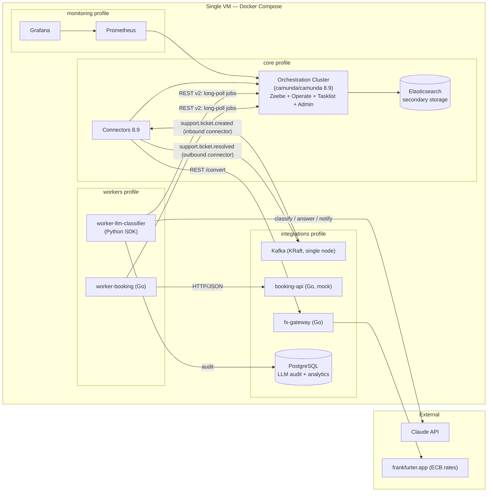

# Camunda Support Automation

Non-production Camunda license · single node · phases 0–6.5 done · 6.6 acceptance and phase 7 pending

A customer support automation stand on **Camunda 8.9 Self-Managed**, built from an empty VM
into a monitored, backed-up, upgradeable single-node deployment. A ticket arrives over Kafka,
an LLM classifier with guardrails reads it, DMN routes it, workers call a booking API and an FX
gateway, an LLM drafts the answer, and the result goes back to Kafka. It proves the whole loop:
process and decision modelling, an LLM step that fails safely, REST and Kafka integrations, and
day-two operations (incidents, migration, backup, upgrade, monitoring, least privilege), each
rehearsed on the running stand and written down with what was observed. Decisions: [`docs/adr/`](docs/adr/).

Stack: Camunda 8.9.21 Self-Managed, Docker Compose, Kafka 4.3.1, Python/Go workers, Claude API, Prometheus/Grafana.

## Requirement → Evidence

| Requirement | Evidence | Screenshot |
|---|---|---|
| BPMN processes and DMN decision tables in Camunda 8 | [`processes/`](processes/), [`decisions/`](decisions/), [DMN test matrix](tests/dmn/README.md) (18 cases) | [DRD in Modeler](docs/assets/phase-3/modeler-drd.png), [process v3 in Modeler](docs/assets/phase-2/modeler-support-request-v3.png) |
| Customer support automation, greenfield + ongoing improvements | process changelog v1→v10 in [process design](docs/design/process-v1.md) (§10–11), [migration runbook](docs/runbooks/migration.md) | [v10 model](docs/assets/phase-6/d-00-v10-model.png), [versions in Operate](docs/assets/phase-4/operate-process-versions.png) |
| LLM classifier with configurable prompts | [`workers/llm-classifier/`](workers/llm-classifier/), [`prompts/`](prompts/), [accuracy report](tests/classification/report-latest.md) | [review form in Tasklist](docs/assets/phase-5/tasklist-review-form-v2.png) |
| Call flow schemes | planned, phase 7 | — |
| Support and debug in Operate, quick fixes in production | [incident-handling runbook](docs/runbooks/incident-handling.md), [timeout runbook](docs/runbooks/timeout.md) | [failing element in Operate](docs/assets/phase-6/a1-02-diagram-incident.png), [batch Retry](docs/assets/phase-6/a2-03-batch-retry.png) |
| REST / JSON / Kafka integrations | Kafka and REST connectors in [`infra/docker-compose.yml`](infra/docker-compose.yml) and the model, [`workers/booking/`](workers/booking/), [`services/fx-gateway/`](services/fx-gateway/), [integrations design](docs/design/integrations-v1.md) | [Kafka start event](docs/assets/phase-4/modeler-kafka-start-event.png), [REST convert-refund](docs/assets/phase-4/modeler-rest-convert-refund.png) |
| Operations on production-like systems | [install](docs/ops/install.md), [backup and restore](docs/runbooks/backup-restore.md), [upgrade](docs/ops/upgrade.md), [password rotation](docs/runbooks/password-rotation.md), [monitoring profile](docs/design/operations-v1.md#2-monitoring-65) | [Grafana dashboard](docs/assets/phase-6/g-01-grafana-dashboard.png), [incident alert firing](docs/assets/phase-6/g-02-grafana-alert-firing.png) |
| BPMN 2.0 / DMN / FEEL depth | planned, phase 7 | — |
| AI/LLM guardrails | [LLM guardrails overview](docs/design/llm-guardrails.md), [classifier design](docs/design/llm-classifier-v1.md) | [review loop in Operate](docs/assets/phase-5/operate-v7-review-loop.png) |
| SQL for process analysis | planned, phase 7 | — |

## Findings worth reading

- **A profile that is only in `.env.example` is not deployed.** The monitoring profile was built in 6.1 and never reached the VM until 6.5; a key check now guards install, restore and upgrade — [lessons learned](docs/lessons-learned.md).
- **The incident gauge is `zeebe_pending_incidents`, not `_total`.** The design assumed the suffix; a live scrape corrected it before the alert went in — [operations design §2](docs/design/operations-v1.md#2-monitoring-65).
- **A search answering 200 proves credentials, not permissions.** Least privilege for the `worker` user is proven by job activation and `--probe-sla`, not by a search — [install, Workers](docs/ops/install.md#workers).
- **The search API lags the engine.** The e2e completed a user task twice on a stale search result and died on the 404; only the write's answer is authoritative — [lessons learned](docs/lessons-learned.md).
- **Identity indices are in no snapshot of the backup set.** Users and authorizations come back with the engine state, their secondary-storage indices do not; verify `worker` after any restore — [backup and restore §6](docs/runbooks/backup-restore.md#6-limits).

## Architecture


```mermaid
flowchart LR
    subgraph external["External"]
        claude["Claude API"]
        ecb["frankfurter.app (ECB rates)"]
    end

    subgraph vm["Single VM — Docker Compose"]
        subgraph core["core profile"]
            camunda["Orchestration Cluster<br/>(camunda/camunda 8.9)<br/>Zeebe + Operate + Tasklist + Admin"]
            connectors["Connectors 8.9"]
            es[("Elasticsearch<br/>secondary storage")]
        end
        subgraph integrations["integrations profile"]
            kafka["Kafka (KRaft, single node)"]
            bookingapi["booking-api (Go, mock)"]
            fxgw["fx-gateway (Go)"]
            pg[("PostgreSQL<br/>LLM audit + analytics")]
        end
        subgraph workers["workers profile"]
            wbooking["worker-booking (Go)"]
            wclassifier["worker-llm-classifier<br/>(Python SDK)"]
        end
        subgraph monitoring["monitoring profile"]
            prom["Prometheus"]
            graf["Grafana"]
        end
    end

    kafka -- "support.ticket.created (inbound connector)" --> connectors
    connectors -- "support.ticket.resolved (outbound connector)" --> kafka
    connectors -- "REST /convert" --> fxgw
    fxgw --> ecb
    wbooking -- "REST v2: long-poll jobs" --> camunda
    wbooking -- "HTTP/JSON" --> bookingapi
    wclassifier -- "REST v2: long-poll jobs" --> camunda
    wclassifier -- "classify / answer / notify" --> claude
    wclassifier -- "audit" --> pg
    camunda --> es
    connectors --> camunda
    prom --> camunda
    graf --> prom
```

All clients use the **Orchestration Cluster REST API (v2)** with Basic auth; the gRPC port is not
published. The Go booking worker carries its own thin REST client (`workers/booking/camunda.go`).

## Repository layout

```
infra/              Docker Compose, config, disposable upgrade-lab stack
processes/          BPMN models
decisions/          DMN models
forms/              Camunda Forms
workers/            Job workers: booking (Go), llm-classifier (Python)
services/           Mock Booking API + FX gateway (Go)
prompts/            Versioned classifier prompts with labelled test set
tests/              DMN and classification test cases
docs/               Design, ops guides, runbooks, analytics, ADRs
```

## Phases

| # | Phase | Status |
|---|-------|--------|
| 0 | Scope & repo | done |
| 1 | Platform | done |
| 2 | Process v1 happy path | done |
| 3 | DMN + FEEL | done |
| 4 | Integrations | done |
| 5 | LLM classifier with guardrails | done ([acceptance](docs/backlog.md#phase-5-acceptance-against-the-plan)) |
| 6 | Operations | in progress — 6.1–6.5 done 2026-09-28; 6.6 acceptance left ([design and plan](docs/design/operations-v1.md)) |
| 7 | Docs & analytics | planned |
| 8 | Publication | planned |

## Phase notes

Phase 5 — LLM classifier with guardrails (Claude Haiku classify, Sonnet
answer/notify, two-layer schema validation, number grounding, keyword/template fallback,
review loop with recorded corrections, PostgreSQL audit); process v8, DMN v3, e2e 8/8 over
Kafka incl. the Russian refund ticket, negative probe raises an incident (run 20260925T142455Z).
Acceptance against the plan: [docs/backlog.md](docs/backlog.md#phase-5-acceptance-against-the-plan).
Phase 6 — 6.1–6.5 done 2026-09-28: incident scenarios, instance migration, SLA
escalation, backup/restore rehearsed in three round-trips, patch upgrade rehearsed on the lab,
monitoring profile deployed with the incident alert, workers on a scoped `worker` user,
password rotation rehearsed.

Phase 2 — process `support-request-v1` at version 3 (v1 happy path; v2 misrouted
at a single gateway; v3 with a separate needs-review gateway, see
[docs/design/process-v1.md](docs/design/process-v1.md), D2-7), two linked Camunda forms, Python
stub worker, e2e script — 5/5 tickets passed in unattended and manual modes (Phase 2
acceptance; 7 tickets since Phase 4). Screenshots in
[docs/assets/phase-2/](docs/assets/phase-2/): `modeler-support-request-v3.png`,
`operate-process-v1.png`, `operate-process-v3.png`, `operate-t0001-happy-path.png`,
`operate-t0004-waiting-review.png`, `operate-t0004-review-loop.png`,
`operate-t0004-v2-wrong-branch.png`, `tasklist-open-tasks.png`,
`tasklist-review-classification-form.png`, and from the manual run
`tasklist-handle-by-agent-form.png` and `operate-completed-instances.png` (the
handle-by-agent form in Tasklist and the completed instances list in Operate).

Phase 3 — routing lives in DMN: DRD `routing-v1` of four decisions (three decision tables plus
a literal expression), `route-ticket` is a business rule task since process version 4, and the
stub worker no longer contains routing rules (see
[docs/design/routing-v1.md](docs/design/routing-v1.md)). Ticket T-1006 demonstrates a rule the
code never had — `sentiment = "negative"` alone raises priority to `high`. Tests: DMN matrix
17/17, e2e 6/6 in both modes at the Phase 3 acceptance (18 cases / 7 tickets since
Phase 4 — `tests/dmn/`, `tests/e2e/`). Two observations worth knowing:
the DMN result variable `routing` exists only at the `route-ticket` task scope — the process
sees just the fields copied out by output mappings; and `tests/dmn/evaluate.sh` calls show up
in Operate → Decisions as standalone evaluations with Process Instance Key = -1. Screenshots
in [docs/assets/phase-3/](docs/assets/phase-3/), e.g. `modeler-drd.png`,
`operate-decision-evaluation.png`, `operate-instance-v4.png`.

## Daily status

One line per day: date — phase — done / broken / next.

- 2026-09-21 — Phase 0 done, Phase 1 nearly done — VM + Docker; core stack (Camunda 8.9.21 / Connectors 8.9.12 / ES 8.19.11) up in under a minute; protected API with Basic auth and authorizations; smoke test via REST + Tasklist + Operate; install guide / ES yellow on single node (replicas 0); sysctl override lowered the Debian 13 default (removed); VM time zone (UTC); config edited but not synced before restart (make deploy) / install-from-scratch run against docs/ops/install.md, then Phase 2
- 2026-09-22 — Phase 1 done — install-from-scratch run against docs/ops/install.md passed in <N> min; one doc gap (ssh config block was not a command) fixed / stand broke overnight before the run was finished (restarted from the clean snapshot) / Phase 2: process v1 happy path
- 2026-09-24 — Phase 4 done — Kafka in/out via Connectors (messageId dedup, TTL PT1H), FX conversions via REST connectors, Go booking worker, workers as containers; process v6, DMN v3; e2e 7/7 over Kafka incl. dedup probe / v5 shipped without output mappings on branch tasks — convert-refund incident, fixed in v6 (D4-6) / Phase 5: LLM classifier
- 2026-09-25 — Phase 5 done — Haiku classify with guardrails (35/35 on the 40-ticket set, threshold 0.8), review loop re-routes and records corrections (v7), Sonnet answer/notify grounded in the KB with number grounding (v8), audit in PostgreSQL; e2e 7/7 → 8/8 with the Russian refund ticket / D4-6 hit twice more (user task v7, answer task v8) — rule of thumb in process-v1.md §11; first 5.5 run: T-1008 looped silently on cancel-refund — the Go worker threw BPMN errors to `/jobs/{key}/errors` (404, path is singular) and swallowed the failure; fixed, a failed lifecycle call now raises an incident (install.md) / Phase 6: operations (incidents, migration, backup, upgrade, monitoring) — scenario B input ready (`--probe-unknown-booking`)
- 2026-09-27 — Phase 6.4 done — backup/restore to local disk (`backup.sh`, `restore.sh`, `verify-state.sh`), three round-trips on the stand; patch upgrade 8.9.19 → 8.9.21 rehearsed on the lab with three waiting instances resumable / first restore lost `startDate` on eight instances finished shortly before the backup (snapshot intact, loss after `bin/restore`) — exporter-sync wait added before the soft-pause, not reproduced in the two following round-trips, cause stays a hypothesis (runbook §6); a wrong owner on the Zeebe backup path left partition 1 leaderless behind a `healthy` container; first restore stopped on the snapshot repository lost with the volume (script fixed) / 6.5 monitoring profile, worker user, password rotation
- 2026-09-28 — Phase 6.5 done — monitoring profile deployed (Prometheus + Grafana, `CamundaIncidentsPending` seen Firing and Normal, g-01/g-02), `worker` user with three scoped permissions created on the running stand, both workers off `admin`, negative proof 403, e2e 8/8 and `--probe-sla` as `worker`, rotation rehearsed with a 13 s workers-down window / the `monitoring` profile had sat in `.env.example` since 6.1 without ever reaching the VM's `.env` (key check added to install, restore and upgrade); the incident gauge is `zeebe_pending_incidents`, not `_total`; the e2e completed a user task twice on a lagging search and died on the 404 (fixed) / 6.6 acceptance against §8, screenshots, traceability

## Run the e2e

```bash
brew install kcat                      # producer for the Kafka entry (once)
export CAMUNDA_BASE_URL=http://<stand>:8080
export CAMUNDA_USER=admin
export CAMUNDA_PASSWORD=...            # from infra/.env on the stand
export STAND_IP=<stand address>        # Kafka EXTERNAL listener, port 9092

tests/e2e/send-tickets.sh              # 8 tickets + dedup probe, verify via REST
tests/e2e/send-tickets.sh --check      # re-verify + consume support.ticket.resolved
make check-public                      # exit 0 = clean; pattern from PUBLIC_CHECK_PATTERN (owner's shell)
```

Details and the manual (Tasklist) mode: `tests/e2e/README.md`.

## Docs

- Design: [process](docs/design/process-v1.md), [routing (DMN)](docs/design/routing-v1.md),
  [integrations](docs/design/integrations-v1.md), [LLM classifier](docs/design/llm-classifier-v1.md),
  [LLM guardrails overview](docs/design/llm-guardrails.md), [domain model](docs/design/domain-model.md)
- Operations: [install](docs/ops/install.md), [Phase 6 design](docs/design/operations-v1.md); decisions: [ADRs](docs/adr/)
- [Traceability](docs/traceability.md) (capability → evidence), [backlog and phase status](docs/backlog.md)

## License note

The stand runs **without a Camunda license key**, i.e. as non-production use — the components show
"Non-production license" and "Non-commercial license" badges, with no functional limits. Applying for Camunda's
**non-commercial license** is planned after publication (see `docs/backlog.md`); until then the
banner stays visible in screenshots. This project demonstrates production-grade practices
(pinned versions, protected API, backups, monitoring, upgrade procedure) on a single-node
deployment; it is not a production deployment.


To bring the stand up from an empty VM, follow [`docs/ops/install.md`](docs/ops/install.md).