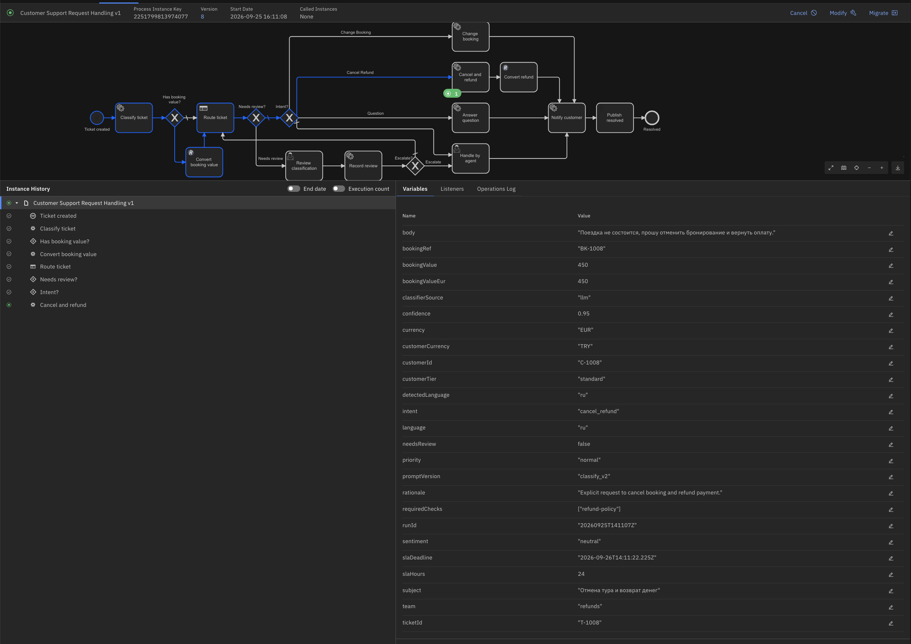
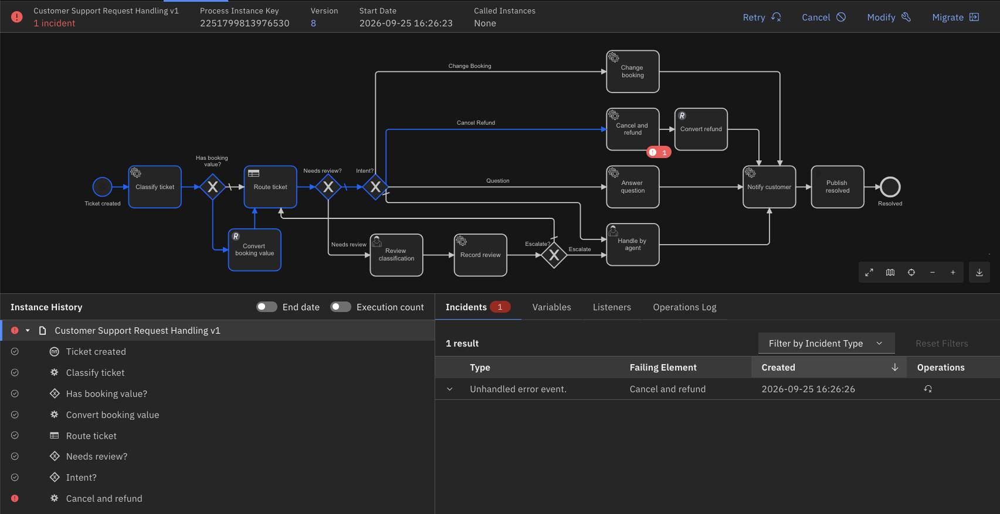

# Backlog

Ideas parked here to keep the current phase focused. Each entry names the phase it could fit into.

## Parked ideas
   - **FX — swap the fx-gateway `RateProvider` to the shared currency-rate-service**
     (`FX_BASE_URL` / gRPC client) once that service is deployable; the `/convert` contract
     stays unchanged, so the REST connector does not notice the switch.
   - **currency-rate-service repository debt (tracked there, not here):** Dockerfile +
     grpc-gateway (REST) + PostgreSQL/migrations/provider seeding — option (a) of the
     2026-09-24 assessment, ~5–6 h.
   - **Own Kafka consumer (Go)** — only if the Camunda Kafka connector's semantics prove
     insufficient (DLQ, batching, transactional produce); see ADR-007.
   - **Phase 6 items moved into the plan** (2026-09-25): dedicated worker user and password
     rotation → 6.6, error boundary on the booking tasks / scenario B → 6.2; the Phase 5.5
     evidence stays here:

     

     *Before the fix — instance green, token on cancel-refund, no incident; the worker logged the 404 every 60 s.*

     

     *After the fix — the same ticket raises `UNHANDLED_ERROR_EVENT` on cancel-refund: the error is thrown, nothing catches it yet.*
   - **Phase 7 — metrics endpoints on the Go services and the Python worker** (`/metrics`,
     scraped by the monitoring profile). Phase 6 scrapes the engine only (D6-7).
   - **Phase 7 — import the official Zeebe Grafana dashboard** (`monitor/grafana/zeebe.json`,
     850 KB) by hand when a detail view (RocksDB, stream processor latency) is wanted; not
     vendored (D6-6).
   - **Re-pin `camunda-orchestration-sdk`** when a stable 8.9.x is published (currently
     pinned to `8.9.0.dev39`; the stable 9.0.x line targets server 8.10).
   - **Measure install-from-scratch time** on the next clean-OS-plus-Docker run; recorded as
     ≤ 10 min without errors (design D2-6), not yet timed.
   - **Phase 7 — classifier: add `retryBackOff`.** The SDK fails a job with backoff 0, so
     the three retries run within 3 s and a 5–10 s PostgreSQL restart already produces an
     incident (A3b in `docs/runbooks/incident-handling.md`). A `JobFailure(retry_back_off=…)`
     raised from the audit path, or a worker-level default, would let short restarts heal.
   - **Phase 7 — classifier calls the LLM before the audit write**, so each retry of a
     failed audit write (A3b in `operations-v1.md`) costs an extra LLM call — reorder the
     steps or cache the LLM result per `jobKey`. Observed in Phase 6.1; no change now.
   - **Phase 7 — `answer_v2` candidate:** do not mix scripts inside one reply (a Russian
     answer wrote "voucher" where «ваучер» was expected), one language per reply; bump the
     prompt version and re-run `tests/generation/report.sh`. Not implemented in Phase 5.
   - **After Phase 8 — Camunda Non-Commercial License application.** The stand currently runs
     without a key ("Non-Production License" banner). Apply for the non-commercial license and
     add the key through the environment once the project is published.

## Phase 5 milestones

| Step | Scope | Status |
|---|---|---|
| 5.0 | Design decisions D5-1…D5-6 (`docs/design/llm-classifier-v1.md`), ADR-004 amendment | done |
| 5.1 | PostgreSQL + audit schema, worker rename to `workers/llm-classifier`, audit-writing skeleton, provider interface, smoke | done (acceptance run pending) |
| 5.2 | Claude classify call, JSON-schema guardrails, retry + fallback, threshold calibration (`tests/classification/report.sh`) | done — e2e 6/7 on v6, T-1004 blocked by D4-6 until v7 (5.3) |
| 5.3 | Process v7: review loop re-routes (D5-4), explicit output mappings `intent`/`sentiment`/`escalate`/`reviewedBy` on `review-classification` (D4-6, unblocks T-1004), `record-review` → `classification_review` writes, `slaDeadline` normalised (D3-11) | done (run 20260925T063333Z) |
| 5.4 | Process v8 (output mappings on `answer-question`), LLM `ticket.answer` (grounded in `prompts/kb_tourism.md`, D5-11) and `ticket.notify` (D5-5) on `LLM_MODEL_GENERATE`, generation guardrails D5-8…D5-10, `tests/generation/report.sh`, e2e generation checks | done (run 20260925T121224Z) |
| 5.5 | Acceptance, docs, screenshots. Also: `review-classification` form — the Text view renders live form values, so after the agent changes a select the block labelled "LLM classification" shows the corrected value, not the LLM snapshot; form fixed by the owner (Text view shows source/confidence/language/rationale only, redeployed on v8). T-1008 (Russian cancel_refund, TRY) in `tests/e2e/tickets.json`; `--manual-user-tasks` lists every open task of the run; `make check-public`; `docs/design/llm-guardrails.md`; booking-worker fix (throw-error path, lifecycle fallback) | done (run 20260925T142455Z) |

### Phase 5 acceptance (against the plan)

| Criterion (plan) | Result | Evidence |
|---|---|---|
| ≥ 85 % classification accuracy on the labelled test set | **100 %** intent (35/35 non-ambiguous), 97.5 % sentiment, 100 % language, 0 silent errors, 5/5 ambiguous tickets to review, 39/40 stable across 3 runs | `tests/classification/report-latest.md` (`classify_v2`, threshold 0.8, Haiku) |
| Every low-confidence ticket goes to Tasklist | Threshold 0.8 sits in the 0.75–0.85 gap; live: T-1004 (`other` → corrected to `question`, re-routed through the DMN) and T-1006 (borderline) reach `review-classification`; the review is recorded in `classification_review` | e2e runs `20260925T063333Z`, `20260925T121224Z`; screenshots `docs/assets/phase-5/` |
| LLM outputs validated and auditable | Two-layer schema, fallback and incident semantics; every LLM job leaves an `llm_audit` row with the exact model id; generation: 0 grounding violations, 0 fallbacks, cost $0.033/run | `docs/design/llm-guardrails.md`, `tests/generation/report-answer_v1.md` |
| Customer text grounded, both languages | 8/8 e2e tickets with `message ok`, T-1008 `message ok (ru/llm)` with the refund amount in the Russian text | `tests/e2e/send-tickets.sh --check`, run `20260925T142455Z` |
| Human review reachable for every borderline ticket | `--manual-user-tasks` listed T-1004, T-1005 and T-1006 (borderline) | run `20260925T142455Z` |
| Failures surface, never loop silently | `--probe-unknown-booking`: incident on `cancel-refund`, `UNHANDLED_ERROR_EVENT` "Expected to throw an error event with the code 'BOOKING_NOT_FOUND' … but it was not caught" — after the booking-worker fix (before: silent 60 s loop) | `docs/ops/install.md`, `docs/assets/phase-5/silent-loop-before-fix.png`, `incident-booking-not-found.png` |
| Public repo clean | `make check-public` exits 0 (pattern from the owner's shell environment) | Makefile |
## Phase 6 milestones

Design and decisions D6-1…D6-7: `docs/design/operations-v1.md`. Decisions taken by the
owner on 2026-09-25: monitoring profile on the stand VM, backups to local disk, `slaOverride`.

| Step | Scope | Status |
|---|---|---|
| 6.0 | Design decisions D6-1…D6-7, plan, ADR-008 | done 2026-09-25 |
| 6.1 | Incident scenario A, no BPMN change: booking worker fails 5xx/timeout/transport with `retryBackOff` (`RETRY_BACKOFF`, default `PT10S`) and a self-explanatory errorMessage + WARN log line; booking-api runtime outage toggle (`/admin/fault`, `/app -fault`, `make fault-on/off/status`); classifier `connect_timeout=5` (D5-12); e2e `--probe-booking-5xx`, `--probe-outage`, `--probe-classify`, `--incidents`; `tests/smoke/phase-6-infra.sh`; A1/A2/A3a/A3b run on the stand, runbook `docs/runbooks/incident-handling.md`, screenshots `docs/assets/phase-6/`; install.md entry (`make deploy` deletes files next to `.env`) | done 2026-09-26 (committed 62705bd) |
| 6.2 | Scenario B: process v9 = v8 + interrupting `BOOKING_NOT_FOUND` boundary events `err-booking-not-found-cancel` / `err-booking-not-found-change` → `handle-by-agent`, output mappings `errorCode`/`errorMessage` from the throw-error payload (owner, D6-8; the worker sends the payload); two live v8 incidents resolved by instance migration v8 → v9 — one through the Operate UI, one through `tests/ops/migrate-instance.sh` — then Retry, caught by the new boundary event; `--probe-unknown-booking` reports incident (v8) or open task (v9); timeout stays scenario A (`--probe-timeout`, D6-10, cancelled); regression 8/8 on v9; runbooks `docs/runbooks/migration.md`, `docs/runbooks/timeout.md`; `process-v1.md` v8→v9; screenshots `b-*`, `c-*` | done 2026-09-26 (committed: —) |
| 6.3 | SLA escalation, process v10 = v9 + `slaOverride` in the start event and the `slaDeadline` mapping (D6-3), non-interrupting timer boundary `sla-timer` on `handle-by-agent` (D6-5); second migration case: a v9 instance waiting in `handle-by-agent` migrated to v10 gains the timer subscription (D6-9); T-1009 in `tickets.json`, `--probe-sla`; **`handle-by-agent` form shows `errorMessage`** (why the ticket was escalated: the v9 boundary events put it in the process scope, the form does not display it yet) — form redeploy together with v10 | planned — v10 modelled by the owner after 6.2 |
| 6.4 | Backup/restore to local disk (ES `fs` repository, orchestration `FILESYSTEM` store, `tests/ops/backup.sh` / `restore.sh`, runbook, one restore rehearsed); patch upgrade of the main stand under `docs/runbooks/upgrade.md`; minor upgrade 8.8 → 8.9 rehearsed on `infra/upgrade-lab/` (ADR-002) | planned |
| 6.5 | Monitoring: deploy the `monitoring` profile (Prometheus `v3.15.0`, Grafana `13.2.2`, alert `incidents > 0`, dashboard `camunda-stand`, `tests/smoke/phase-6-monitoring.sh`) — **the repository side exists since 6.0** (compose profile, `infra/config/prometheus/`, `infra/config/grafana/`, the Prometheus endpoint in `application.yaml`, `.env.example` variables, install.md section), nothing is deployed; password rotation rehearsed; `worker` user with scoped authorizations, workers switched from `admin` | repo side of monitoring done 2026-09-25; rest planned. **Check first:** on the 6.1 deploy `orchestration` did not restart although `application.yaml` changed (bind-mounted file — Compose sees no service change?); verify with `docker compose ps` timestamps and `docker compose up -d --force-recreate orchestration` before the monitoring deploy, and only then write the install.md entry |
| 6.6 | Acceptance against §8 of the design, screenshots `docs/assets/phase-6/`, traceability, README status | planned |
