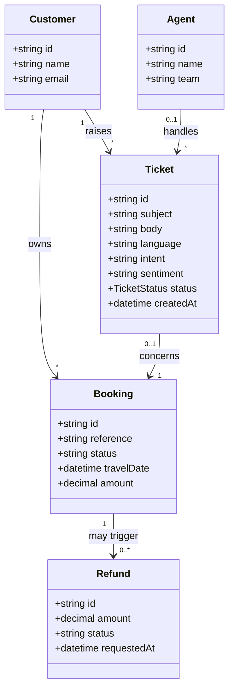
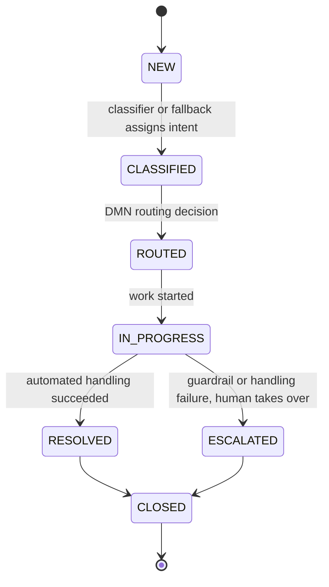

# Domain model

Core entities of the support automation domain and the ticket lifecycle they revolve around.

## Entities

A ticket is raised by a customer and may concern one of their bookings. Refund tickets lead to a
refund against that booking. An agent is assigned only when the ticket is escalated to a human.

## Ticket status state machine

