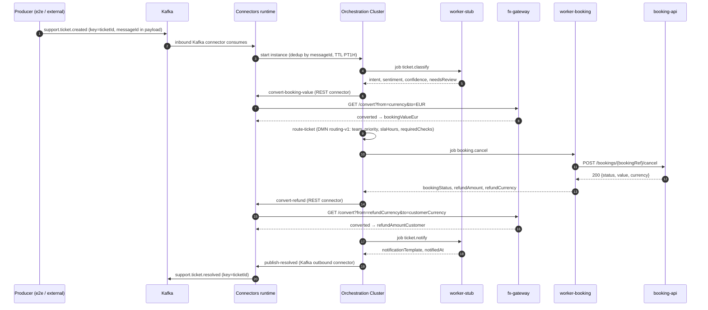
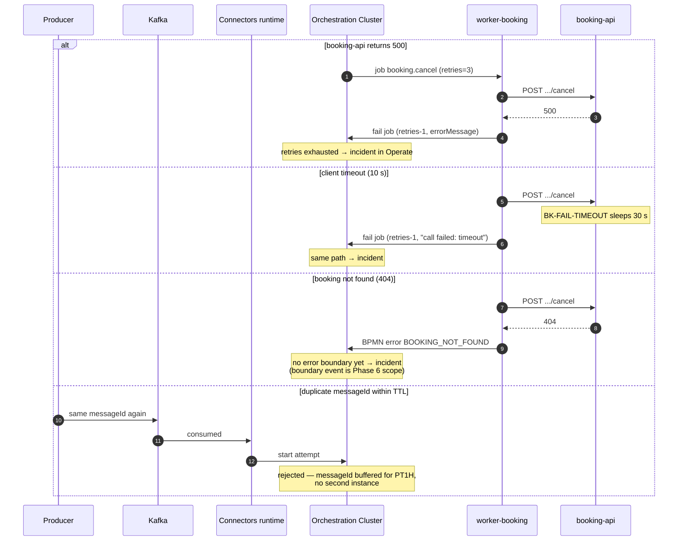

# Integrations v1 — design (Phase 4)

**Status:** accepted — the flows below passed the Phase 4 acceptance (process v6, DMN v3,
e2e 7/7 through Kafka).

Related: ADR-005 (Kafka), ADR-006 (containers and profiles), ADR-007 (Kafka via Connectors),
`process-v1.md`, `routing-v1.md`.

## 1. Kafka

Single-node KRaft broker (`apache/kafka`, pinned in `infra/docker-compose.yml`), compose
profile `integrations`, no authentication (stand limitation — `docs/ops/install.md`).

| Topic | Direction | Producer | Consumer |
|---|---|---|---|
| `support.ticket.created` | in | e2e scripts / external systems | inbound Kafka connector → starts `support-request-v1` |
| `support.ticket.resolved` | out | outbound Kafka connector task | e2e verification, downstream systems |

Listeners: `INTERNAL` `kafka:29092` for connectors and workers inside the compose network;
`EXTERNAL` host port `9092`, advertised address from `STAND_IP` (`infra/.env`) for clients
outside the VM. Topics are created by the one-shot `kafka-init` container.

Connector wiring (since process v5, step 4.3): the Kafka Message Start Event Connector is
the **only** way an instance starts, and `publish-resolved` produces the outcome — exact
element properties in `process-v1.md`, "v5→v6 changes".

| ID | Decision | Rationale |
|---|---|---|
| D4-4 | The Kafka start event connector replaces REST message publication as the only process entry | One entry path, one dedup mechanism; the e2e producer becomes a real external system |
| D4-5 | Dedup key is the `messageId` field of the event payload, connector expression `=value.messageId`; Message TTL `PT1H` | The producer controls idempotency (`<ticketId>-<runId>`); the TTL bounds the dedup window so deliberate re-sends (incident drills) work after an hour |

## 2. Booking API

Mock service `services/booking-api` (compose profile `integrations`, in-network only,
`http://booking-api:8080`). Contract and the deterministic-failure convention
(`BK-FAIL-500`, `BK-FAIL-TIMEOUT`, unknown → 404): see `services/booking-api/README.md`.
Consumed by the `booking.change` / `booking.cancel` Go workers from 4.2; the failure ids
drive the incident-handling scenarios in Phase 6.

## 3. FX

`services/fx-gateway` (profile `integrations`, `FX_BASE_URL=http://fx:8080`), called by the
REST connector for currency-aware refund decisions (the `bookingValue > 1000` threshold from
`routing-v1.md` D3-7 becomes currency-aware here).

Contract: `GET /convert?from=USD&to=EUR&amount=1200` →
`{"from","to","amount","rate","converted","asOf"}`. Provider behind a `RateProvider`
interface — currently frankfurter.app (ECB rates, no RSD, needs outbound internet); the swap
to the shared currency-rate-service is parked in `docs/backlog.md` and does not change the
contract.

Same-currency short-circuit: `from == to` returns `rate: 1`, `converted = amount`, `asOf` =
today, **without a provider call** — EUR-only tickets work offline and any currency code is
accepted when it converts to itself.

Since process v5 the model uses two conversions: `convert-booking-value` (booking `currency` → EUR →
`bookingValueEur`, the `sla-policy` DMN input per D3-7) and `convert-refund` (see Refund).

## 4. Refund

`booking.cancel` completes with `refundAmount` (= the booking's `value`) and
`refundCurrency` (= the booking's `currency`) taken from the Booking API response. The
process then converts the refund into the customer's payout currency:
`convert-refund` calls the FX gateway with `from=refundCurrency`, `to=customerCurrency`,
`amount=refundAmount` and stores `refundAmountCustomer`. Same-currency refunds hit the
short-circuit and stay deterministic.

## 5. Workers (Phase 4.2)

`workers/booking` (Go, stdlib, REST API v2 long polling) serves `booking.change` and
`booking.cancel`; the Python stub keeps `ticket.classify`, `ticket.answer`, `ticket.notify`.
Both run as containers in the `workers` compose profile (ADR-006). Output variables are
unchanged against the Phase 2 stub, plus `bookingStatus` from the Booking API response.

| ID | Decision | Rationale |
|---|---|---|
| D4-1 | Error contract: Booking API 2xx → complete with `{bookingStatus}`; 404 **or missing/null `bookingRef`** → BPMN error `BOOKING_NOT_FOUND`; 5xx or client timeout (10 s) → fail with `retries - 1` and errorMessage | Business absence is a modelled path, infrastructure trouble is a retry and then an incident; the missing-ref case cannot reach the API and is business absence too |
| D4-2 | One binary serves both booking job types | Same dependency, same error contract; two polling loops inside one process cost less than two containers |
| D4-3 | `/healthz` is age-based: 200 while the last successful activation poll (empty responses count) is < 60 s old | A worker that cannot reach the engine is unhealthy even though its process lives; job timeout 60 s covers the mock API's 30 s injected delay |
| D4-6 | Branch service tasks map worker completion variables explicitly: `cancel-refund` maps `bookingStatus`/`refundAmount`/`refundCurrency`, `change-booking` maps `bookingStatus` | The branch tasks have carried an output mapping since v1 (`resolution` literal, D2-3) — and any output mapping makes **all** completion variables task-local. Symptom that led here: `convert-refund` evaluated its URL with `refundCurrency` = null → incident "No retries left" |

## 6. Flows

Happy path of the cancel branch, Kafka to Kafka:

Failure paths of the booking call and the start-event dedup:

## 7. Screenshots

Evidence per decision, all under `docs/assets/phase-4/`:

| Decision / topic | Screenshot |
|---|---|
| D4-4/D4-5 — Kafka start event as the only entry, messageId dedup, TTL PT1H | `modeler-kafka-start-event.png` (full connector panel: bootstrap secret, topic, group ID, Message ID expression, TTL, result expression) |
| Booking-value conversion wiring | `modeler-gw-has-booking-value.png` (gateway + convert + route section with the panel), `modeler-flow-condition-booking-value.png` (`bookingValue != null` condition and the default-flow marker) |
| REST connector for FX | `modeler-rest-convert-refund.png` (URL expression with secrets, result expression `refundAmountCustomer`) |
| Kafka outbound | `modeler-kafka-publish-resolved.png` (topic, key `=ticketId`, JSON value expression; schema-strategy dropdown open) |
| D3-7 closure in DMN v3 | `modeler-dmn-sla-policy.png` (`sla-policy` table, input expression `bookingValueEur`) |
| Process v6 overview | `modeler-process-v6.png` |
| D4-6, the incident | `operate-incident-convert-refund.png` (v5 instance, "No retries left" at Convert refund) |
| D4-6, local scope | `operate-variables-url-null.png` (connector-local variables, `url: null`) |
| D4-6, missing process-scope variables | `operate-variables-process-scope.png` (process scope without the refund variables) |
| Completed T-1002 with refund variables | `operate-t1002-completed.png` |
| Deployed versions (process v6, DMN v3) | `operate-process-versions.png` |

## 8. Idempotency

The producer owns idempotency: every `support.ticket.created` event carries a `messageId`
(`<ticketId>-<runId>` in the e2e set), and the Kafka start event connector uses it as the
buffered-message id with TTL `PT1H` (D4-5). Within that window Zeebe rejects any repeat —
whether a producer retry or a connector redelivery (the inbound connector is
at-least-once, ADR-007) — and no second instance appears. After the window a re-send
starts a fresh instance on purpose: incident drills in Phase 6 rely on being able to
replay a ticket an hour later.

Consequences:

- consumers of `support.ticket.resolved` must tolerate at-least-once delivery themselves;
  the event carries `ticketId` and `runId` for their dedup;
- the dedup window is part of the contract: producers that need longer protection must
  keep their own outbox/inbox bookkeeping;
- every e2e publish run re-sends T-1001 with the same `messageId` and verification asserts
  exactly one instance per `(runId, ticketId)` — the dedup path is exercised on every run,
  not only in drills.
