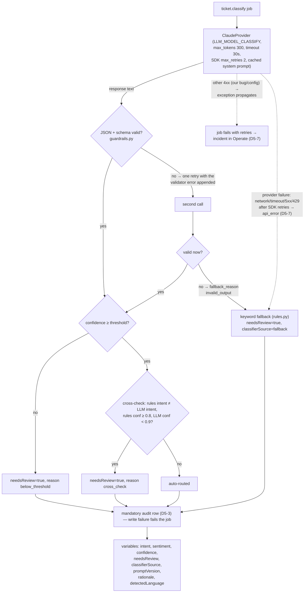

# LLM classifier v1 — design (Phase 5)

**Status:** in progress — 5.0 (decisions), 5.1 (infrastructure + worker skeleton) and
5.2 (LLM classify path with guardrails) are implemented; 5.3–5.4 pending. Milestones
with status: `docs/backlog.md`, Phase 5 section.

Related: ADR-004 (provider), `integrations-v1.md`, `process-v1.md`,
`workers/llm-classifier/`.

## 1. Classify path (implemented in 5.2)

The system prompt is a versioned artifact (`prompts/classify_v2.md` currently, selected
by `CLASSIFY_PROMPT_VERSION` — see `prompts/README.md`; v2 added a confidence rubric and
a 20-word rationale cap after the v1 calibration run). The process variable `language`
(from the ticket payload) is never overwritten; the LLM's detection goes out as
`detectedLanguage`.

**Enum note:** `intent` and `sentiment` values are exactly what the DMN tables and the
`gw-intent` flows consume. The single accepted enum extension of 5.2 is `sentiment:
positive` — the DMN is untouched (its rules only test `negative`); the
review-classification form picks the value up in 5.3.

Calibration: `tests/classification/report.sh` over `tickets-40.json` (40 tourism tickets,
~50/50 RU/EN, 5 deliberately ambiguous ones that must land in review, 10 hard-but-
unambiguous ones — typos, colloquial Russian, mixed intents with a dominant one). Gates:
intent accuracy ≥ 0.85, zero silent errors (wrong intent that was not sent to review),
zero fallbacks. The final `CLASSIFY_CONFIDENCE_THRESHOLD` is fixed after the classify_v2
calibration run; `report-latest.md` is the current record, `report-classify_v1.md` the
archived v1 one.

**Threshold note (v2 calibration, runs=3, 40 tickets):** the v1 run showed flat 0.95
confidences and T-1006 oscillating 0.70–0.85 around the threshold; the v2 confidence
rubric spread the distribution into two clusters — ambiguous 0.30–0.75, confident
(including the 10 hard tickets) 0.85–0.95, with a clean 0.75–0.85 gap. The threshold
sits in that gap at **0.8**: all swept thresholds gave zero errors, so the deciding
criterion is the margin to both clusters (0.7 touches T-1006's range, 0.9 reviews
correct 0.85 answers). Re-calibrate whenever the prompt or the model changes.
Consequence for e2e stays: `send-tickets.sh` closes a `review-classification` task for
**any** ticket where one appears and verifies by final resolution — only T-1004's
review visit is a hard expectation (borderline tickets may still drift across runs).

## 2. Decisions

| ID | Decision | Rationale |
|---|---|---|
| D5-1 | Model routing per job type: `ticket.classify` → `claude-haiku-4-5`; `ticket.answer` / `ticket.notify` → `claude-sonnet-5`. Env: `LLM_MODEL_CLASSIFY`, `LLM_MODEL_GENERATE` (aliases). System prompts carry `cache_control` — note the minimum cacheable prefix for haiku-4-5 is 4096 tokens, so with the current ~600-token classify prompt cache write/read stay 0; the marker is harmless and activates by itself once the prompt grows (do not inflate the prompt for the cache's sake) | Cheap where a wrong answer is caught by guardrails, better model where the output is customer-facing. Cost estimate for the phase: single-digit USD. The exact model id of every call is recorded in the audit from `response.model`, so alias drift is visible. Confirmed by the v2 calibration: Sonnet was never needed for classify — Haiku closed the 40-ticket set including the 10 hard ones (35/35, 0 silent); a comparison run is a config change via `LLM_MODEL_CLASSIFY`, no code involved |
| D5-2 | Guardrail policy for classify: strict JSON schema (intent enum `change_booking\|cancel_refund\|question\|other`; sentiment enum; language `ru\|en\|other`; confidence 0..1; rationale one line). The schema is enforced twice: **structured output** (`output_config.format: json_schema`, GA for claude-haiku-4-5) constrains the answer server-side — the wire copy (`API_SCHEMA`) has the keywords structured output rejects stripped (`minimum`/`maximum`/`multipleOf`, `minLength`/`maxLength`, `pattern`) — and the full-schema `jsonschema` validation in the worker stays as the second line of defence, so the confidence range and rationale length are still enforced locally (violation → invalid_output → retry → fallback). Parsing is tolerant before validation — markdown fences are stripped and the first balanced JSON object is extracted (`guardrails.extract_json`): the model's *packaging* of the answer is untrusted input like everything else it returns, so tolerating it is a guardrail, not a workaround; the schema check afterwards stays strict. No temperature parameter: the `anthropic` SDK (1.8.0) removed sampling controls from `messages.create` for current models — output discipline comes from the schema-constrained output, the validation and the retry, not from temperature. Invalid JSON → one retry with the validator error in the prompt → still invalid → keyword fallback (`rules.py`) + `needsReview=true`. Threshold `CLASSIFY_CONFIDENCE_THRESHOLD` **fixed at 0.8** (classify_v2 calibration, runs=3, 40 tickets): with zero errors at every swept threshold the choice is made by the gap between the ambiguous cluster (≤ 0.75) and the lower edge of confident answers (≥ 0.85) — 0.7 would make T-1006 (0.70–0.75) unstable, 0.9 would send correct 0.85 answers to review. Re-calibration is mandatory on any prompt or model change. Cross-check: LLM intent ≠ keyword intent AND confidence < 0.9 → `needsReview=true`. Worker always outputs `classifierSource` (`llm` \| `fallback`) and `promptVersion` | The LLM is untrusted input to the process: everything it returns is validated, low confidence and disagreement route to a human, and the fallback keeps the process moving when the provider misbehaves |
| D5-3 | Audit in PostgreSQL: tables `llm_audit` and `classification_review` (§3). The audit write is mandatory — if it fails, the job fails with retries → incident in Operate. **Verified against the SDK `8.9.0.dev39` source** (`runtime/job_worker.py`): any exception in a handler callback becomes a fail-job action with `retries - 1`, so raising from the audit module is sufficient — no explicit `fail_job` call needed. The live negative test (broken `DATABASE_URL` → one ticket → incident after retries) is part of the 5.1 acceptance run | An unauditable classification must not complete silently; the deliberate incident feeds the Phase 6 incident-handling scenarios |
| D5-4 | Review loop re-routes: after `review-classification` the process goes back through `route-ticket`, so corrected intent/sentiment produce fresh `team`/`priority`/`slaDeadline`. The escalate path goes straight to `handle-by-agent` with the initial routing. Process change lands in v7 (5.3, Modeler, by the owner). D4-6 implication: the user task needs explicit output mappings for `intent`/`sentiment`/`escalate` — confirmed live in the 5.2 acceptance (T-1004's corrected intent stayed task-local on v6) | A corrected classification with stale routing is worse than no review; the escalate path is a human takeover where routing no longer matters |
| D5-5 | Scope of answer/notify (implemented in 5.4): `ticket.answer` = general-question branch, grounded in `prompts/kb_tourism.md`, must not state amounts/dates absent from the input. `ticket.notify` = final customer message in the customer's language built from structured variables (`resolution`, `refundAmountCustomer`, `slaDeadline`, `requiredChecks`); delivery stays a stub (log). Both on `LLM_MODEL_GENERATE` | Grounding limits hallucinated commitments; notify composes from verified process data only, so the LLM formats rather than invents |
| D5-6 | Ollama rejected: no local models on the homelab (owner decision); the provider abstraction stays (`llm/provider.py`), so a second provider is a config change. ADR-004 amended accordingly | Local hosting is an operations project of its own and outside this stand's scope |
| D5-7 | **Provider failures only** degrade to the keyword fallback (`needsReview=true`, `fallback_reason=api_error`, ERROR log, job completes): network errors and timeouts (`APIConnectionError` incl. `APITimeoutError`), `RateLimitError` (429), `InternalServerError` / status ≥ 500 — after the SDK's 2 retries. **Any other 4xx** (`BadRequestError`, `AuthenticationError`, `PermissionDeniedError`, `NotFoundError`) is our code/config bug: the exception propagates, the job fails with retries → incident in Operate, as in D5-3 | An LLM *outage* degrades to keyword routing with mandatory human review instead of stalling the queue — but a malformed request would fail identically forever, and masking it as a fallback would hide a defect; that class must surface as an incident. Trade-off, accepted deliberately: provider outages do **not** show in Operate — only in the audit (`fallback_used`, `fallback_reason`) and the logs |

## 3. Audit schema

`infra/postgres/init/001_llm_audit.sql`, executed on the first start of an empty
`postgres-data` volume:

- `llm_audit(id, ticket_id, run_id, job_type, model, prompt_version, input_hash,
  output jsonb, confidence numeric(4,3), needs_review, fallback_used, tokens_in,
  tokens_out, latency_ms, created_at)`; indexes on `(ticket_id, run_id)` and
  `created_at`. `model` holds the **exact id from the API response** (`response.model`),
  or the literal `fallback`; in 5.1 every row is `model='fallback'`,
  `prompt_version='rules'`, `fallback_used=true`.
- `classification_review(id, ticket_id, run_id, reviewed_by, llm_intent, final_intent,
  llm_sentiment, final_sentiment, escalated, reviewed_at)` — filled by the 5.3 review
  loop.

## 4. Configuration

| Variable | Where | Meaning |
|---|---|---|
| `DATABASE_URL` | `infra/.env` (no default; password must match `POSTGRES_PASSWORD`) | audit connection |
| `POSTGRES_USER` / `POSTGRES_PASSWORD` / `POSTGRES_DB` | `infra/.env` | database bootstrap |
| `ANTHROPIC_API_KEY` | `infra/.env` | provider key (used from 5.2) |
| `LLM_MODEL_CLASSIFY` / `LLM_MODEL_GENERATE` | `infra/.env`, defaults in compose | model aliases per D5-1 |
| `CLASSIFY_CONFIDENCE_THRESHOLD` | `infra/.env`, default 0.8 | D5-2; calibrated in 5.2 |
| `CLASSIFY_PROMPT_VERSION` | `infra/.env`, default `classify_v2` | selects `prompts/<version>.md`; stamped into output and audit |
| `PROMPTS_DIR` | optional | prompt location override; default `/app/prompts` (compose mount) or the repo's `prompts/` in the venv run |
