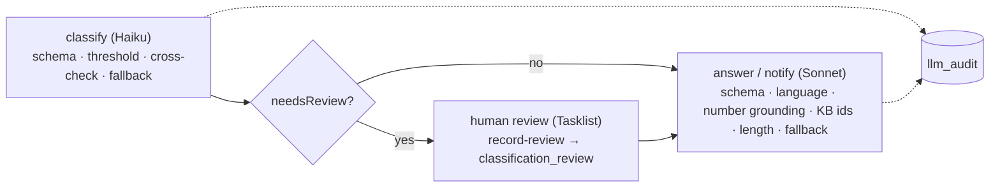

# LLM guardrails — overview

One page for the capability "LLM classification with guardrails" (`docs/traceability.md`).
It maps the mechanisms to where they are designed, implemented and measured; the text
itself lives in `llm-classifier-v1.md`, this page only points.

| Layer | What it guards | Design | Code | Measured by |
|---|---|---|---|---|
| Classification | JSON schema twice (wire + local), confidence threshold 0.8, keyword cross-check, one retry, keyword fallback with mandatory review; provider outage → fallback, our 4xx → incident | `llm-classifier-v1.md` §1, D5-2, D5-7 | `workers/llm-classifier/classifier.py`, `llm/guardrails.py` | `tests/classification/report-latest.md` (40 tickets, 3 runs) |
| Generation | Structured output `{text, language, usedKbIds}`, reply language (D5-8), every number grounded in the ticket or the KB, KB ids known, ≤ 1200 chars, one retry, template fallback; KB without figures, honest handover | `llm-classifier-v1.md` §6, D5-8…D5-11 | `generator.py`, `llm/generation_guardrails.py`, `rules.py` (templates), `prompts/kb_tourism.md` | `tests/generation/report-answer_v1.md` (10 questions) |
| Human in the loop | Low confidence or disagreement → `review-classification` in Tasklist; corrected values re-route through the DMN (D5-4); escalate → agent; every review recorded | `llm-classifier-v1.md` §5, D5-4; `process-v1.md` §11 | `worker.py` (`review.record`), `audit.py` | e2e T-1004 (`classification_review` row asserted by `--check`) |
| Audit | One `llm_audit` row per LLM job with the exact model id, prompt version, tokens, latency, output incl. rejection reasons; write failure fails the job → incident (D5-3) | `llm-classifier-v1.md` §3, D5-3 | `audit.py`, `infra/postgres/init/001_llm_audit.sql` | `--check` and the SQL in the 5.4 acceptance |
| Prompt versioning | A prompt change is a new file and a new version; the version is stamped into variables and audit | `prompts/README.md` | `CLASSIFY_/ANSWER_/NOTIFY_PROMPT_VERSION` | archived reports per version |

Known limit: the grounding check is numeric — invented non-numeric policy is caught only by
the prompt rule and the report review (`llm-classifier-v1.md` §6, "Known limit").
