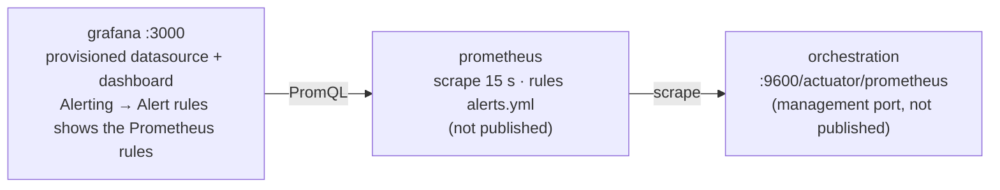

# Operations v1 — design (Phase 6)

**Status:** 6.0 (decisions, plan) done 2026-09-25; 6.1 (incident scenario A) done 2026-09-26
(run on the stand, runbook `docs/runbooks/incident-handling.md`); the monitoring files of 6.5 exist in the
repository (written with 6.0) but are not deployed. Milestones with status:
`docs/backlog.md`, Phase 6 section.

Related: ADR-001 (profiles), ADR-002 (upgrade rehearsal, secondary storage), ADR-008
(monitoring and backups stay on the stand VM), `process-v1.md`, `integrations-v1.md`,
`docs/ops/install.md`, runbooks under `docs/runbooks/`.

## 1. Scope

Phase 6 turns the stand into something that can be operated: failures are visible and
handled, state can be saved and restored, and a version change is rehearsed before it is
done for real. Everything runs on the single Compose VM (ADR-001); nothing new is
published outside the lab network except Grafana on port 3000.

| Area | Deliverable | Step |
|---|---|---|
| Incidents, scenario A | Three reproducible incident cases, resolved in place: A1 data (`BK-FAIL-500`), A2 downstream outage (booking-api fault toggle), A3 configuration (classifier database) — worker backoff, structured failure messages, probes and `--incidents` in the e2e script | 6.1 |
| Incidents, scenario B | Error boundary events for `BOOKING_NOT_FOUND` (process v9), the live incident resolved by **instance migration** v8 → v9; timeout handling | 6.2 |
| SLA | Timer boundary on `handle-by-agent` fires at `slaDeadline`; `slaOverride` makes the demo run in minutes | 6.3 |
| Backup / restore, upgrade | ES snapshot repository + orchestration backup store on the VM's local disk, one full backup and restore rehearsed; patch upgrade of the main stand under a runbook, minor upgrade 8.8 → 8.9 rehearsed on `upgrade-lab` (ADR-002) | 6.4 |
| Monitoring, least privilege | `monitoring` compose profile (Prometheus + Grafana, alert `incidents > 0`); dedicated `worker` user with scoped authorizations; password rotation on the running cluster | 6.5 |
| Acceptance | Runbooks executed once each from the doc, screenshots, traceability | 6.6 |

Out of scope, stated where it matters: off-host backups (ADR-008), Alertmanager and
notification channels (§2.4), Optimize (ADR-002), Kubernetes.

## 2. Monitoring (6.5)



### 2.1 What is scraped

The Orchestration Cluster exposes Micrometer metrics at `:9600/actuator/prometheus`. Two
properties turn the endpoint on (8.9 metrics guide, verified 2026-09-25):

```yaml
management:
  endpoint.prometheus.access: unrestricted
  prometheus.metrics.export.enabled: true
```

They live in `infra/config/orchestration/application.yaml` next to the existing
management settings. The port stays unpublished — Prometheus reaches it on the Compose
network. Connectors, the workers and the mock services are **not** scraped in Phase 6:
their health is already gated by Compose healthchecks, and a metrics endpoint on the
Go services is a Phase 7 idea (`docs/backlog.md`).

### 2.2 Metrics the dashboard and the alert use

| Metric | Type | Used for |
|---|---|---|
| `zeebe_pending_incidents_total` | gauge, per partition | the alert and the headline stat |
| `zeebe_incident_events_total{action}` | counter (`created`, `resolved`) | incident rate, shows scenarios A/B happening |
| `zeebe_job_events_total{action,type}` | counter | worker activity per job type (`activated`, `completed`, `failed`, `error thrown`) |
| `zeebe_element_instance_events_total{action,type}` | counter | process instances completed per minute |
| `zeebe_exporter_last_exported_position`, `zeebe_log_appender_last_committed_position` | gauges | exporter lag = committed − exported; grows when ES is slow or exporting is paused (backup, §5) |
| `jvm_memory_used_bytes{area}` | gauge | heap vs the 2 GiB `-Xmx` |
| `up{job="orchestration"}` | scrape health | target-down alert |

Names come from the official Zeebe Grafana dashboard for 8.9 (`monitor/grafana/zeebe.json`
in `camunda/camunda`). That dashboard is 850 KB and built for multi-node Kubernetes
clusters; it is **not vendored** — import it by hand when a detail view is needed (Grafana
→ Dashboards → New → Import → upload the file). The stand dashboard
`infra/config/grafana/dashboards/camunda-stand.json` has nine panels and is provisioned
automatically.

### 2.3 Alert rule

`infra/config/prometheus/alerts.yml`:

| Alert | Expression | For | Meaning |
|---|---|---|---|
| `CamundaIncidentsPending` | `sum(zeebe_pending_incidents_total) > 0` | 1 m | at least one unresolved incident in Operate — the operations trigger for the runbook `docs/runbooks/incidents.md` |
| `OrchestrationTargetDown` | `up{job="orchestration"} == 0` | 2 m | the management endpoint stopped answering |

`for: 1m` on the incident rule filters the incident that a worker fails and resolves
within the same retry cycle; every incident of the Phase 6 scenarios stays open for
longer than that by design.

### 2.4 Where alerts are visible

Prometheus evaluates the rules; Grafana lists them under **Alerting → Alert rules**
(data-source managed rules) and the dashboard's "Pending incidents" stat turns red at
`> 0`. There is **no Alertmanager and no notification channel**: the stand has no mail
relay or chat webhook, and adding one is configuration, not a demonstration of anything.
The limitation is written down in `docs/ops/install.md`.

### 2.5 Configuration

| Variable (`infra/.env`) | Meaning |
|---|---|
| `COMPOSE_PROFILES=integrations,workers,monitoring` | the profile is on permanently, like the other two |
| `PROMETHEUS_VERSION=v3.15.0`, `GRAFANA_VERSION=13.2.2` | pinned tags (Docker Hub, 2026-09-25) |
| `GRAFANA_ADMIN_PASSWORD` | Grafana `admin` login; Compose refuses to start without it |

Data is kept in the volumes `prometheus-data` (15 days retention) and `grafana-data`.

## 3. Incident scenarios (6.1 — scenario A, 6.2 — scenario B)

Both scenarios reuse inputs that Phase 5 produced deliberately — nothing is simulated
with a fake worker.

### 3.1 Scenario A — resolve in place (6.1, run on the stand 2026-09-26)

One rule: the model is right and the environment is wrong, so the fix is outside the
process and the incident is resolved in place. Operator procedure, screenshots and log
excerpts: **`docs/runbooks/incident-handling.md`**. What was observed, in short:

| Case | Trigger | Observed | Resolution |
|---|---|---|---|
| A1 data | `--probe-booking-5xx` (cancel on `BK-FAIL-500`) | 3 attempts at T, T+10 s, T+20 s, same jobKey, `retriesLeft` 2→1→0; `JOB_NO_RETRIES` on `cancel-refund` ≈ 20 s after the first failure; Operate list says "Job: No retries left.", the full message (`booking-api HTTP 500 on POST /bookings/BK-FAIL-500/cancel (retries left: 0)`) is behind **More**; the incident row shows the Job ID = the log's jobKey | edit `bookingRef` → `BK-90` in Operate, Retry → completed, `refundAmount` 210 EUR. **Caveat:** `bookingValue` stayed 100 — Retry re-runs the failed step only, DMN routing is not recomputed; use Modify or Cancel + resubmit when routing inputs change. Edit and Retry appear in the Operations Log |
| A2 downstream outage | `make fault-on` + `--probe-outage` | **self-heal:** fault off after the first failed attempt → the next attempt 10 s later completed, no incident. **Incident run:** two instances, own jobKey series 2→1→0 each, two `JOB_NO_RETRIES`; booking-api container healthy throughout | `make fault-off`, batch Retry from the instance list → both jobs completed 3 ms apart with their original jobKeys (Retry creates no new job); instance ends differ by seconds because `notify-customer` (Sonnet) runs after the booking step |
| A3a configuration, startup | wrong password in `DATABASE_URL`, `docker compose up -d worker-llm-classifier` | 10 × `password authentication failed`, `RuntimeError: audit database unreachable after 10 attempts`, exit, Compose restarts; `docker compose ps` shows `Up N seconds (health: starting)` and looks normal; `RestartCount` grows (3 → 4 → 6). Operate: instance Active on `classify-ticket`, **no incident**. `--incidents`: no active incident, one CREATED `ticket.classify` job aged 107 s | restore `DATABASE_URL`, `up -d` → `audit database connected`, the waiting job completed 2 s later, **no Retry** needed |
| A3b configuration, runtime | `docker compose stop postgres` + `--probe-classify` | 3 attempts in ≈ 3 s, each with a Haiku call before the audit write failed; messages: `terminating connection due to administrator command`, then twice `failed to resolve host 'postgres'` (a stopped container leaves Compose DNS); Operate shows the last one | `docker compose start postgres`, Retry → completed. Consequence: a normal 5–10 s PostgreSQL restart already exhausts the classifier's retries |

Not exercised: the 5 s connect timeout (D5-12) — DNS failed instantly, so the hung-database
case is covered by design, not by this run.

### 3.2 Scenario B — resolve by migration (6.2)

Trigger: `tests/e2e/send-tickets.sh --probe-unknown-booking` — the booking worker throws
BPMN error `BOOKING_NOT_FOUND` with the message
`booking BK-UNKNOWN not found (HTTP 404 on POST /bookings/BK-UNKNOWN/cancel)`. Process v8
has no boundary event for it, so Operate shows `UNHANDLED_ERROR_EVENT` on `cancel-refund`
(Phase 5.5 finding, `install.md`). The probe waits for either outcome and prints which one
it found: the incident (v8) or an open `handle-by-agent` task (v9 and later).

Fix in the model (owner, Modeler): **process v9 = v8 plus two interrupting error boundary
events** (D6-8): `err-booking-not-found-cancel` on `cancel-refund` and
`err-booking-not-found-change` on `change-booking`, error code `BOOKING_NOT_FOUND`, each
with two output mappings `errorCode ← =errorCode` and `errorMessage ← =errorMessage`, both
flowing to `handle-by-agent`. Nothing else changes in v9 (the SLA timer is v10, D6-9). The
mappings read the **throw-error payload**: in Camunda 8 an error catch event receives
variables only from the `variables` object of the throw-error command, at the catch
event's local scope (8.9 docs, error events → variable mappings), so the worker sends
`variables: {errorCode, errorMessage}` with the error — without that payload the mappings
resolve to null.

Resolution of the live incident, API path (`tests/ops/migrate-instance.sh <key> 9`):

1. `POST /v2/process-definitions/search` with `processDefinitionId` + `version` → the
   target `processDefinitionKey`.
2. `POST /v2/element-instances/search` with `processInstanceKey` + `state = ACTIVE` → the
   active elements (the `PROCESS` element is listed too and is never mapped).
3. `POST /v2/process-instances/{processInstanceKey}/migration` with
   `targetProcessDefinitionKey` and identity `mappingInstructions`
   (`{sourceElementId: "cancel-refund", targetElementId: "cancel-refund"}`), plus an
   `operationReference`.
4. The incident is carried over; resolve it separately — Retry in Operate, or
   `PATCH /v2/jobs/{jobKey}` (`{"changeset": {"retries": 1}}`) followed by
   `POST /v2/incidents/{incidentKey}/resolution`. The job runs again, the error is thrown
   again, and this time the new boundary event catches it: the token moves to
   `handle-by-agent`, and the boundary event's output mappings copy `errorCode` /
   `errorMessage` from the throw-error payload into the process scope.

Rules that matter (8.9 migration concept, verified 2026-09-25): every active element
needs a mapping instruction; a catch event that exists only in the target is subscribed
after migration — precisely how the new boundary event becomes active; the incident is
carried over and must be resolved explicitly. The script refuses when the instance already
runs the target version and never resolves incidents itself. The live demo uses the
Operate UI (Migrate → v9 → Retry); the script is the documented API path. Endpoint and
field names come from the installed 8.9 SDK models, not from memory.

Timeout (`--probe-timeout`, `BK-FAIL-TIMEOUT`) is **not** part of scenario B: the client
timeout stays an infrastructure failure with retries and backoff (D6-10), i.e. scenario A.

### 3.3 Runbook

`docs/runbooks/incidents.md` — triage in Operate (incident type → cause → action), the
two scenarios as worked examples, and the rule "resolve in place when the model is right
and the environment was wrong; migrate when the model was wrong".

## 4. SLA timer and `slaOverride` (6.3)

### 4.1 Model change (process v10, owner — 6.3)

- Non-interrupting **timer boundary event** `sla-timer` on `handle-by-agent`, time date
  `=slaDeadline`. v10 = v9 + this timer + the `slaOverride` mapping below; migrating a
  v9 instance that waits in `handle-by-agent` to v10 is the second migration case (D6-9):
  the waiting user task gains a timer subscription. The expression is evaluated when the task is entered; `slaDeadline` is
  plain ISO 8601 with a zone since v7 (D3-11), which is the format a time date needs.
- Its outgoing flow ends in `end-sla-breached`; the boundary event carries the output
  mapping `=true` → `slaBreached`. The token in `handle-by-agent` is untouched — the
  agent still finishes the ticket, and the breach is a fact on the instance, visible in
  Operate and in `support.ticket.resolved` (add `slaBreached: slaBreached` to the
  `publish-resolved` payload).
- `slaOverride` enters through the Kafka start event's `resultExpression` (add
  `slaOverride: value.slaOverride`; a missing key evaluates to `null`).
- The `slaDeadline` output mapping on `route-ticket` becomes:

```feel
{d: if slaOverride != null and duration(slaOverride) != null
      then duration(slaOverride)
      else duration("PT" + string(routing.slaHours) + "H"),
 s: string(now() + d),
 v: if contains(s, "[") then substring before(s, "[")
    else if contains(s, "@") then substring before(s, "@") + "Z"
    else s}.v
```

  An unparsable override (`duration("2 minutes")` is `null`) falls back to the DMN value
  instead of raising an incident. DMN `routing-v1` is unchanged; `slaHours` still reaches
  the process scope, so analytics can compare the policy value with the effective deadline.

### 4.2 Test input

`tests/e2e/tickets.json` gets **T-1009**: `intent = other` (goes to `handle-by-agent`),
`slaOverride = "PT2M"`, no booking. The unattended run completes the task immediately, so
the timer never fires and the expected path is the v8 one plus nothing — the ticket is a
regression guard for the override expression (`slaDeadline` within 2–3 minutes of the
instance start, asserted by `--check`). The SLA demo itself is
`send-tickets.sh --probe-sla`: publish T-1009, do **not** complete the task, wait for
`sla-timer` to appear in the completed elements and `slaBreached = true`, then complete
the task. Evidence: Operate showing the fired boundary event; `docs/assets/phase-6/`.

## 5. Backup and restore (6.4)

### 5.1 Target: local disk (ADR-008)

Both stores live on the VM, on the same NVMe the volumes use:

| Store | Config | Path (bind mount) |
|---|---|---|
| ES snapshot repository `camunda` (type `fs`) | `path.repo` on the `elasticsearch` service, repository registered once with `PUT /_snapshot/camunda` | `/var/backups/camunda/elasticsearch` |
| Orchestration backup store | `camunda.data.primary-storage.backup.store: FILESYSTEM`, `camunda.data.primary-storage.backup.filesystem.base-path` (unified configuration, 8.9 property reference, verified 2026-09-25) | `/var/backups/camunda/orchestration` |
| Web-apps (secondary storage) backup | `camunda.backup.webapps.enabled: true` (currently `false` from the distribution default), `camunda.data.backup.repository-name: camunda` | inside the ES repository |

The property names differ from the 8.8 docs (`camunda.data.backup.*` vs
`camunda.data.primary-storage.backup.*`); the 8.9 reference is the source, and the first
deploy in 6.4 confirms them against the startup log.

**Stated limitation:** a backup on the same disk as the data protects against operator
mistakes, bad deployments and the restore rehearsal — not against losing the VM. Copying
`/var/backups/camunda` off-host is a `rsync` line the runbook mentions and this project
does not automate.

### 5.2 Procedure (order is mandatory — 8.9 backup guide)

1. `POST :9600/actuator/exporting/pause?soft=true`
2. `POST :9600/actuator/backupHistory {"backupId": N}` → poll `GET …/backupHistory/N` until `COMPLETED`
3. `PUT :9200/_snapshot/camunda/camunda_zeebe_records_backup_N?wait_for_completion=true {"indices": "zeebe-record*", "feature_states": ["none"]}`
4. `POST :9600/actuator/backupRuntime {"backupId": N}` → poll `GET …/backupRuntime/N` until `COMPLETED`
5. `POST :9600/actuator/exporting/resume`

`N` is an integer greater than every previous backup id (`date +%s`). The management port
is not published, so the runbook runs the calls from inside the Compose network
(`docker compose exec orchestration curl …`) and wraps them in `tests/ops/backup.sh`.
Restore (`tests/ops/restore.sh`): stop everything but Elasticsearch, delete the indices,
restore every snapshot of `N`, run the restore app of the **same image version**
(`camunda/bin/restore --backupId=N` with `ZEEBE_RESTORE_FROM_BACKUP_ID`) against an empty
`camunda` volume, start the stack. Acceptance: instances started before the backup are
visible in Operate after the restore; the exporter lag panel shows the pause.

Runbook: `docs/runbooks/backup-restore.md`.

## 6. Upgrade (6.4)

- **Patch upgrade of the main stand** (8.9.21 → the newest 8.9.x at the time of 6.4, or a
  rehearsed no-op if none exists): backup (§5) → change `CAMUNDA_VERSION` /
  `CAMUNDA_CONNECTORS_VERSION` in `.env` → `make deploy` → verification block from
  `install.md` → e2e 9/9. Rollback = restore the backup with the old image.
- **Minor upgrade rehearsal** on `infra/upgrade-lab/` (ADR-002): a second Compose project
  (`upgrade-lab`, own network and volumes, ports 18080/19200) starts on 8.8.x with the
  8.8 configuration keys, deploys process v9 and starts instances that wait in user
  tasks, then upgrades to 8.9.21 — the lab exists to see the unified-configuration
  remapping and the exporter/index migration on real data before the main stand ever
  needs it. Memory: the lab runs **only while the main stand's workers and Kafka are
  stopped** (`docker compose stop` on the `integrations`/`workers` profiles); 16 GiB is not
  enough for two full stacks.
- Runbook: `docs/runbooks/upgrade.md` (pre-checks, order, verification, rollback).

## 7. Least privilege and rotation (6.5)

- User `worker` created through `camunda.security.initialization` (fresh secondary storage
  only) **or** the Admin UI / `POST /v2/users` on the running stand — the runbook covers
  the second path because the stand is not recreated for this. Authorizations: `PROCESS_DEFINITION`
  `UPDATE_PROCESS_INSTANCE` on `support-request-v1` for job activation/completion,
  `DECISION_DEFINITION` read is not needed by the workers. Exact resource/permission
  names are taken from the 8.9 authorization reference during 6.5 and recorded in the
  runbook; `CAMUNDA_USER` in `infra/docker-compose.yml` switches from `admin` to `worker`
  for both workers, `CAMUNDA_WORKER_PASSWORD` joins `.env.example`.
- Password rotation on a running cluster (backlog item): change via `PUT /v2/users/{username}`
  → update `.env` → `docker compose up -d` on the affected services, in that order, and
  the window in which a worker holds the old password is one long-poll (10 s). Rehearsed
  once for `worker`; documented for `admin` and `connectors`.

## 8. Acceptance (6.6)

| Criterion | Evidence |
|---|---|
| Incident visible in Grafana within 1 min, alert fires, clears on resolution | screenshot `grafana-incident-alert.png`, Prometheus alert state |
| Scenario A: A1, A2 (healing and incident), A3a, A3b each run once as documented; scenario B resolved by migration v8 → v9 | Operate screenshots, `--incidents` output, `send-tickets.sh --migrate-probe` PASS |
| SLA timer fires on `slaOverride = PT2M`, `slaBreached = true` in `support.ticket.resolved` | `send-tickets.sh --probe-sla` PASS |
| Backup + restore rehearsed from the runbook; pre-backup instances visible after restore | `tests/ops/backup.sh` / `restore.sh` output in the runbook |
| Patch upgrade under the runbook, e2e 9/9 afterwards; minor upgrade rehearsed on the lab with waiting instances | runbook log, `upgrade-lab` screenshots |
| Workers run as `worker`, not `admin`; rotation rehearsed | compose diff, runbook |
| Every runbook executed once from the doc without improvising | `docs/runbooks/*.md` "last run" line |

## 9. Decisions

| # | Decision | Rationale |
|---|---|---|
| D6-1 | Monitoring is the `monitoring` compose profile on the stand VM (Prometheus + Grafana), scraping the Orchestration Cluster's management endpoint; the one alert rule is `incidents > 0`. No separate monitoring host, no Alertmanager | Owner decision 2026-09-25. A second host would make the demo about networking; the alert that matters for this process is "someone must look at Operate", and the rule is visible in Grafana without a notification channel (ADR-008) |
| D6-2 | Backup target is the stand VM's local disk for both stores (ES `fs` repository, orchestration `FILESYSTEM` store). Off-host copies are out of scope and the runbook says so | Owner decision 2026-09-25. Object storage is credentials and a bucket, not a procedure; the procedure — order, ids, pause/resume, restore with the same version — is what the phase demonstrates (ADR-008) |
| D6-3 | Optional ticket variable `slaOverride` (ISO 8601 duration, e.g. `PT2M`) takes precedence over the DMN `slaHours` when `slaDeadline` is computed; DMN `routing-v1` unchanged; an unparsable value falls back to `slaHours` | Owner decision 2026-09-25. The SLA demo must fire in minutes without touching the policy tables; a fallback instead of an incident keeps a typo in a demo payload from becoming an incident drill |
| D6-4 | Scenario B is resolved by **instance migration** to v9 (error boundary events on both booking tasks), not by cancelling and re-sending the ticket | The point of the phase is keeping the customer's instance; re-sending would also duplicate the Kafka `messageId` semantics (D4-5) |
| D6-5 | The SLA boundary event is **non-interrupting** and records `slaBreached = true`; it does not reassign or cancel the task. **Lives in process v10 (6.3), not v9** — see D6-9 | An SLA breach is an operational fact, not a change of ownership; the agent finishes the ticket and analytics (Phase 7) count the breach |
| D6-6 | The official Zeebe Grafana dashboard is not vendored; the stand ships a small provisioned dashboard built on the same metric names | 850 KB of Kubernetes-oriented JSON in a portfolio repo hides the eight panels that matter |
| D6-7 | Connectors, workers and mock services are not scraped in Phase 6 | Compose healthchecks already gate them; process-level facts come from the engine's metrics. Go/Python metrics endpoints are parked in the backlog |
| D6-8 | **Process v9 scope (6.2):** v8 plus two interrupting error boundary events, `err-booking-not-found-cancel` on `cancel-refund` and `err-booking-not-found-change` on `change-booking`, error code `BOOKING_NOT_FOUND`, each with the output mappings `errorCode ← =errorCode` and `errorMessage ← =errorMessage`, both to `handle-by-agent`. Nothing else changes. The mappings are filled from the throw-error payload: **the worker must send `variables: {errorCode, errorMessage}` on `POST /v2/jobs/{key}/error`, otherwise the mappings get nothing** — Camunda 8 has no `errorCodeVariable`/`errorMessageVariable` (those are Camunda 7) | Owner decision 2026-09-26, corrected the same day. One change per version keeps the migration v8 → v9 an identity mapping and the diff in Operate readable; the error variables give the agent the worker's message without opening the log |
| D6-9 | **The SLA timer moves to process v10 (6.3).** v10 = v9 + `sla-timer` + the `slaOverride` mapping (§4). Migrating a v9 instance that waits in `handle-by-agent` to v10 is the second, different migration case: a waiting user task gains a new timer subscription | Owner decision 2026-09-26. Two migration cases of different kinds (error boundary on a failed service task; timer on a waiting user task) demonstrate more than one version with both, and D6-8 stays minimal |
| D6-10 | **Timeouts stay infrastructure failures.** A booking-api client timeout (`BK-FAIL-TIMEOUT`, 10 s) fails the job with `retries - 1` and `RETRY_BACKOFF`, like a 5xx — incident after ~50 s. No `BOOKING_TIMEOUT` BPMN error, no boundary event | Owner decision 2026-09-26. A BPMN error is final for the job: converting a timeout into one would drop the automatic retry that heals a slow dependency (A2 self-heal); D4-1 unchanged |
