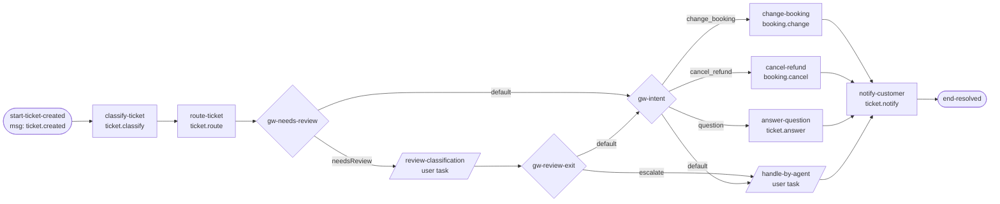
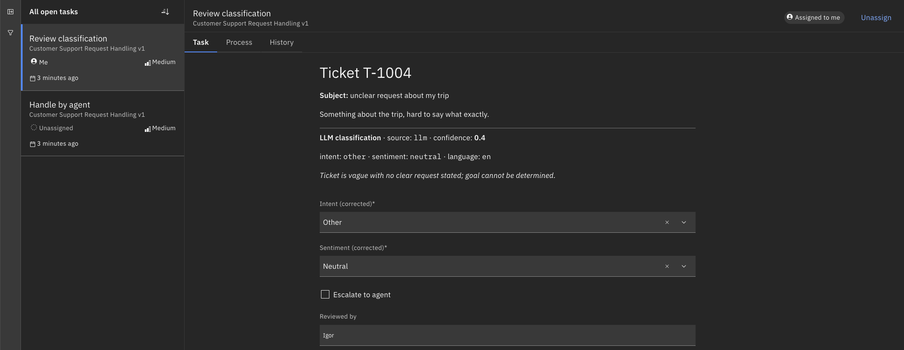
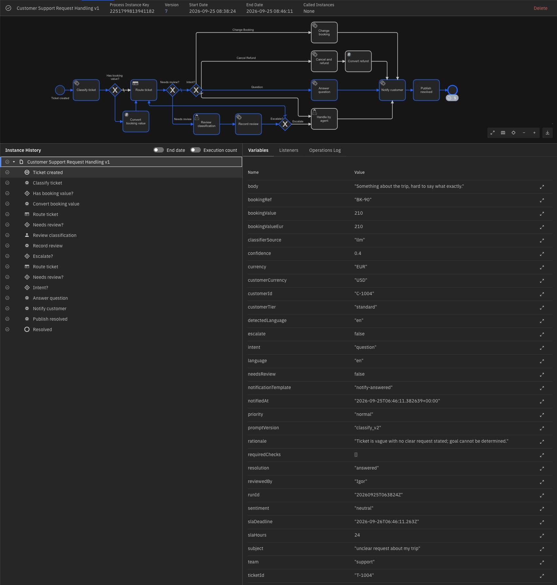
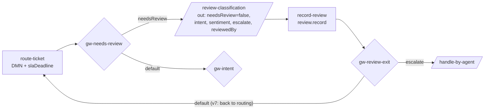
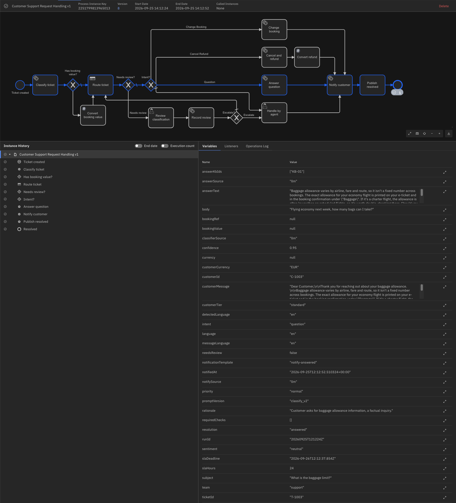
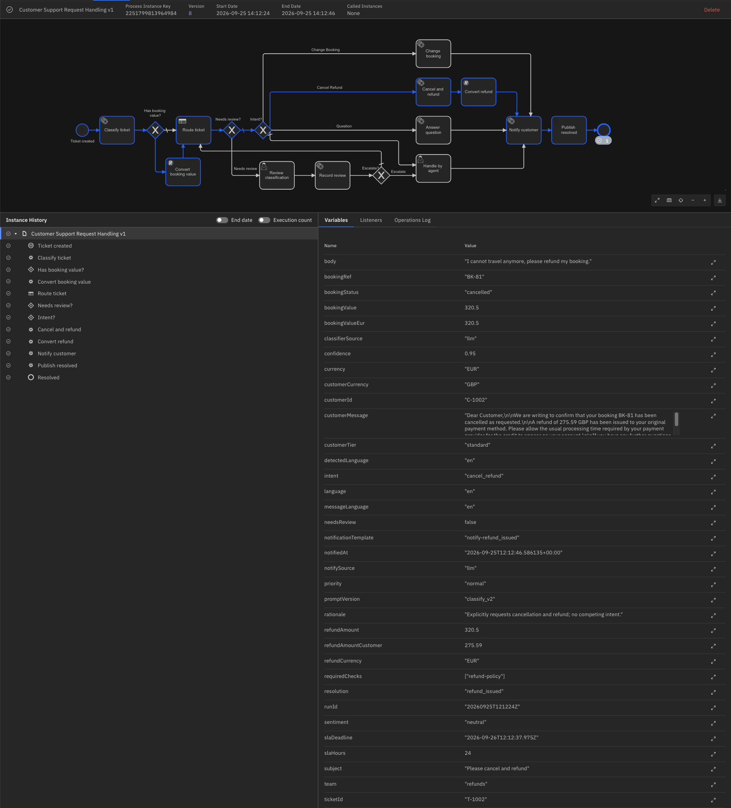
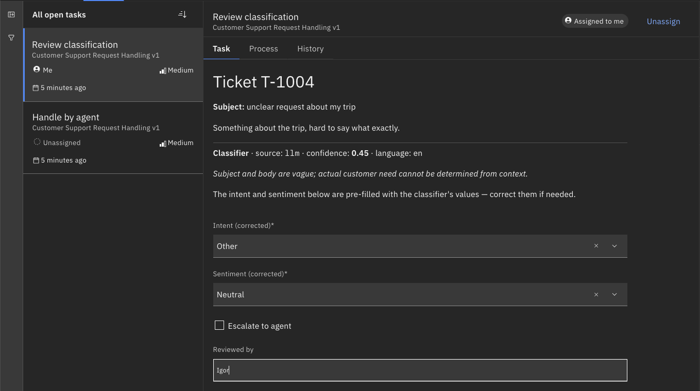

# Process design: Customer Support Request Handling v1

**Phase:** 2 (happy path)
**Status:** approved 2026-09-22
**Model file:** `processes/support-request-v1.bpmn`
**Process ID:** `support-request-v1`

## 1. Scope

Phase 2 delivers the process skeleton end to end: a message starts an instance, a stub worker completes every service task with deterministic values, user tasks are completed through the REST API, and five tickets travel five distinct branches to a resolved end state.

Deliberately out of Phase 2 (each has a hook below):

| Deferred to | What |
|---|---|
| Phase 3 | `route-ticket` becomes a DMN business rule task; `customerTier` drives `priority` |
| Phase 4 | Integration job types move to Go workers; `booking.*` call external services |
| Phase 5 | `ticket.classify` and `ticket.notify` call the LLM; `resolution` becomes an LLM input |

## 2. Flow

The four resolving branches feed `notify-customer` directly (multiple incoming sequence flows on a task, no join gateway — paths are exclusive).

## 3. Elements

| ID | BPMN type | Name | Implementation |
|---|---|---|---|
| `start-ticket-created` | Message start event | Ticket created | message `ticket.created` |
| `classify-ticket` | Service task | Classify ticket | job type `ticket.classify` |
| `route-ticket` | Service task | Route ticket | job type `ticket.route` |
| `gw-needs-review` | Exclusive gateway | Needs review? | conditions in §4 |
| `gw-intent` | Exclusive gateway | Intent? | conditions in §4 |
| `review-classification` | User task (Camunda user task) | Review classification | linked form `review-classification`; outputs `needsReview = false`, `intent`, `sentiment`, `escalate`, `reviewedBy` (v7, §12) |
| `record-review` | Service task | Record review | job type `review.record` (v7, §12); no I/O mappings |
| `gw-review-exit` | Exclusive gateway | Escalate? | conditions in §4 |
| `change-booking` | Service task | Change booking | job type `booking.change`; output `resolution = "booking_changed"` |
| `cancel-refund` | Service task | Cancel and refund | job type `booking.cancel`; output `resolution = "refund_issued"` |
| `answer-question` | Service task | Answer question | job type `ticket.answer`; outputs `resolution = "answered"`, `answerText`, `answerSource`, `answerKbIds` (v8, §11) |
| `handle-by-agent` | User task (Camunda user task) | Handle by agent | linked form `handle-by-agent`; output `resolution = "agent_handled"` |
| `notify-customer` | Service task | Notify customer | job type `ticket.notify` |
| `end-resolved` | End event | Resolved | — |

Conventions:

- Element IDs: kebab-case, `<object>-<verb>` or `gw-<question>`.
- Job types: `<domain>.<verb>`; domains are `ticket` and `booking`.
- `resolution` is set by an **output mapping** on the branch task (FEEL literal), not by the worker. Workers stay unaware of process routing; the model documents the outcome.
- User tasks are Camunda user tasks (Tasklist-managed), not job-worker user tasks. Forms are linked by form ID (`zeebe:formDefinition formId`), deployed as separate `.form` resources.
- Sequence flow IDs from gateways are snake_case and equal the `intent` value they select (`change_booking`, `cancel_refund`, `question`); element IDs stay kebab-case.

## 4. Gateway conditions

Every gateway has mutually exclusive conditions plus a default flow, so branch selection never depends on the order in which sequence flows are defined (see D2-7).

### `gw-needs-review`

| # | Target | Condition (FEEL) |
|---|---|---|
| 1 | `review-classification` | `needsReview = true` |
| 2 | `gw-intent` | default flow |

### `gw-intent`

| # | Target | Condition (FEEL) |
|---|---|---|
| 1 | `change-booking` | `intent = "change_booking"` |
| 2 | `cancel-refund` | `intent = "cancel_refund"` |
| 3 | `answer-question` | `intent = "question"` |
| 4 | `handle-by-agent` | default flow (covers `intent = "other"` and anything unexpected) |

### `gw-review-exit`

| # | Target | Condition (FEEL) |
|---|---|---|
| 1 | `handle-by-agent` | `escalate = true` |
| 2 | `route-ticket` (v7; `gw-intent` in v1–v6) | default flow |

Since v7 the default flow re-enters `route-ticket` (D5-4, §12): the DMN and `slaDeadline` are recomputed from the corrected `intent`/`sentiment`, then `gw-needs-review` passes the ticket on to `gw-intent` because `review-classification` set `needsReview = false` via output mapping — the loop is closed by that mapping, not by topology.

## 5. Variables

### 5.1 Start (message payload)

| Name | Type | Example | Notes |
|---|---|---|---|
| `ticketId` | string | `T-1001` | correlation key |
| `customerId` | string | `C-42` | |
| `customerTier` | string | `standard` | `standard` \| `premium` |
| `subject` | string | `Change my flight date` | |
| `body` | string | free text | |
| `language` | string | `en` | ISO 639-1 |
| `bookingRef` | string \| null | `BK-77` | null for non-booking tickets |
| `bookingValue` | number \| null | `540.00` | |
| `currency` | string \| null | `EUR` | ISO 4217 |

### 5.2 Produced by `ticket.classify`

| Name | Type | Values / rule |
|---|---|---|
| `intent` | string | `change_booking` \| `cancel_refund` \| `question` \| `other` |
| `sentiment` | string | `positive` \| `neutral` \| `negative` |
| `confidence` | number | 0.0–1.0 |
| `needsReview` | boolean | `confidence < 0.7` |

### 5.3 Produced by `ticket.route`

| Name | Type | Phase 2 stub rule |
|---|---|---|
| `team` | string | by intent: `change_booking` → `bookings`, `cancel_refund` → `refunds`, `question` → `support`, `other` (and anything else) → `escalation` |
| `priority` | string | `high` if `customerTier = "premium"` else `normal` |
| `slaHours` | number | `high` → 4, `normal` → 24 |

### 5.4 Produced by user task forms

| Task | Name | Type | Notes |
|---|---|---|---|
| `review-classification` | `intent` | string | overwrites classifier value |
| `review-classification` | `sentiment` | string | overwrites classifier value (v7) |
| `review-classification` | `escalate` | boolean | default `false` |
| `review-classification` | `reviewedBy` | string | reviewer name; `"unknown"` when the field is left empty (v7 output mapping) |
| `handle-by-agent` | `agentNote` | string | free text |

### 5.5 Produced by output mappings

| Task | Name | Type | Value |
|---|---|---|---|
| `change-booking`, `cancel-refund`, `answer-question`, `handle-by-agent` | `resolution` | string | `booking_changed` \| `refund_issued` \| `answered` \| `agent_handled` |
| `review-classification` | `needsReview` | boolean | `false` |
| `review-classification` | `intent`, `sentiment`, `escalate`, `reviewedBy` | as in §5.4 | v7: explicit pass-through mappings (D4-6 — any output mapping makes completion variables task-local, so the form values need mapping out) |

### 5.6 Produced by `ticket.notify`

| Name | Type | Phase 2 stub rule |
|---|---|---|
| `notificationTemplate` | string | `notify-<resolution>` |
| `notifiedAt` | string | ISO 8601 timestamp |

## 6. Message and correlation

| Property | Value |
|---|---|
| Message name | `ticket.created` (referenced by `start-ticket-created`) |
| Correlation key | not set in the model — a message start event opens no subscription; the key is carried by the published message: `correlationKey = ticketId` |
| Message ID | `messageId = ticketId` (optional uniqueness check) |
| Publish endpoint | `POST /v2/messages/publication` (REST API v2, Basic auth) |

Idempotency comes from the publisher side: the engine does not create a new instance for a message start event while an active instance created with the same correlation key exists, and a message with the same name, correlation key and ID is rejected while a copy is buffered. Verified against the Camunda 8.9 messages concept page on 2026-09-22.

*As of Phases 2–4.2. Since process v5 the only entry is the Kafka start event connector
(D4-4, §10); REST message publication is not used anymore, and dedup rides on the payload's
`messageId` with TTL PT1H (D4-5, `integrations-v1.md`).*

## 7. Phase 2 stub worker

One Python process (Python SDK per ADR-003) subscribed to all six job types in Phase 2; since Phase 3 routing lives in DMN (see `routing-v1.md`), and since Phase 4.2 the booking types run in the Go worker (`workers/booking/`) — the stub serves three: `ticket.classify`, `ticket.answer`, `ticket.notify`. This was a deliberate, temporary deviation from ADR-003's Go-for-integration split: it kept Phase 2 to a single moving part. (The Phase 2 plan had `ticket.answer` moving to Go as well; in the event it stayed in the stub.) `ticket.classify` and `ticket.notify` stay in Python for Phase 5.

Location: `workers/stub/` (renamed to `workers/llm-classifier/` in Phase 5). Configuration via env: `CAMUNDA_BASE_URL`, `CAMUNDA_USER`, `CAMUNDA_PASSWORD`. No secrets in the repo.

Deterministic behaviour, keyed on `subject` (case-insensitive):

| Job type | Rule |
|---|---|
| `ticket.classify` | contains `change` → `change_booking`, 0.92; contains `cancel` or `refund` → `cancel_refund`, 0.90; contains `?` or starts with `how`/`what`/`when` → `question`, 0.85; contains `unclear` → `question`, 0.40; otherwise `other`, 0.80. `sentiment` = `negative` if body contains `angry`/`terrible`, else `neutral`. `needsReview = confidence < 0.7`. |
| `ticket.route` | per §5.3 — moved to DMN in Phase 3 (`routing-v1.md`); the stub no longer serves this job type |
| `booking.change` | logs, returns `{}` |
| `booking.cancel` | logs, returns `{}` |
| `ticket.answer` | logs, returns `{}` |
| `ticket.notify` | per §5.6, logs `resolution` and template |

Every handler logs one line: `job=<type> ticketId=<id> -> <returned variables>`.

## 8. E2E test set

`tests/e2e/send-tickets.sh` publishes five messages and has two modes:

| Mode | Behaviour | Purpose |
|---|---|---|
| default (unattended) | completes user tasks itself via `POST /v2/user-tasks/search` + `POST /v2/user-tasks/{key}/completion`, then verifies paths and `resolution` | regression run after every model change |
| `--manual-user-tasks` | publishes messages, waits until tickets 4 and 5 reach their user task, prints the `taskKey`s and exits; user completes them in Tasklist, then runs `send-tickets.sh --check` for the same verification | acceptance run with Tasklist and Operate screenshots |

| # | `ticketId` | `subject` | Expected path | Completed with | `resolution` |
|---|---|---|---|---|---|
| 1 | `T-1001` | Change my flight date | classify → route → change-booking | — | `booking_changed` |
| 2 | `T-1002` | Please cancel and refund | classify → route → cancel-refund | — | `refund_issued` |
| 3 | `T-1003` | What is the baggage limit? | classify → route → answer-question | — | `answered` |
| 4 | `T-1004` | unclear request about my trip | classify → route → gw-needs-review → review-classification → record-review → gw-review-exit → route-ticket → gw-needs-review → gw-intent → answer-question (v7 loop) | `intent=question, needsReview=false, escalate=false` | `answered` |
| 5 | `T-1005` | Complaint about staff | classify → route → handle-by-agent | `agentNote="Called customer"` | `agent_handled` |

Tickets 1, 2 and 4 carry `bookingRef`/`bookingValue`/`currency`; 3 and 5 send `null` for all three. Ticket 5 has `customerTier = "premium"` to show `priority = "high"`.

## 9. Acceptance (Phase 2)

- [x] `support-request-v1` deployed from Desktop Modeler; version visible in Operate.
- [x] Stub worker running, all six job types polled (worker log).
- [x] Unattended run: `send-tickets.sh` exits 0; five completed instances in Operate, paths and `resolution` match §8, `notificationTemplate = notify-<resolution>`.
- [x] Manual run: `send-tickets.sh --manual-user-tasks`, tickets 4 and 5 completed in Tasklist, `send-tickets.sh --check` exits 0.
- [x] Screenshots in `docs/assets/phase-2/`: Operate diagram with all five paths highlighted (one per instance), variables panel of ticket 4, Tasklist form for tickets 4 and 5.
- [x] `docs/ops/install.md` updated with anything that broke (symptom → cause → fix).

## 10. v5→v6 changes (Phase 4.3–4.4)

Modeler checklist, brought in line with what is actually deployed: **process v6, DMN
routing-v1 v3**. v5 was deployed with the output mappings of the branch tasks missing
(D4-6 in `integrations-v1.md`) — v6 is the fix. Element IDs are load-bearing: the e2e path
verification (`tests/e2e/tickets.json`) expects exactly these. Secrets referenced below
exist as `SECRET_*` environment variables on the connectors container
(`infra/docker-compose.yml`). Screenshots of every panel referenced below are in
`docs/assets/phase-4/` (overview: `modeler-process-v6.png`).

New flow order: `start-ticket-created` → `classify-ticket` → `gw-has-booking-value` →
(`convert-booking-value` | skip) → `route-ticket` → `gw-needs-review` → … (unchanged) …
→ `notify-customer` → `publish-resolved` → `end-resolved`; on the cancel branch
`cancel-refund` → `convert-refund` → `notify-customer`.

| Element (id) | Type / template | Properties |
|---|---|---|
| `start-ticket-created` (keep the existing id) | Replace the plain message start event with **Kafka Message Start Event Connector** (`modeler-kafka-start-event.png`) | Bootstrap servers: `{{secrets.KAFKA_BOOTSTRAP}}` · Topic: `support.ticket.created` · Authentication: `Custom` with empty username/password fields (= PLAINTEXT) · Consumer group ID: `camunda-support-request` · Auto offset reset: `latest` · **Message ID expression**: `=value.messageId` · **Message TTL**: `PT1H` (dedup window, D4-5) · Correlation key: leave empty (message start) · Result expression: `={ticketId: value.ticketId, customerId: value.customerId, customerTier: value.customerTier, subject: value.subject, body: value.body, language: value.language, bookingRef: value.bookingRef, bookingValue: value.bookingValue, currency: value.currency, customerCurrency: value.customerCurrency, runId: value.runId}` |
| `gw-has-booking-value` | Exclusive gateway between `classify-ticket` and `route-ticket` (`modeler-gw-has-booking-value.png`) | Flow to `convert-booking-value`: `=bookingValue != null` (`modeler-flow-condition-booking-value.png`) · default flow: straight to `route-ticket` |
| `convert-booking-value` | Service task, **REST Outbound Connector** (HTTP JSON) | Method: `GET` · URL: `="{{secrets.FX_BASE_URL}}/convert?from=" + currency + "&to=EUR&amount=" + string(bookingValue)` · Authentication: none · Result expression: `={bookingValueEur: response.body.converted}` · Outgoing flow → `route-ticket` |
| `convert-refund` | Service task, **REST Outbound Connector** (HTTP JSON), between `cancel-refund` and `notify-customer` (`modeler-rest-convert-refund.png`) | Method: `GET` · URL: `="{{secrets.FX_BASE_URL}}/convert?from=" + refundCurrency + "&to=" + customerCurrency + "&amount=" + string(refundAmount)` · Authentication: none · Result expression: `={refundAmountCustomer: response.body.converted}` |
| `publish-resolved` | Service task, **Kafka Outbound Connector** ("Publish Message to Kafka"), between `notify-customer` and `end-resolved` (`modeler-kafka-publish-resolved.png`) | Bootstrap servers: `{{secrets.KAFKA_BOOTSTRAP}}` · Topic: `support.ticket.resolved` · Authentication: none · Serialization: JSON · Key: `=ticketId` · Value: `={ticketId: ticketId, resolution: resolution, team: team, priority: priority, slaDeadline: slaDeadline, refundAmountCustomer: refundAmountCustomer, runId: runId}` |
| `cancel-refund` | Existing service task — **add output mappings** (v6, D4-6) | `=bookingStatus` → `bookingStatus`, `=refundAmount` → `refundAmount`, `=refundCurrency` → `refundCurrency` (the task's v1 `resolution` mapping makes all completion variables task-local, so the worker's variables must be mapped out explicitly) |
| `change-booking` | Existing service task — **add output mapping** (v6, D4-6) | `=bookingStatus` → `bookingStatus` |
| `sla-policy` and `required-checks` (DMN, `decisions/routing-v1.dmn`, v3) | Decision table inputs (`modeler-dmn-sla-policy.png`) | Input expression `bookingValue` → `bookingValueEur` in **both** tables (D3-7; the DMN itself does not convert) |

Removed with v5/v6: nothing — the REST publication path disappears operationally (D4-4),
the model keeps the same single start event, now Kafka-backed.

## 11. v6→v7 changes (Phase 5.3)

Deployed as **process v7** (DMN unchanged, v3). The review loop now actually corrects the
routing (D5-4 in `llm-classifier-v1.md`) and the review outcome is recorded (5.3). Accepted
live in run `20260925T063333Z`.

*Tasklist — the v7 review form for T-1004: corrected intent and sentiment, escalate, reviewer.*

*Operate — T-1004's path: review-classification → record-review → gw-review-exit → route-ticket → gw-intent → answer-question.*

| # | Change | Why |
|---|---|---|
| 1 | `review-classification` gets explicit output mappings `intent`, `sentiment`, `escalate`, `reviewedBy` (FEEL: `"unknown"` when the form field is empty or undefined) next to the existing `needsReview = false` | **D4-6 defect:** the v6 task already carried one output mapping (`needsReview`), and any output mapping makes *all* completion variables task-local. The form's corrected `intent` therefore never reached the process scope — T-1004 corrected to `question` still ended in `handle-by-agent` (seen live in the 5.2 acceptance). Same root cause as the v5 branch tasks, fixed the same way |
| 2 | New service task `record-review` (job type `review.record`) between `review-classification` and `gw-review-exit`, no I/O mappings | Persists the review to `classification_review` (`workers/llm-classifier`, D5-3 semantics: DB failure fails the job). Sits before the gateway so the escalate path is recorded too |
| 3 | `gw-review-exit` default flow → `route-ticket` (was `gw-intent`); the loop then passes `gw-needs-review` → `gw-intent` | D5-4: DMN outputs and `slaDeadline` are recomputed from the corrected `intent`/`sentiment`. No second review: the output mapping set `needsReview = false`. Escalation still bypasses routing (the agent takes over) |
| 4 | `route-ticket` output `slaDeadline` is normalised in the mapping to plain ISO 8601 with a zone (`…Z` or `±hh:mm`) — the engine's `[GMT]` zone-id suffix is stripped | D3-11 closed (`routing-v1.md`): since v6 the value leaves the stand in `support.ticket.resolved`, and external consumers expect ISO 8601 |

E2E (`tests/e2e`): `record-review` is part of T-1004's expected path and an allowed extra
element for any other ticket that visits review; `--check` asserts the ISO format of
`slaDeadline` for every ticket and the `classification_review` row for T-1004
(`llm_intent = other`, `final_intent = question`).

### v7→v8 (Phase 5.4)

Deployed as **process v8** (DMN unchanged). One change: `answer-question` gets three
pass-through output mappings next to its `resolution` literal — `=answerText` →
`answerText`, `=answerSource` → `answerSource`, `=answerKbIds` → `answerKbIds`. Without
them the LLM answer produced by `ticket.answer` (5.4, `llm-classifier-v1.md` §6) would
stay task-local and never reach `notify-customer`. `notify-customer` has no output
mappings, so `customerMessage`, `messageLanguage` and `notifySource` land in the process
scope directly.

**D4-6 rule of thumb, third occurrence (v5 branch tasks, v7 user task, v8 answer task):**
a task with *any* output mapping must map out *every* completion variable it wants in
the process scope. Corollary for this model: every task that carries a `resolution`
literal is affected, so a new worker variable on `change-booking`, `cancel-refund`,
`answer-question` or `handle-by-agent` always comes with a mapping.

Accepted live in run `20260925T121224Z`.

*Operate — T-1003 variables: `answerText` and `answerKbIds` in the process scope via the v8 mappings, `customerMessage` from notify-customer.*

*Operate — T-1002: `refundAmountCustomer` repeated verbatim inside `customerMessage` (grounding check D5-9).*

*Tasklist — the fixed review form (5.5, redeployed on v8, accepted in run `20260925T142455Z`): the "LLM classification" block shows source, confidence, language and rationale only, so a corrected select no longer overwrites the LLM snapshot on screen.*

## 12. Decisions

| # | Decision | Rationale |
|---|---|---|
| D2-1 | `review-classification` returns to `gw-intent` (v7: via `route-ticket`, D5-4); `escalate` is the exit to the agent | Keeps the guardrail a guardrail, not a second agent path |
| D2-2 | One `notify-customer`; branch identity carried in `resolution` | One job type, one LLM hook in Phase 5; branches stay visible in Operate via path and variables |
| D2-3 | `resolution` set by output mapping, not by workers | Routing knowledge lives in the model |
| D2-4 | `intent` ∈ {`change_booking`, `cancel_refund`, `question`, `other`}; review threshold `confidence < 0.7` | Four values map onto the branches without ambiguity; `other` falls to the default flow |
| D2-5 | Single Python stub worker for all job types in Phase 2 | Temporary; Phase 4 restores the ADR-003 split |
| D2-6 | Install run time recorded as ≤ 10 min without errors, to be measured on the next clean run | Not timed during the Phase 1 acceptance run |
| D2-7 | Separate `gw-needs-review` before `gw-intent`; gateway conditions must be mutually exclusive | In v2 a single gateway with `needsReview = true` listed first still took the `intent = "question"` flow for a ticket where both were true. Relying on sequence-flow order is fragile; the structural split removes the dependency and makes the review path visible in Operate |
