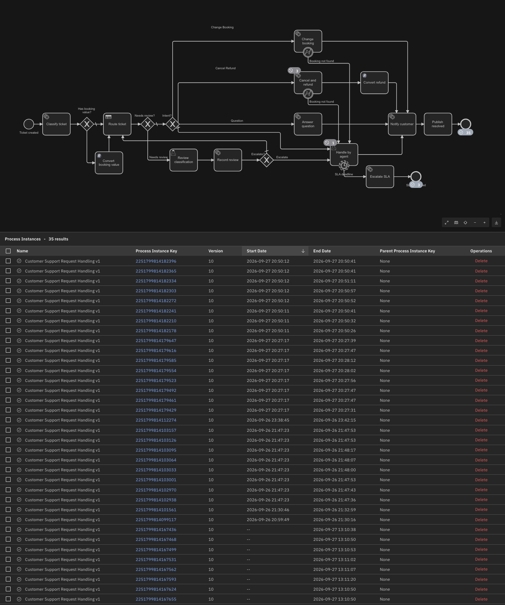

# Runbook: backup and restore

**Scope:** a full, consistent backup of the stand and its restore on the same version —
Orchestration Cluster (Zeebe partitions, Operate/Tasklist indices), Elasticsearch
snapshots, and the PostgreSQL audit database. All three stores live on the VM's local disk
under `/srv/camunda-backups/{es,zeebe,pg}` (ADR-008): they protect against operator
mistakes, bad deployments and the restore rehearsal, **not** against losing the VM. Copying
that directory off-host is one `rsync` line this project does not automate.
Kafka (KRaft) is **not** backed up: its topics are transient (message dedup by `messageId`,
TTL 1 h); a ticket that was in flight during a restore is re-sent by the producer.

**Status:** rehearsed on the stand 2026-09-27 — three backup/restore round-trips (§3, §6
*Observed*): the first found the repository gap in §3 and the integrity finding in §6, the
second and third, with mitigation A in place, came back complete.
Design: `docs/design/operations-v1.md` §5. Scripts: `tests/ops/backup.sh`,
`tests/ops/restore.sh`, `tests/ops/pg-backup.sh`, `tests/ops/pg-restore.sh`,
`tests/ops/verify-state.sh`. All run on the stand host, in `infra/`, as the deploy user;
none prints a secret.

## 1. What is backed up, and where

| Store | Mechanism | Config | Host path |
|---|---|---|---|
| Zeebe partitions | `POST :9600/actuator/backupRuntime` | `camunda.data.primary-storage.backup.store: FILESYSTEM`, `…filesystem.base-path: /usr/local/camunda/backup` (8.9 unified keys, confirmed 2026-09-27: `FilesystemBackupStore created`). The host path must be owned by uid **1001** | `/srv/camunda-backups/zeebe/<partition>/<backupId>` |
| Operate / Tasklist indices (web apps) | `POST :9600/actuator/backupHistory` → ES snapshots `camunda_webapps_<id>_<version>_part_n_of_m` | `camunda.backup.webapps.enabled: true`, `camunda.data.secondary-storage.elasticsearch.backup.repository-name: camunda` (the docs' `camunda.data.backup.repository-name` is accepted as legacy) | `/srv/camunda-backups/es` (repository `camunda`, type `fs`, `path.repo` on the ES service) |
| Day-suffixed indices of today and yesterday (`*_YYYY-MM-DD`) | explicit ES snapshot `camunda_dated_<id>`, taken when such indices exist — belt and braces for the same-day gap (§6); `restore.sh` restores from it only the indices the web-apps parts did not bring back | — | same repository |
| Exported `zeebe-record*` indices | ES snapshot, **only if such indices exist** (they belong to the old Elasticsearch exporter; the stand runs the Camunda Exporter) | — | same repository |
| PostgreSQL (`llm_audit`, `classification_review`, `sla_escalation`) | `pg_dump -Fc` | — | `/srv/camunda-backups/pg/camunda_support_<id>.dump` |

One integer **backup id** (`date +%s`, monotonic) names the whole set. The management
port 9600 and Elasticsearch 9200 are not published; the scripts call them with curl inside
the `elasticsearch` container.

## 2. Backup

```bash
tests/ops/verify-state.sh > /tmp/state-before.txt     # what must come back
tests/ops/backup.sh                                    # prints the backupId and a summary
```

Order (8.9 backup guide, mandatory, plus one step of our own in front): **wait until the
exporter is in sync** (mitigation A, §6: `zeebe_exporter_last_updated_exported_position` ≥
`zeebe_stream_processor_last_processed_position` on every partition, polled every 2 s,
`EXPORTER_SYNC_TIMEOUT` 120 s, abort on timeout) → soft-pause exporting → web-apps backup →
wait `COMPLETED` → `zeebe-record*` snapshot if present → Zeebe partition backup → wait
`COMPLETED` → resume exporting → `pg_dump`. Pause and resume answer HTTP 200 with
`"status":204` on success. A trap resumes exporting on any failure, so a failed backup never
leaves the exporter paused (a paused exporter stops log compaction and grows the disk). The
sync wait runs before the pause, so an aborted wait leaves nothing to undo.

**Observed 2026-09-27**, backup id `1790507500` on 8.9.21: web-apps backup
`camunda_webapps_1790507500_8.9.21_part_1_of_7` … `_part_7_of_7`, all `SUCCESS`; no
`zeebe-record*` indices (Camunda Exporter) — step skipped; `backupRuntime`: partition 1
`COMPLETED`, broker version 8.9.21; `pg_dump` 25 KB (owned by `root:root` — `pg_dump` runs
as root in the container, normal). On disk: `es` 17 MB, `zeebe` 129 MB, `pg` 32 KB.
**Observed 2026-09-27, backups 1790534421 and 1790535095** (round-trips #2 and #3, with
step 0b): `wait_exporter_sync` logged `exporter lag = 0 on all partitions (waited 0s)` both
times — the stand was idle, the wait never had to hold. Run logs `state-before-2.txt` and
`backup-2.log` (round-trip #2; raw run output kept on the VM, not in the repository). Two
more backups exist on disk without a restore (1790533211, 1790534841, taken without fresh
instances; harmless).

## 3. Restore

Preconditions: **same image version** as the backup (the version is in the snapshot names),
no ACTIVE instances (the script refuses otherwise), a window without traffic, and `.env`
complete against `.env.example` (`comm -23 <(grep -o '^[A-Z_]*=' .env.example | sort) <(grep -o '^[A-Z_]*=' .env | sort)` prints nothing; `docs/ops/install.md`).

```bash
tests/ops/restore.sh <backupId>                        # full sequence
tests/ops/restore.sh <backupId> --pause-after-seed     # stops after the clean start (empty Operate) for a screenshot
```

Order (8.9 restore guide): `docker compose down` and removal of the `camunda` and
`elastic` volumes (the backups are bind mounts and stay) → clean start of Elasticsearch and
the Orchestration Cluster so the index templates are seeded → stop the cluster → delete every
index matching `camunda|operate|tasklist|optimize|zeebe` → restore each snapshot of the set
with `wait_for_completion=true` → remove the `camunda` volume again (the seed start wrote
to it; the data dir **must be empty**) → `bin/restore --backupId=<id>` under
`SPRING_PROFILES_ACTIVE=restore` with the same `application.yaml` (success line
`Successfully restored broker from backup`) → start everything → `pg_restore --clean` →
`verify-state.sh` and diff against the pre-backup output.

**Observed 2026-09-27, first run — failed at the snapshot step and was fixed:** after the
clean start the repository `camunda` was gone (it is cluster state in the removed `elastic`
volume; the files under `/srv/camunda-backups/es` were intact), so `_snapshot/camunda/_all`
was 404 and the script stopped with `jq: error Cannot iterate over null`, leaving the stand
mid-restore (volumes wiped, templates seeded, 36 indices deleted, cluster stopped, ES up).
`restore.sh` now re-registers and verifies the repository right after the seed
(`ensure_repo`), lists the set from the repository instead of `backupHistory`, refuses with
a clear message when the set is missing, and is re-runnable from any intermediate state
(down, volume removal and index deletion tolerate what is already gone).
`--pause-after-seed` worked as intended: at the pause after the clean start of step 2,
Operate was empty — index templates seeded, no process deployed, fresh users from
`application.yaml` (run log; no screenshot kept).

**Observed 2026-09-27, run 3 — success end to end:** step 2b registered the repository, 7
snapshots restored with 0 failed shards, `bin/restore`: `Successfully restored broker from
backup [1790507500]`, `pg_restore` row counts 229 / 18 / 3 as before. `verify-state` after:
v10 latest, COMPLETED 178, TERMINATED 9, ACTIVE 0 — with **ACTIVE 8 transient** right
after the start, gone within a minute (the exporter re-processing its tail), and
**esIndices 105 against 95 before** (the archiver created the day-suffixed indices for
2026-09-27 right after the start). Log e-04 (`restore-1790507500-run3.log`). One integrity
finding, see §6.

**Observed 2026-09-27, round-trips #2 and #3 — clean:** backup 1790534421, taken ~12 min
after 8 e2e instances completed (COMPLETED 186), and backup 1790535095, taken 24 s after
the last of 8 new instances completed (last `endDate` 18:51:11Z, backup 18:51:35Z,
COMPLETED 194 — the exact window in which round-trip #1 lost `startDate`). Both
`restore.sh` runs went through steps 1–7 without intervention; in both, step 4 logged
`camunda_dated_<id>: every day-suffixed index already came back with the parts — skipped`.
`verify-state.sh` 90 s after each restore: every count identical to the pre-backup output,
only `esSnapshots` and `zeebeBackups` differ, and all three `newest instance` lines carry
`start=`. The reading of these two runs — what they show and what they do not — is in §6.



*e-05 — Operate, process `support-request-v1` v10 after the restore of round-trip #3:
35 Completed. The view is filtered to v10; `verify-state.sh` counts 194 COMPLETED across
all versions. The eight instances of run 20260927T111019Z, restored in round-trip #1, still
show Start Date "--"; the sixteen instances of round-trips #2 and #3 have their start dates.*

## 4. Verify

`tests/ops/verify-state.sh` prints the engine version, the latest `support-request-v1`
version and definition count, instance counts per state, active incidents, open user tasks,
the three table row counts, the index count, the snapshot count and the Zeebe backup count.
Take it before the backup and **at least one minute after** `orchestration` is healthy
again: right after the start the exporter re-processes its tail, so instance counts can
show a transient ACTIVE figure that settles within a minute. The counts must then match
(instances that finished between the two runs are the only legitimate difference).
`esIndices` is expected to **grow**: the archiver creates the current day's suffixed
indices as soon as it runs. The `newest instance` lines are the integrity check — every one
must carry a `startDate`; `start=null` on a recent instance means it was rebuilt from
re-exported completion records instead of restored (§6).

## 5. Failure modes

| What you see | Cause | Action |
|---|---|---|
| `backupRuntime` answers an error instead of a list | Zeebe backup store not configured | check the keys in `application.yaml` (§1), `docker compose up -d --force-recreate orchestration` |
| container `healthy`, API says "partition 1 is currently INACTIVE with no leader", log `AccessDeniedException …/backup/contents`, `Failed to install partition 1` | the Zeebe backup path is not writable by uid 1001 (observed 2026-09-27, ~70 min leaderless) | `chown 1001:1001 /srv/camunda-backups/zeebe`, `--force-recreate orchestration`; run the smoke's writability checks **before** any recreate with backup keys — `healthy` means the management port answers, not that a partition processes |
| `restore.sh`: `jq: error Cannot iterate over null`, `_snapshot/camunda/_all` 404 after the clean start | the repository registration went with the `elastic` volume | fixed in the script (`ensure_repo` after the seed); by hand: the `PUT /_snapshot/camunda` from `_lib.sh`, then re-run `restore.sh <id>` |
| `backupHistory` answers 404 | snapshot repository not registered or name mismatch | `backup.sh` registers `camunda`; the name must equal `camunda.data.backup.repository-name` |
| `exporting/pause` answers `"status":500` | a broker is not running | wait for `orchestration` healthy, retry |
| restore app: "data directory is not empty" | the `camunda` volume survived | `restore.sh` removes it before the restore; by hand: `docker compose rm -sf orchestration && docker volume rm infra_camunda` |
| restore app: no valid backup with the given id | id typo, or the Zeebe store path differs from the backup's | `ls /srv/camunda-backups/zeebe/1/` lists the ids |
| snapshot restore fails with "index already exists" | indices were not deleted | repeat step 3 of `restore.sh` by hand |

## 6. Limits

- Local disk only (ADR-008). A lost VM loses the backups with the data.
- Kafka is not backed up; PostgreSQL is dumped in the same window but not paused — a row
  written between the two steps is in the dump and not in the process data, which is the
  harmless direction (an audit row without a process instance).
- **Restore-path data loss for instances finished shortly before the backup (observed
  2026-09-27, backup 1790507500) — cause found, not in the backup.** Eight instances that
  completed 20–60 s before the backup (11:10–11:11Z, pause 11:11:40Z) came back after the
  restore as COMPLETED with `endDate` but **`startDate = null`**, living only in
  `operate-list-view-8.3.0_2026-09-27`, an index the archiver created at 16:05:17Z after the
  restore. The **snapshot was intact**: restoring part 2 of 7 under a renamed copy showed
  key 2251799814167655 with `startDate 2026-09-27T11:10:20.527Z` and `endDate 11:10:50.851Z`.
  So the loss happens **after** `bin/restore`, when two things run at once on the freshly
  started cluster:

  1. **Re-export.** Zeebe resumes exporting from the last *acknowledged* exporter position
     in the backup, which was about 1.5 minutes behind the pause (the exporter acknowledges
     positions when it flushes its bulk; the tail covered the whole e2e run, ~584 list-view
     documents). Every record of those instances is exported again.
  2. **Archiver.** The Camunda Exporter's archiver moves finished instances into the day's
     index `waitPeriodBeforeArchiving = 1h` after their `endDate`, checking every
     `delayBetweenRuns = 2 s`. Right after the restore the eight instances are hours old, so
     the first archiver pass moves the full documents from `operate-list-view-8.3.0_` into
     `…_2026-09-27` and deletes them from the main index.

  When a re-exported completion record then arrives, the list-view handler writes it as an
  **upsert**: an update of `state`, `endDate` and process metadata if the document exists,
  otherwise a new document from the same partial entity — and `startDate` is set only by the
  activation record. The main-index document is already gone, so a partial document is
  created there. The next archiver pass moves it into the dated index with a reindex whose
  destination has **no `op_type`** (default `index`, `conflicts: proceed` — 8.9 source,
  `ElasticsearchArchiverRepository.reindexDocuments`), which **overwrites the full document
  with the partial one**, then deletes it from the main index. Net effect: one document per
  key, in the dated index, without `startDate`. (Your hypothesis had the same outcome with the
  opposite mechanism; the source shows overwrite, not create.)

  What is and is not affected: only instances whose records lie between the acknowledged
  exporter position and the pause (here ~1.5 min) **and** that are old enough to be archived
  at restore time (finished > 1 h before the restore — always true for a restore rehearsal
  hours later). Instances that finished earlier are restored complete and are not re-exported;
  instances still ACTIVE at backup time get their records re-applied to existing documents.
  `camunda_dated_<id>` (§1) stays as an extra Elasticsearch snapshot of the day-suffixed
  indices, but it is **not** a mitigation for this: the affected documents were in the main
  index at backup time and are lost after the restore, not missing from the backup.

  Mitigations — decision 2026-09-27: **A + D applied**, **B documented** (not rehearsed),
  **C rejected**.

  | Option | How | Trade-offs | Applied |
  |---|---|---|---|
  | A. Close the exporter gap before pausing | `backup.sh` step 0b calls `wait_exporter_sync` (`tests/ops/_lib.sh`) before `exporting/pause`: it scrapes `/actuator/prometheus` (management port) and waits until, on every partition, `lag = max(0, zeebe_stream_processor_last_processed_position − zeebe_exporter_last_updated_exported_position{exporter="camundaexporter"})` is 0. Polls every 2 s, `EXPORTER_SYNC_TIMEOUT` 120 s; on timeout it prints the last lag per partition and aborts the backup (nothing is paused yet). Only records of the pause window are then re-exported after a restore. **The condition is `updated ≥ processed`, not equality:** the updated (acknowledged) position normally runs *ahead* of the processed position by the follow-up events of the last command (stand: 981013 vs 981012, 981033 vs 981032). Do not "fix" it back to `==`. The *updated* gauge is used, not `zeebe_exporter_last_exported_position`, because the updated position is the one persisted in the exporter state and the one a restore resumes from. | cheap, addresses the root of the tail; needs traffic to be quiet for a few seconds; does not help for a backup taken under load. A **stable, non-growing positive lag** on timeout is usually job polling by the workers (each poll is a processed record that the exporter only acknowledges once it is otherwise up to date): raise `EXPORTER_SYNC_TIMEOUT`, or — the standard fallback — stop the workers for the backup window: `docker compose stop worker-booking worker-llm-classifier && tests/ops/backup.sh && docker compose start worker-booking worker-llm-classifier` | **yes** — `backup.sh` step 0b, `wait_exporter_sync`, `EXPORTER_SYNC_TIMEOUT` |
  | B. Start with the archiver held back | Procedure, for a restore of a backup taken under load: (1) after `bin/restore`, before the first start, add a temporary compose override for `orchestration` that sets `camunda.exporters.camundaexporter.args.archiver.waitPeriodBeforeArchiving: P7D` (property path to be confirmed on the stand at that time — 8.9 docs); (2) `docker compose up -d orchestration`, wait for healthy; (3) `wait_exporter_sync 600` from `tests/ops/_lib.sh` — the re-export tail is applied to the full documents while the archiver stays idle; (4) remove the override, `docker compose up -d --force-recreate orchestration`, wait for healthy; (5) `verify-state.sh` — every `newest instance` line must carry a `start=`. | deterministic: the re-export updates full documents before anything is moved; costs one extra restart and a temporary config; the property path must be confirmed on the stand | **no** — documented procedure, not rehearsed |
  | C. Re-restore the main indices after the exporter settles | after step 7, delete `operate-list-view-8.3.0_` and the other main indices again and restore parts 2, 4, 6; the archiver then moves the full documents and, because its reindex overwrites, repairs the partial documents in the dated indices | works with the overwrite semantics found above; ugly (a second deletion of live indices, Operate briefly empty), and only repairs what was in the main index at backup time | **rejected** — a second deletion of live indices, and it repairs only what was in the main index at backup time |
  | D. Accept and check | keep the procedure, take rehearsal backups a few minutes after the last completed work, and treat `start=null` on the `newest instance` lines of `verify-state.sh` as the integrity signal | zero engineering; the loss window stays for real restores taken under load | **yes** — the `newest instance … start=` integrity lines of `verify-state.sh`, run after every restore |

  Applied combination: **A + D** on the stand (exporter acknowledged up to the processed
  position before the pause, integrity check after every restore); **B** is the documented
  fallback for a restore whose backup was taken under load.

  **Observed — round-trips #2 and #3 (2026-09-27, 8.9.21, A in `backup.sh`).** The loss
  did **not reproduce in 2 of 2 clean round-trips**: backup 1790534421, taken ~12 min after
  the last completion, and backup 1790535095, taken 24 s after it (last `endDate`
  18:51:11Z, pause 18:51:35Z — the same window as round-trip #1); both restores clean, all
  `newest instance` lines with `start=`, counts identical (§3). What this does and does not
  show: in both runs `wait_exporter_sync` logged `exporter lag = 0 on all partitions (waited 0s)` — **A never
  actively waited**, so the runs do not exercise A, they exercise a quiet stand. The
  mechanism above (re-export tail × archiver overwrite) therefore remains the
  **best-supported hypothesis, not a confirmed cause**: it is consistent with the source and
  with the snapshot-peek evidence, but round-trip #1 differed in two other ways — the
  exporter lag was not measured at that backup, and the restore was the third attempt after
  two failed ones (the missing repository registration, §3) plus a peek-restore of part 2
  into a renamed index. **A is kept** as protection against the one cause that is measurable
  before the pause; D stays the check after every restore. Evidence for the pending
  `camunda_dated_<id>` decision (`docs/backlog.md`): the dated snapshot was taken in both
  runs and **skipped by `restore.sh` in both** — every day-suffixed index came back with the
  web-apps parts. It is not removed yet.

  Known-issue search (camunda/camunda, 2026-09-27, unauthenticated GitHub search over
  "restore missing startDate", "exporter re-export after restore", "archiver overwrite
  document restore", "backup restore list-view archiver"): **no issue describes this
  loss.** Nearest related items: PR #47413 "docs: clarify soft-pause exporter behavior in
  backup/restore context" (the re-export after a restore is documented as intended
  behaviour), issue #9105 "Understand consistency requirements of Operate backup" (2022,
  closed), and issue #54736 (an actuator endpoint to reset exporter metadata, open). The
  archiver's overwrite of a restored document by a re-exported partial one is not reported
  there. After the round-trips above it is material for an **observation report** (one
  occurrence, no reproduction), not a bug report with steps — `docs/backlog.md`, Phase 7.
- **Identity data and the backup (6.5).** Users, roles, authorizations and memberships are
  engine state in 8.9 (source, `stable/8.9`: `zeebe/engine/…/state/user/DbUserState.java`,
  `…/state/authorization/DbAuthorizationState.java`), so they travel with the Zeebe
  partition backup; the Camunda Exporter writes them into identity indices of the secondary
  storage (`UserCreatedUpdatedHandler`, `AuthorizationCreatedUpdatedHandler`) — on the stand
  `camunda-user-8.8.0_`, `camunda-authorization-8.8.0_`, `camunda-role-8.8.0_`,
  `camunda-group-8.8.0_`, `camunda-tenant-8.8.0_`, `camunda-mapping-rule-8.8.0_`
  (`_cat/indices`, 2026-09-28). **Observed in the snapshot index list, restore not tested:**
  none of these six indices is in any of the eight snapshots of set 1790598065 (seven
  web-apps parts plus `camunda_dated`), so the web-apps backup carries no identity data, and
  `restore.sh` step 3 deletes those indices (they match `camunda`). What rebuilds them after
  a restore is not stated in the 8.9 backup guide as far as we read it; the identity-as-code
  page says only that Admin "checks only the ID to decide whether an entity already exists"
  and never updates an existing one, without saying whether that check reads the engine or
  the secondary storage. What the three round-trips showed: `admin` could log in after each
  restore (a user from `application.yaml`). `worker`, created through the API and not in
  `application.yaml`, has never been through a restore. **Rule after ANY restore:**
  `tests/ops/create-worker-user.sh --verify`; if it fails, `tests/ops/create-worker-user.sh`
  (idempotent). If that run answers 409 on `POST /v2/users`, the user exists in engine state
  but not in the identity index — stop and record it; this is the open point in
  `docs/backlog.md` (Phase 7: verify identity state on the next restore rehearsal). Because
  passwords are part of the same engine state, a restore should also **revert every user
  password to backup time** (follows from the above, not tested): if a password was rotated
  since (`docs/runbooks/password-rotation.md`), rerun the rotation or put back the `.env`
  that matches the backup. Sessions are lost in every case.
