# Runbook: incident handling (scenario A — resolve in place)

**Scope:** incidents whose cause is outside the process model — bad data, a failing
downstream service, a configuration error, an absent worker. The model is right, so the
instance is kept and the incident is resolved in place. Incidents caused by the model
itself (an uncaught BPMN error) are scenario B, resolved by migration — `migration.md`;
the timeout variant of scenario A is in `timeout.md`.

**Last run:** 2026-09-26 on the stand, process v8, every case below executed as written.
Design and observed results: `docs/design/operations-v1.md` §3.1.

Conventions: "on the stand host, in `infra/`" means an SSH session to the VM as the deploy
user in `/opt/camunda-support-automation/infra`. Steps marked **as root on the stand
host** need `su -` first: `infra/.env` is root-owned. Workstation commands need the same
environment as the e2e (`CAMUNDA_BASE_URL`, `CAMUNDA_USER`, `CAMUNDA_PASSWORD`,
`STAND_IP` or `KAFKA_BROKER`, `STAND_HOST` for `make`). No command here contains an
address or a password; they come from the shell environment and `infra/.env`.

## 1. Triage — the first two minutes

1. **Both views over the API** (workstation):

   ```bash
   tests/e2e/send-tickets.sh --incidents
   ```

   Section one lists ACTIVE incidents with `incidentKey`, `processInstanceKey`,
   `elementId`, `errorType` and the full `errorMessage`. Section two lists CREATED jobs
   older than 60 s that no worker ever activated — an empty first section with entries in
   the second means a worker is missing, not that the stand is healthy (case A3a).
2. **Operate:** Processes → filter *Incidents* only. The failing element is highlighted in
   the diagram; in the instance the Incidents tab shows the type, and the full message is
   behind **More** (the list truncates it).
3. **Worker log, filtered by the instance or job** (on the stand host, in `infra/`):

   ```bash
   docker compose logs --since 30m worker-booking | grep <processInstanceKey>
   docker compose logs --since 30m worker-llm-classifier | grep <jobKey>
   ```

   The booking worker's WARN line names the instance, the element, the HTTP status and
   the retries left; the classifier's `Job failed:` line carries the audit error.
4. **Containers and restarts** (on the stand host, in `infra/`):

   ```bash
   docker compose ps
   docker inspect -f '{{.RestartCount}}' worker-llm-classifier worker-booking
   ```

   `Up N seconds (health: starting)` looks normal even in a crash loop, because the
   healthcheck resets on every restart. A restart count that grows between two calls is
   the reliable signal.

## 2. Decision table

| What you see | Likely class | Fix | Retry? |
|---|---|---|---|
| `JOB_NO_RETRIES`, message names a request with a **bad identifier** (`booking-api HTTP 500 on POST /bookings/BK-FAIL-500/cancel`), classification correct | data | edit the variable in Operate (Variables tab, pencil) | **Retry** the instance |
| `JOB_NO_RETRIES` on **several instances**, same HTTP status (`503`) on different identifiers, booking-api container healthy | downstream outage | wait for, or fix, the downstream service (`make fault-off` in the drill) | **batch Retry** from the instance list |
| `JOB_NO_RETRIES` on `classify-ticket`, message `audit write failed: …` | configuration / dependency of a worker | bring the dependency back (`docker compose start postgres`) | **Retry** |
| **No incident**, instances stay Active on `classify-ticket`, `--incidents` section two lists the job, restart count grows | worker absent | fix the worker's config, `docker compose up -d <worker>` | **no Retry** — the job was never failed, the worker picks it up |
| `UNHANDLED_ERROR_EVENT`, message "Expected to throw an error event with the code '…' … but it was not caught" | **model gap** — the worker threw a BPMN error the deployed version has no catch event for | deploy the fixed version, **migrate** the instance to it, then Retry — `migration.md` | **Retry only after the migration** |
| `JOB_NO_RETRIES` with `httpStatus=0` and "timeout after 10s" in the message; incident ≈ 50 s after the first attempt | downstream **slow or hung**, not necessarily down | check the dependency first, then Retry (recovered) or Cancel (never valid) — `timeout.md` | **Retry** if recovered |
| the corrected data changes the **inputs of a decision already passed** (`route-ticket`: team, priority, SLA) | data, upstream | Retry re-runs only the failed step and does not recompute earlier decisions | **Modify** (move the token back to `route-ticket`) or **Cancel** and resubmit the ticket |

Every variable edit and every Retry is recorded in the instance's **Operations Log** tab —
the audit trail of manual changes on a production instance.

## 3. Case A1 — bad data (`BK-FAIL-500`)

**Trigger (workstation):**

```bash
tests/e2e/send-tickets.sh --probe-booking-5xx      # prints "T-9002 <processInstanceKey>"
```

**Symptom.** Three attempts at T, T+10 s and T+20 s with the **same jobKey**, `retriesLeft`
2 → 1 → 0, then an incident about 20 s after the first failure:

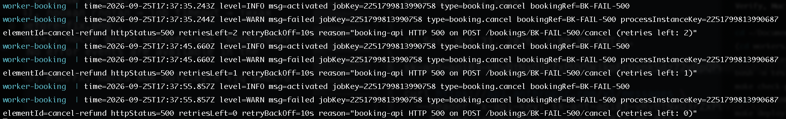

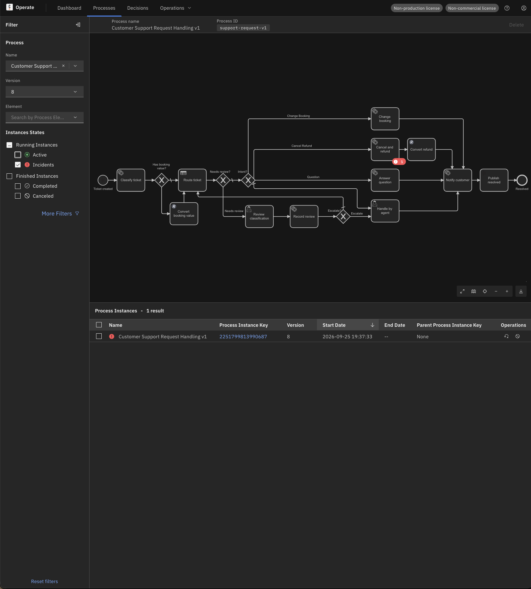

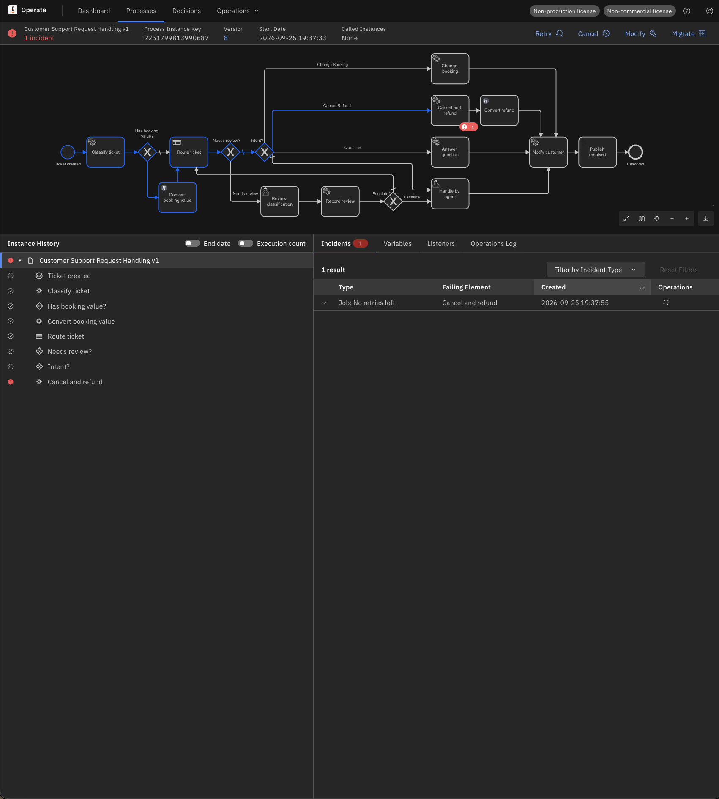

The Incidents tab shows *Job: No retries left.* and the Job ID, which is the `jobKey` from
the log; the full message is behind **More**:

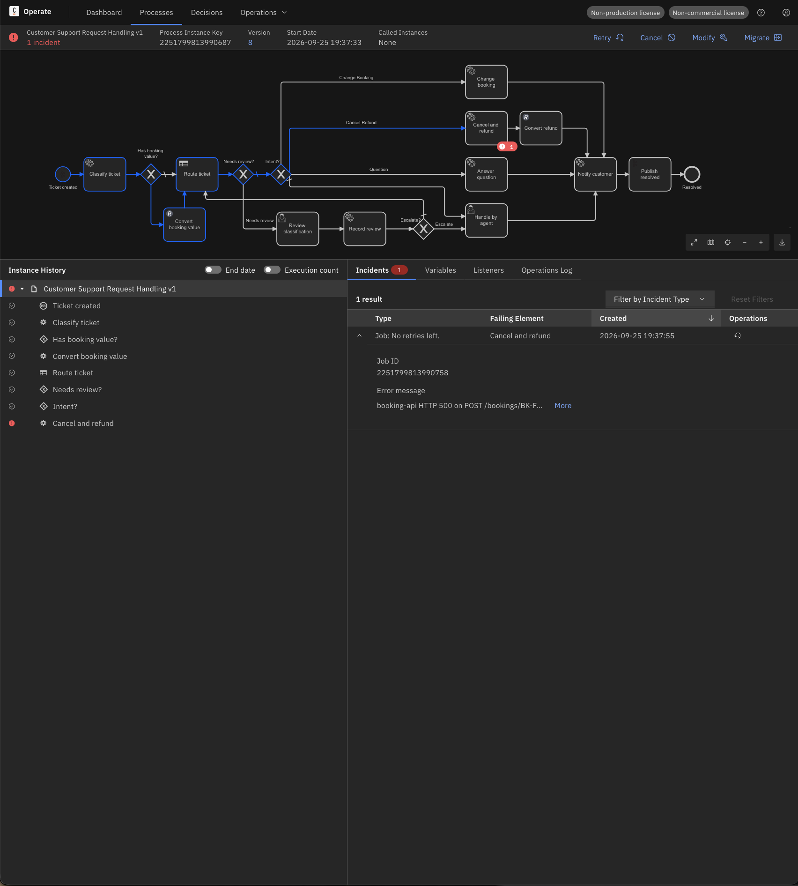

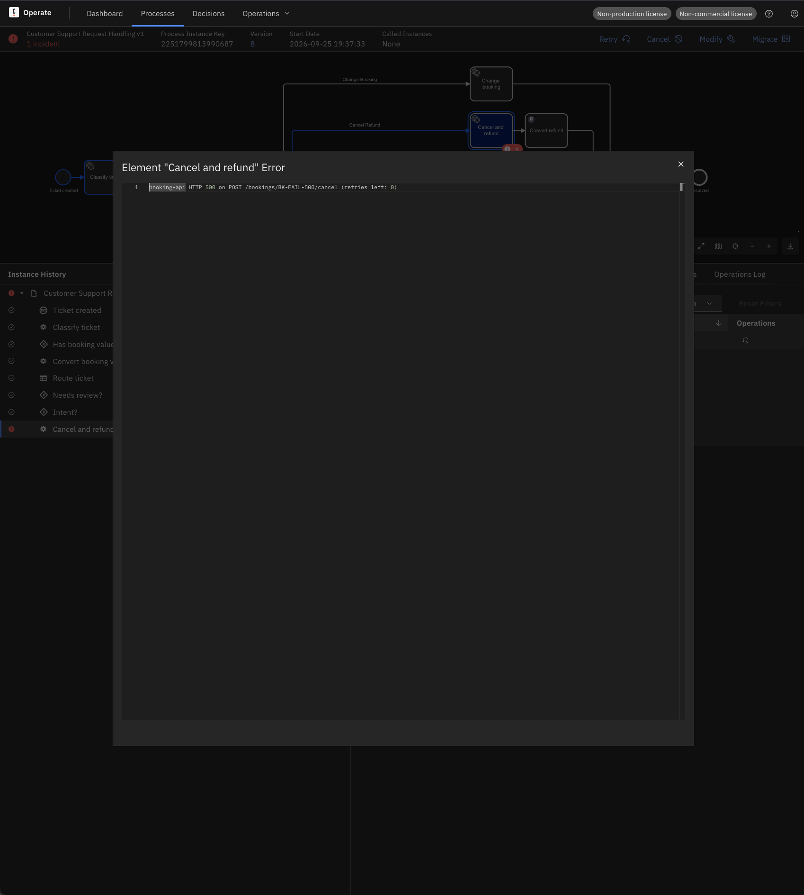

```
booking-api HTTP 500 on POST /bookings/BK-FAIL-500/cancel (retries left: 0)
```

**Diagnosis.** Variables tab: `intent = cancel_refund`, `confidence = 0.95` — the
classification is right, the booking reference is bad data.

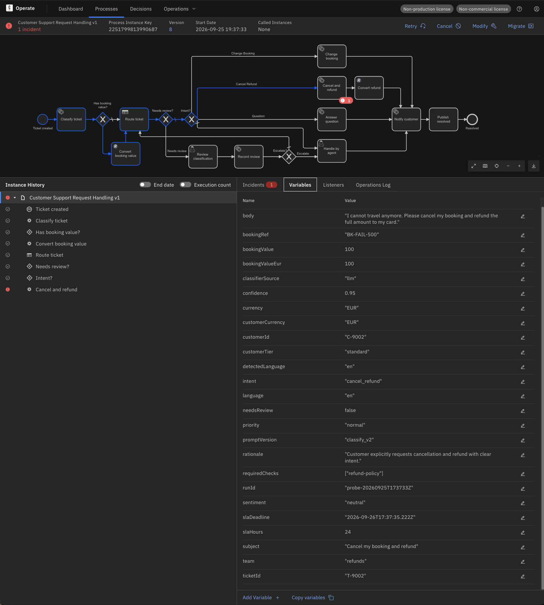

**Fix (Operate).** Variables → edit `bookingRef` → `"BK-90"` → save. Then **Retry** (top
right, or the arrow icon in the incident row).

**Verify.** The instance continues through `convert-refund` → `notify-customer` →
`publish-resolved`; `refundAmount = 210`, `refundCurrency = EUR`, `bookingStatus = cancelled`.

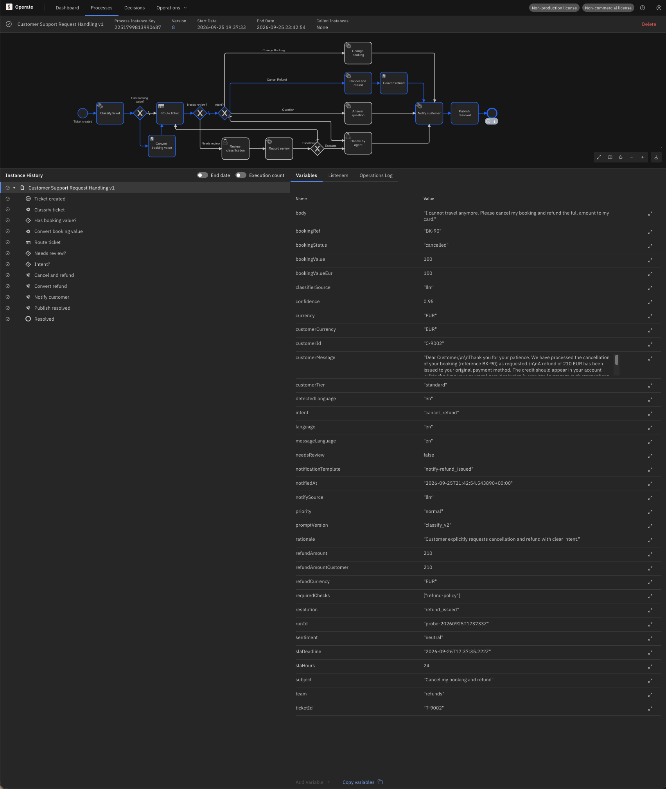

**Caveat seen in the data.** `bookingValue` stayed `100`: routing (`route-ticket`) ran
before the edit and is not recomputed by Retry. Here that is harmless; if the corrected
value changes team, priority or SLA, use Modify or Cancel and resubmit (§2, last row).

## 4. Case A2 — downstream outage (booking-api answers 503)

**Trigger (workstation):**

```bash
make fault-on                                       # booking-api: every /bookings/* → 503
tests/e2e/send-tickets.sh --probe-outage            # T-9003 (cancel BK-81), T-9004 (change BK-77)
```

### 4.1 Self-heal — outage shorter than retries × backoff

`make fault-off` right after the first failed attempt. The next attempt, 10 s later,
completes; no incident, no human action (worker-booking log, UTC):

```
07:44:21.935 WARN failed jobKey=…049844 type=booking.cancel bookingRef=BK-81 elementId=cancel-refund httpStatus=503 retriesLeft=2 retryBackOff=10s
07:44:23.736 WARN failed jobKey=…049919 type=booking.change bookingRef=BK-77 elementId=change-booking httpStatus=503 retriesLeft=2 retryBackOff=10s
07:44:33.057 INFO completed jobKey=…049844 type=booking.cancel bookingRef=BK-81 bookingStatus=cancelled
07:44:34.157 INFO completed jobKey=…049919 type=booking.change bookingRef=BK-77 bookingStatus=changed
```

Rule: an outage shorter than 3 × `RETRY_BACKOFF` (30 s with the defaults) heals itself.

### 4.2 Incident — outage longer than the retries

Leave the fault on for more than 30 s. Each instance runs its own jobKey series 2 → 1 → 0
and gets its own `JOB_NO_RETRIES` incident; the booking-api container stays **healthy** in
`docker compose ps` throughout — the fault affects only `/bookings/*`:

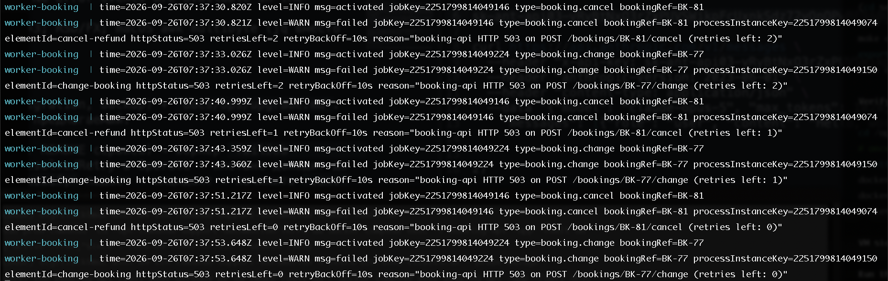

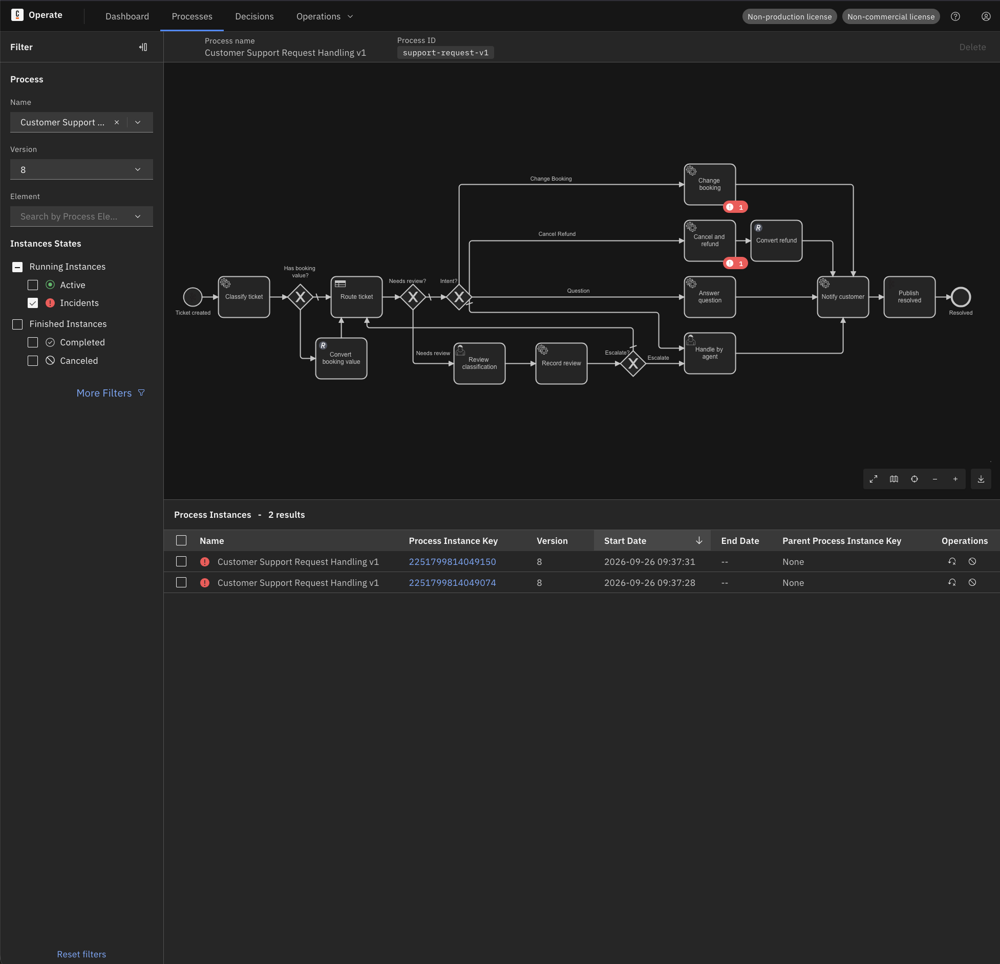

**Fix.** `make fault-off` (the real-world equivalent: the downstream service is back).
Then in Operate → Processes, filter *Incidents*, select both rows, **Retry** in the batch
bar:

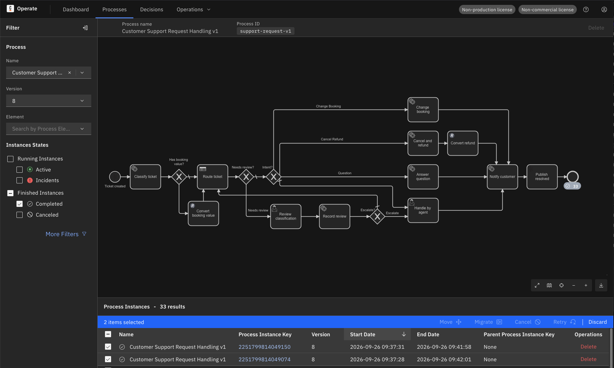

**Verify.** The retried jobs completed 3 ms apart (07:41:55.814 and 07:41:55.817 UTC in
the worker log) and **kept their original jobKeys** — Retry does not create a new job.
The instances ended 09:41:58 and 09:42:01 local time: after the booking step each one
still runs `notify-customer` (a Sonnet call) and `publish-resolved`, which take different
time. The batch shows up under Operations → Batch Operations as *Resolve Incident, 2 items*.

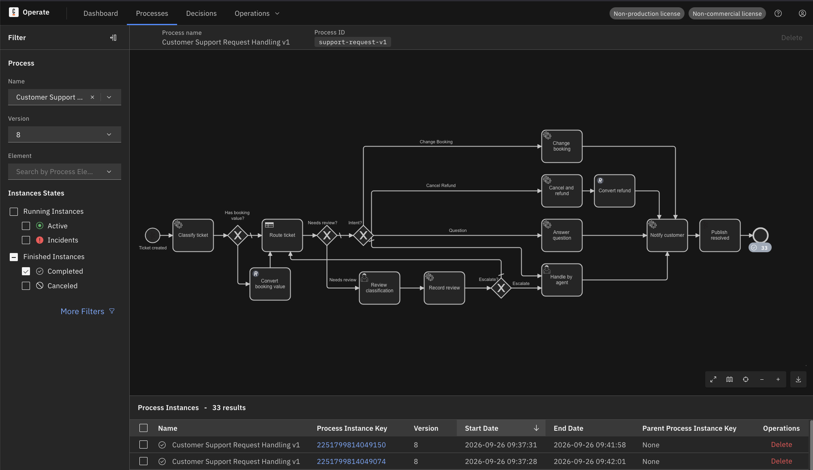

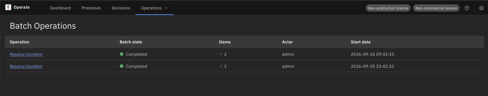

## 5. Case A3b — database stopped while the classifier runs

**Trigger** (on the stand host, in `infra/`, then workstation):

```bash
docker compose stop postgres
```

```bash
tests/e2e/send-tickets.sh --probe-classify          # prints "T-9005 <processInstanceKey>"
```

**Symptom.** Three attempts within about 3 s (the classifier has no retry backoff), each
one a Haiku call **before** the audit write fails (worker-llm-classifier log, UTC):

```
07:52:10 POST https://api.anthropic.com/v1/messages "200 OK"
07:52:10 Job failed: …050558 - audit write failed: terminating connection due to administrator command
07:52:11 POST https://api.anthropic.com/v1/messages "200 OK"
07:52:11 Job failed: …050558 - audit write failed: failed to resolve host 'postgres': [Errno -2] Name or service not known
07:52:13 POST https://api.anthropic.com/v1/messages "200 OK"
07:52:13 Job failed: …050558 - audit write failed: failed to resolve host 'postgres': [Errno -2] Name or service not known
```

The first message is the open connection being killed; the next two are DNS: a stopped
container disappears from the Compose network. Operate shows only the **last** message.

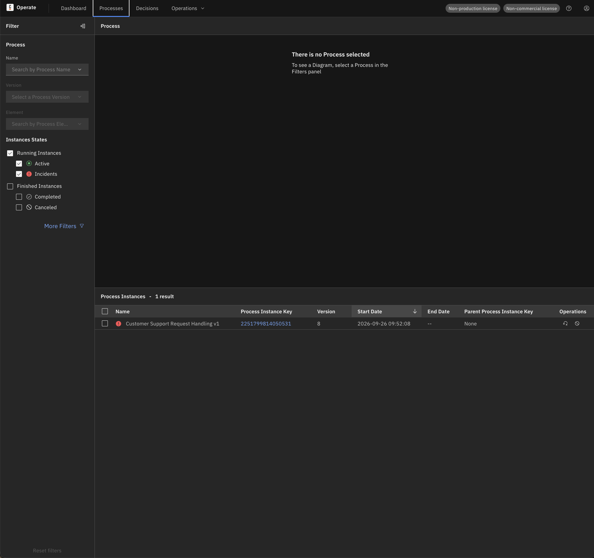

**Diagnosis rule.** `failed to resolve host '<service>'` inside the Compose network means
the container is stopped or removed, not a network fault.

**Fix** (on the stand host, in `infra/`): `docker compose start postgres`, then **Retry**
in Operate.

**Verify.** The audit row is written and the instance completes:

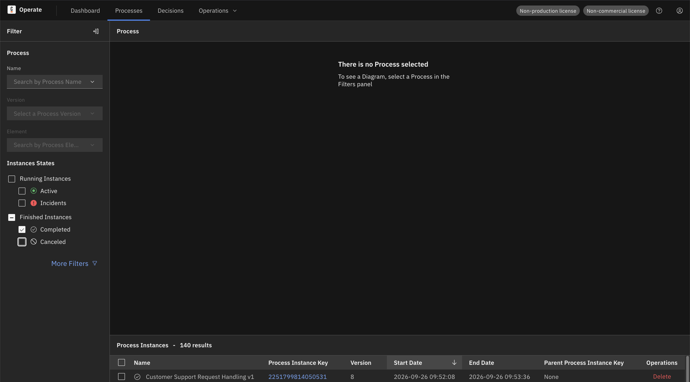

**Consequence.** Even a normal PostgreSQL restart of 5–10 s exhausts the classifier's
three immediate retries → incident. Backlog, Phase 7: retry backoff in the classifier.

## 6. Case A3a — the classifier cannot start (wrong `DATABASE_URL`)

**Trigger — as root on the stand host**, in `/opt/camunda-support-automation/infra`:
put a wrong password into `DATABASE_URL` in `.env`, then `docker compose up -d
worker-llm-classifier`. A password with special characters must be URL-encoded inside the
DSN. Then, from the workstation:

```bash
tests/e2e/send-tickets.sh --probe-classify
```

**Symptom.** The worker tries ten times, exits, and Compose restarts it:

```
WARNING audit database not ready (attempt 1/10): connection failed: connection to server at "<postgres-ip>", port 5432 failed: FATAL:  password authentication failed for user "camunda"
...
RuntimeError: audit database unreachable after 10 attempts
```

`docker compose ps` looks normal — the healthcheck restarts with the container. The
restart count is the reliable signal:

```
$ docker compose ps worker-llm-classifier
NAME                    ...  CREATED          STATUS
worker-llm-classifier   ...  56 seconds ago   Up 22 seconds (health: starting)
$ docker inspect -f '{{.RestartCount}}' worker-llm-classifier
3
4
6
```

Operate shows the instance **Active** (green) on `classify-ticket` with **no incident**:

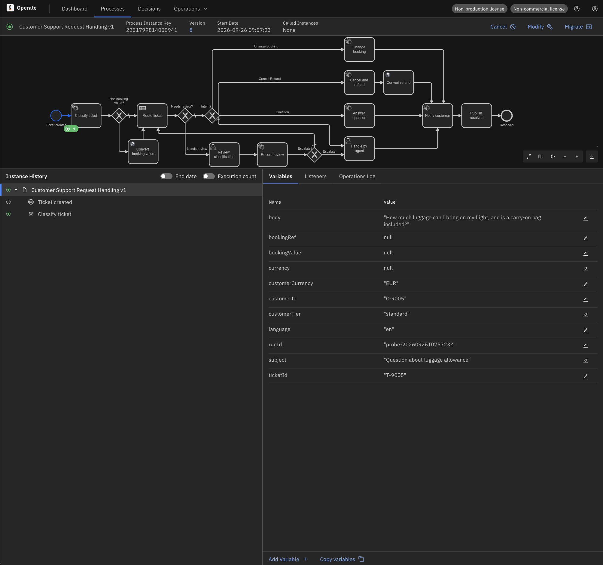

The only API-level signal without monitoring is the second section of `--incidents` — a
CREATED job that no worker has activated, with an age far beyond the container's uptime:

```
ACTIVE incidents (incidentKey processInstanceKey elementId errorType creationTime errorMessage):

CREATED jobs older than 60 s never activated (jobKey processInstanceKey elementId type ageSeconds):
  2251799814050968 2251799814050941 classify-ticket ticket.classify 107
```

**Fix — as root on the stand host:** restore `DATABASE_URL` in `.env` (from the backup
under `/root/env-backups/`, see `docs/ops/install.md`), then `docker compose up -d
worker-llm-classifier`. **No Retry:** there is no incident, the job was never failed —
the worker activates it as soon as it connects:

```
08:01:42 INFO audit database connected
08:01:44 POST /v2/jobs/2251799814050968/completion "204"
```

**Verify.** The waiting instance completes about 2 s after the worker connects:

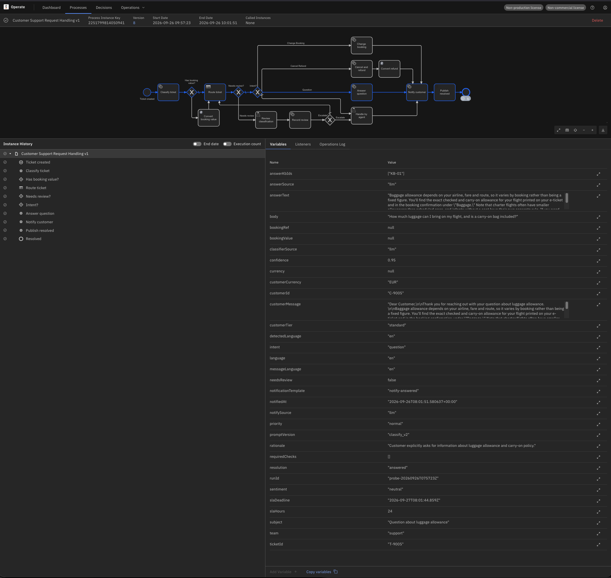

## 7. Limits observed

- **No retry backoff in the classifier.** Three attempts within 3 s; any dependency
  outage longer than that becomes an incident (A3b). Backlog, Phase 7.
- **LLM call before the audit write.** Every retry of a failed audit write costs one more
  LLM call. Backlog, Phase 7: reorder or cache the result per jobKey.
- **The hung-database path was not reproduced.** The stopped container failed on DNS
  instantly, so the 5 s connect timeout (D5-12) was never exercised; it is covered by
  design, not by this run.
- **Retry does not recompute upstream decisions.** A corrected variable feeds only the
  retried step (A1 caveat). Use Modify or Cancel and resubmit when routing inputs change.
- **A crash-looping worker is invisible in Operate.** No incident, green instances; the
  signals are the restart count and `--incidents` section two. Monitoring (6.5) adds the
  job panel on the dashboard.
