# Runbook: instance migration (scenario B — the model was wrong)

**Scope:** an instance is stuck because the **process model** cannot handle what happened —
here an uncaught BPMN error (`UNHANDLED_ERROR_EVENT`). The fix is a new process version;
the running instance is moved to it with **process instance migration** and the incident is
then resolved. Environment failures (bad data, downstream outage, missing worker) are not
migration cases: see `incident-handling.md`.

**Last run:** 2026-09-26 on the stand, v8 → v9, two instances (one through the Operate UI,
one through the API script). Design: `docs/design/operations-v1.md` §3.2, D6-4, D6-8.

Conventions as in `incident-handling.md`: workstation commands need `CAMUNDA_BASE_URL`,
`CAMUNDA_USER`, `CAMUNDA_PASSWORD` (and `STAND_IP` for the probes); nothing here contains an
address or a password. No root steps in this runbook.

## 1. Which tool

| Situation | Tool | Why |
|---|---|---|
| The **model** is wrong or incomplete for a state that already happened (uncaught error, missing branch, wrong timer) | **Migrate** to a fixed version, then resolve the incident | the instance and its history are kept; the new version's catch events become active for the mapped elements |
| The model is right, the **environment** was wrong (data, downstream, config, worker) | **Retry** after the fix | nothing in the model needs to change — `incident-handling.md` |
| The token must be somewhere else in the **same** version (skip a step, re-run an earlier decision) | **Modify** (move / add / cancel a token) | migration does not move tokens; Retry does not recompute passed steps |
| The instance can never succeed (invalid reference, duplicate, test data) | **Cancel** (and resubmit if a real ticket) | a cancelled instance keeps its incident marker in the history for the audit |

## 2. Prerequisites

1. The **target version is deployed** (Modeler → deploy; Operate → Processes → version list
   shows it). The script refuses if the version is not found.
2. **Worker changes are deployed first.** v9's boundary events fill `errorCode` /
   `errorMessage` from the throw-error payload; a worker that does not send the payload
   leaves them empty after the Retry (D6-8). On the stand: `make deploy`, then
   `docker compose ps worker-booking` shows a fresh container.
3. Every **active element** of the instance must exist in the target with the same id
   (identity mapping). For v8 → v9 all ids are unchanged, and the only active element is the
   failed service task. Migration is rejected for instances that are in the middle of taking
   a sequence flow — wait a second and repeat.
4. Know what you are migrating: `tests/e2e/send-tickets.sh --incidents` lists the
   `processInstanceKey`, element and message.

## 3. The case: `BOOKING_NOT_FOUND` uncaught on v8

Trigger on v8 (workstation): `tests/e2e/send-tickets.sh --probe-unknown-booking` twice.

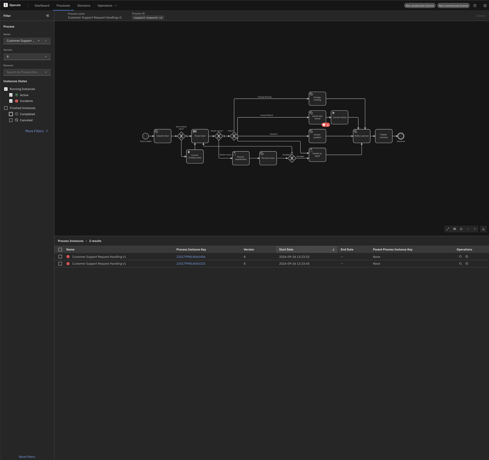

The incident is `UNHANDLED_ERROR_EVENT` on `cancel-refund`; the full message is behind
**More**:

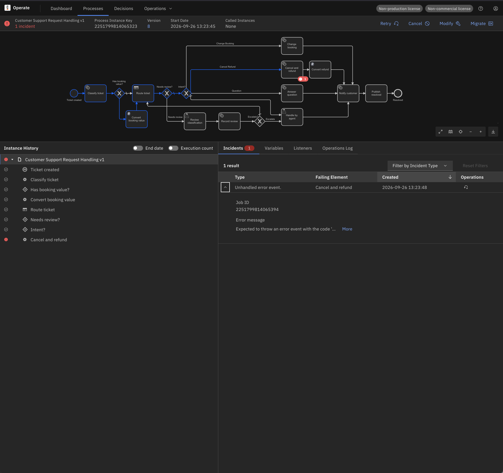

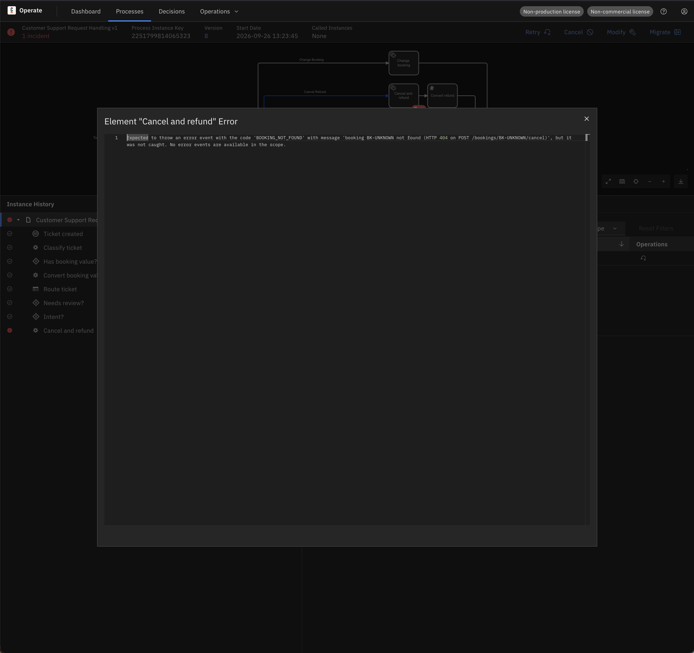

```
Expected to throw an error event with the code 'BOOKING_NOT_FOUND' with message
'booking BK-UNKNOWN not found (HTTP 404 on POST /bookings/BK-UNKNOWN/cancel)',
but it was not caught. No error events are available in the scope.
```

Diagnosis: the worker did its job (the message names the 404); the model has no catch
event for the error. That is a model gap → migration, not Retry. Note the **Job ID** in the
incident row — it stays the same through migration and Retry (§7).

## 4. Fix in the model — process v9

v9 = v8 plus two interrupting error boundary events `err-booking-not-found-cancel` and
`err-booking-not-found-change` (error `BOOKING_NOT_FOUND`), each with output mappings
`errorCode ← =errorCode`, `errorMessage ← =errorMessage`, both flowing to `handle-by-agent`.
Nothing else changes. Details: `docs/design/process-v1.md` (v8 → v9) and D6-8.

## 5. UI path (the demo)

1. Open the instance → **Migrate** (top right) → target version 9.
2. **Step 1 – mapping elements:** Operate auto-maps every element by id; all rows green.

   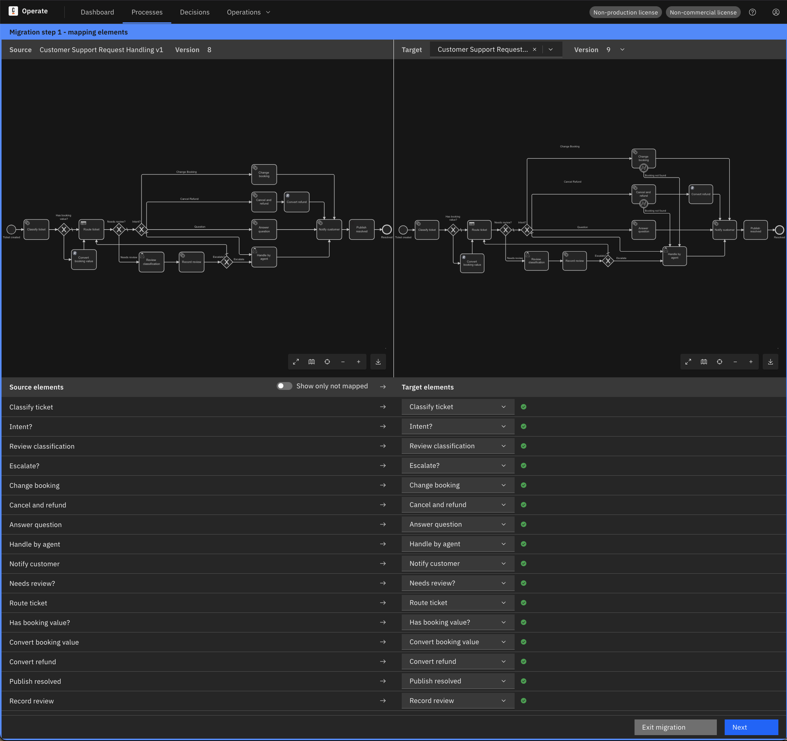

3. **Step 2 – confirm:** the target diagram shows "+1" on Cancel and refund — the boundary
   event that will become active. Confirm.

   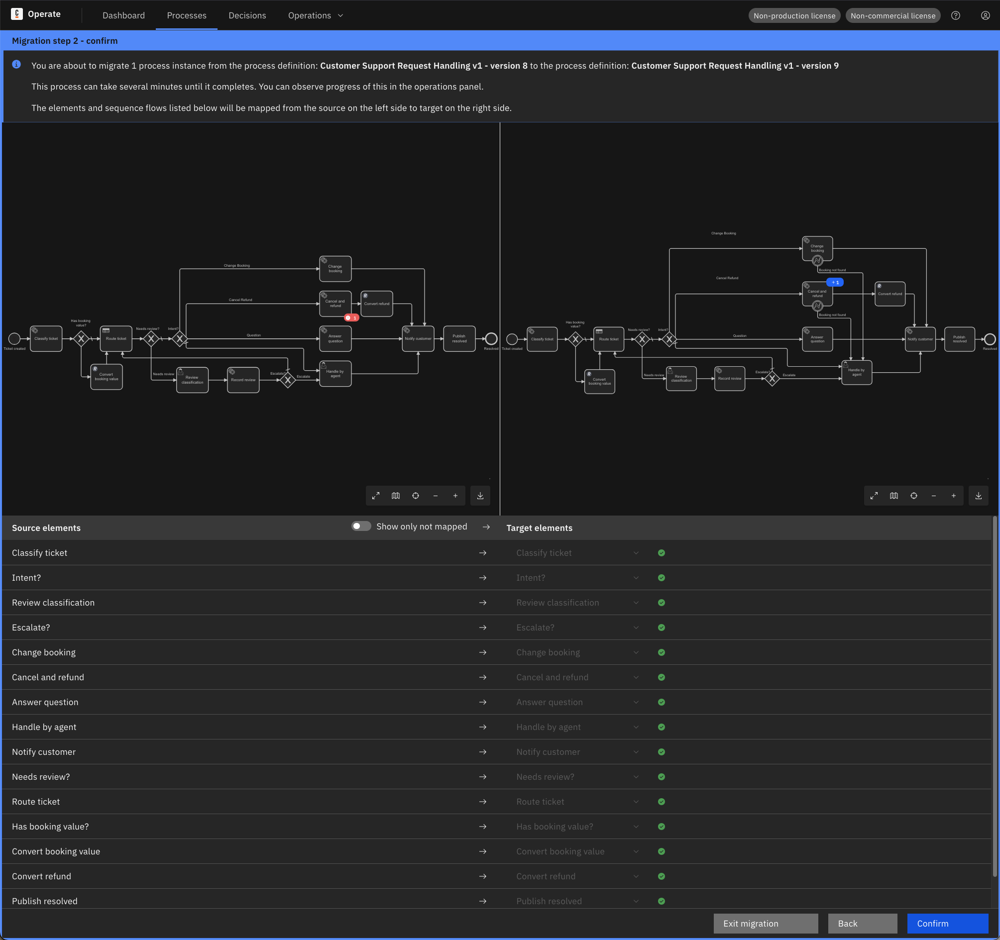

4. The instance header now says **Version 9** with a green **Migrated <timestamp>** tag.
   The incident is **still there**, message unchanged — migration carries incidents over.

   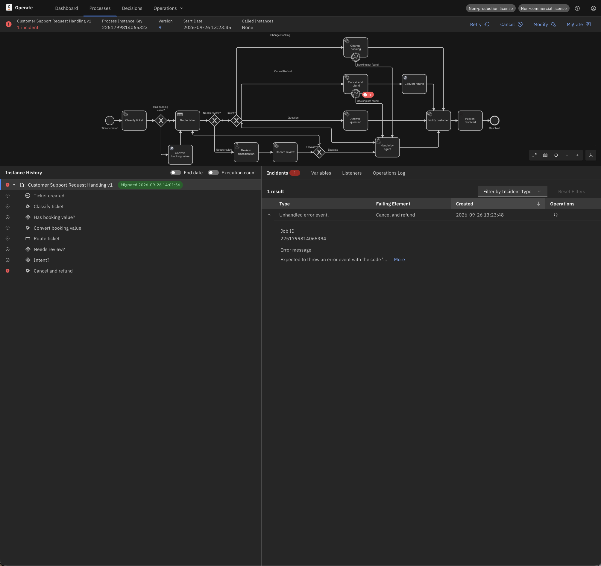

5. **Retry.** The worker log shows the **same jobKey** activated again and
   `BOOKING_NOT_FOUND` thrown again — resolving re-enables the job, it does not replay the
   old error. This time the boundary event catches it: Cancel and refund shows **⊘**
   (the element instance was terminated by the interrupting event, the process instance is
   not cancelled), "Booking not found" completed, token in Handle by agent.

   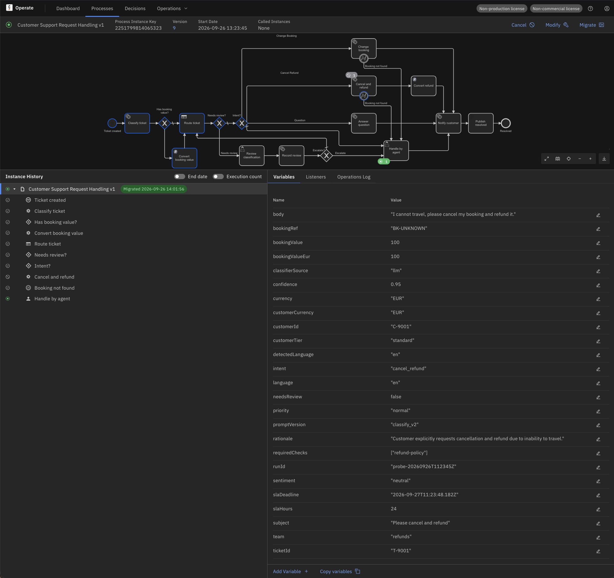

   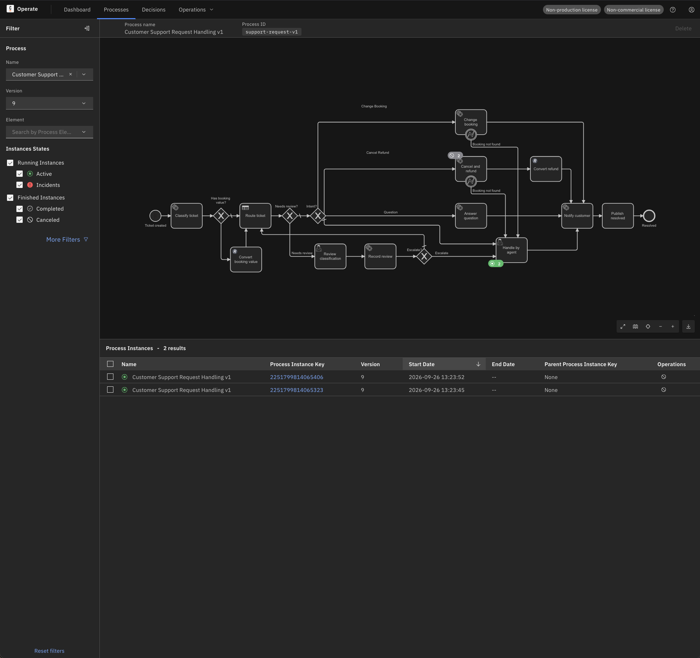

6. The agent closes the tasks in Tasklist; both instances complete on v9.

   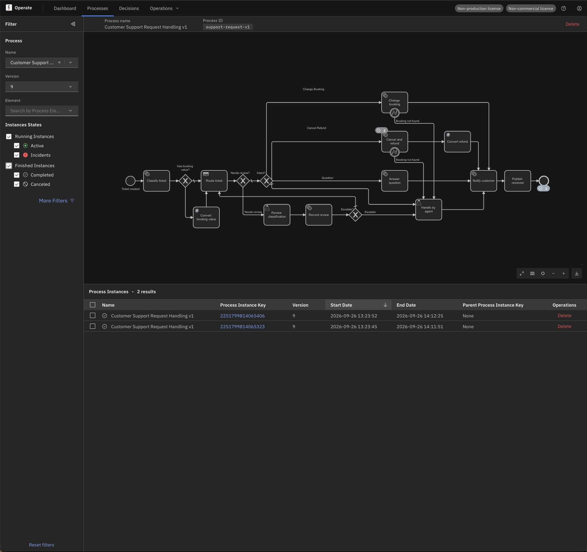

## 6. API path

`tests/ops/migrate-instance.sh <processInstanceKey> <targetVersion>` does the lookup, the
mapping and the call, and asks before it migrates:

```bash
tests/ops/migrate-instance.sh <processInstanceKey> 9
```

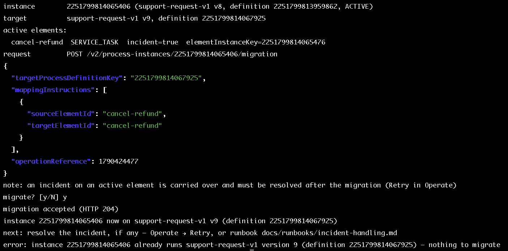

Observed: plan with one active element (`cancel-refund`, `incident=true`), `y`, HTTP 204,
"now on v9"; a second call is refused with "already runs … version 9 — nothing to migrate".

The raw calls the script makes (all `/v2`, Basic auth):

```bash
# target definition key
curl -sS -u "$CAMUNDA_USER:$CAMUNDA_PASSWORD" -X POST "$CAMUNDA_BASE_URL/v2/process-definitions/search" \
  -H 'Content-Type: application/json' \
  -d '{"filter":{"processDefinitionId":"support-request-v1","version":9}}' | jq '.items[0].processDefinitionKey'

# active elements (the PROCESS element is listed too and is never mapped)
curl -sS -u "$CAMUNDA_USER:$CAMUNDA_PASSWORD" -X POST "$CAMUNDA_BASE_URL/v2/element-instances/search" \
  -H 'Content-Type: application/json' \
  -d '{"filter":{"processInstanceKey":"<key>","state":"ACTIVE"}}' | jq '.items[] | select(.type != "PROCESS") | {elementId, hasIncident}'

# migrate (identity mapping)
curl -sS -u "$CAMUNDA_USER:$CAMUNDA_PASSWORD" -X POST "$CAMUNDA_BASE_URL/v2/process-instances/<key>/migration" \
  -H 'Content-Type: application/json' \
  -d '{"targetProcessDefinitionKey":"<targetKey>","mappingInstructions":[{"sourceElementId":"cancel-refund","targetElementId":"cancel-refund"}]}'
```

Resolving the incident over the API (the script does not do this; the demo used Retry in
Operate): give the job retries again, then resolve the incident — `jobKey` and
`incidentKey` come from `--incidents` or the incident row.

```bash
curl -sS -u "$CAMUNDA_USER:$CAMUNDA_PASSWORD" -X PATCH "$CAMUNDA_BASE_URL/v2/jobs/<jobKey>" \
  -H 'Content-Type: application/json' -d '{"changeset":{"retries":1}}'
curl -sS -u "$CAMUNDA_USER:$CAMUNDA_PASSWORD" -X POST "$CAMUNDA_BASE_URL/v2/incidents/<incidentKey>/resolution"
```

## 7. Verify

- **Operate:** reload the page. The instance shows Version 9, the Migrated tag, and after
  the Retry the token in Handle by agent. The Variables tab may lag behind the engine by a
  few seconds (secondary storage); reload before concluding that a variable is missing.
- **Variables over the API** — `errorCode` and `errorMessage` appear **twice**: once at the
  boundary event's local scope (the throw-error payload) and once at the process-instance
  scope (the output mappings):

  ```bash
  curl -s -u "admin:$CAMUNDA_PASSWORD" -X POST "$CAMUNDA_BASE_URL/v2/variables/search" \
    -H 'Content-Type: application/json' \
    -d '{"filter":{"processInstanceKey":"<key>"},"page":{"limit":100}}' \
    | jq '.items[] | select(.name | test("^error")) | {name, value, scopeKey}'
  ```

  The same two variables on an instance that was caught directly on v9 (no migration
  involved), as Operate shows them after a reload:

  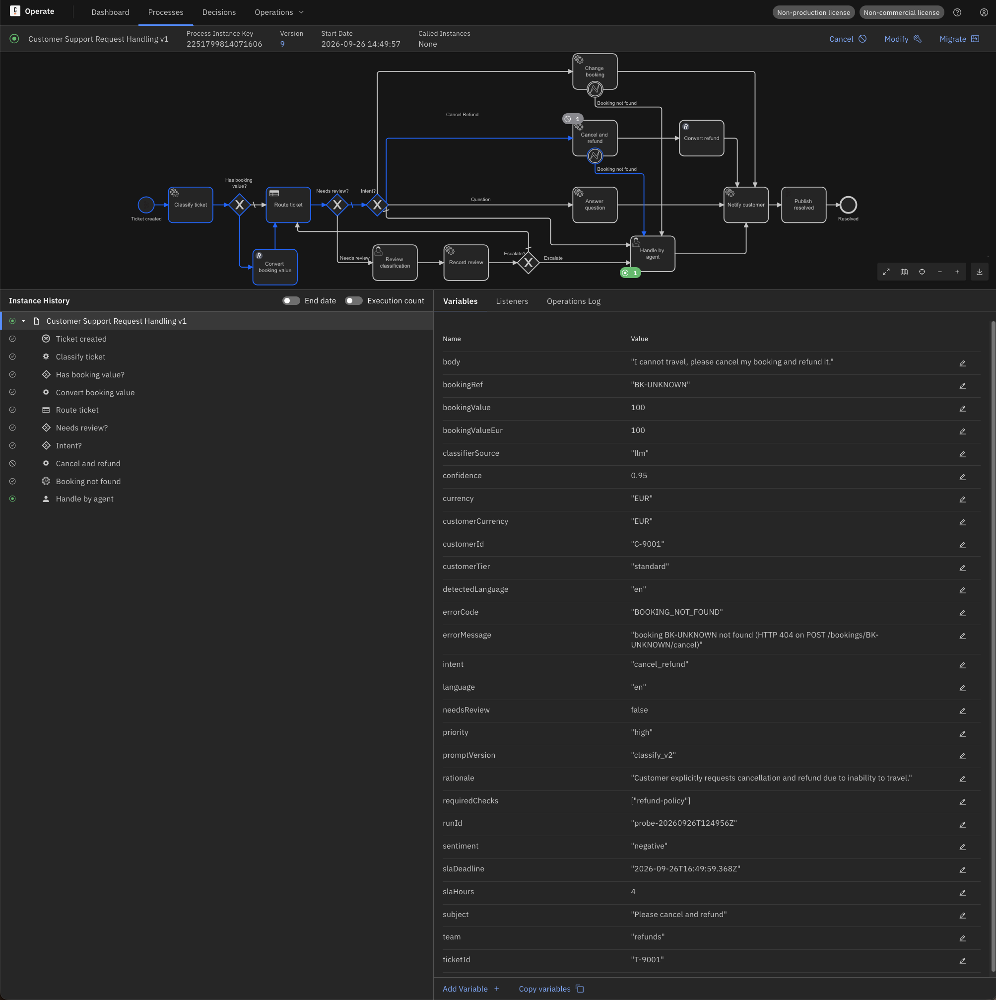

- **Regression:** the eight standard tickets behave identically on v9
  (`tests/e2e/send-tickets.sh` then `--check`, 8/8 plus the dedup PASS on 2026-09-26).

## 8. Observed limits

- **The incident is carried over.** Migration changes the definition, nothing else; the
  incident must be resolved afterwards (Retry). Order: migrate first, then Retry — a Retry
  on v8 would throw the same uncaught error again.
- **Retry does not recreate the job.** The same jobKey is activated again and the worker
  runs again; the error is thrown anew, not replayed. That is why the worker build with the
  payload must be deployed before the Retry.
- **Identity mapping only** in this runbook; every active element needs a mapping, and the
  `PROCESS` element listed by the element-instance search is never mapped.
- **⊘ on an element means the element instance was terminated** (by the interrupting
  boundary event), not that the process instance was cancelled. The instance is green.
- **Operate lags the engine.** New variables and the Migrated tag appear after a reload.
- **Not covered here:** migrations that add or rename active elements, migrations of
  instances waiting in a user task (v10, Phase 6.3), batch migration from the instance list.
