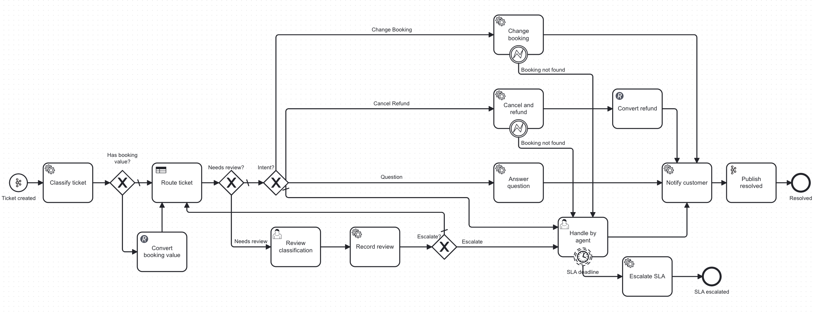
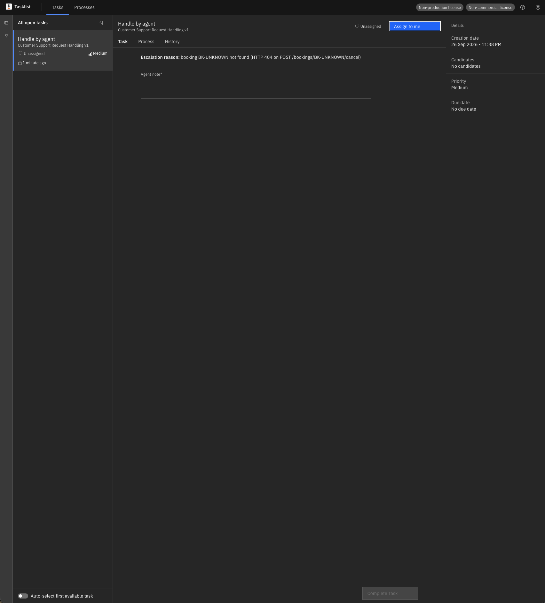
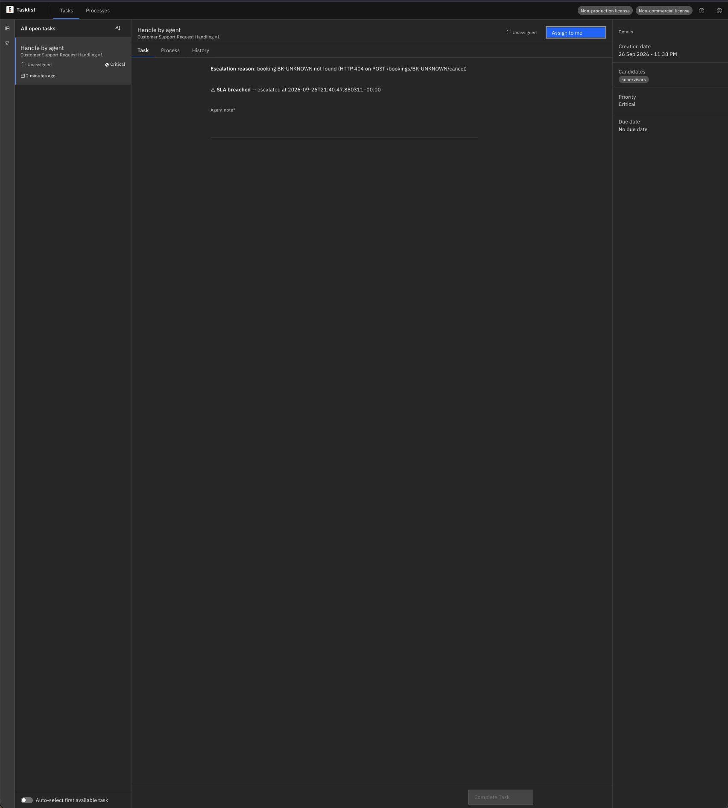
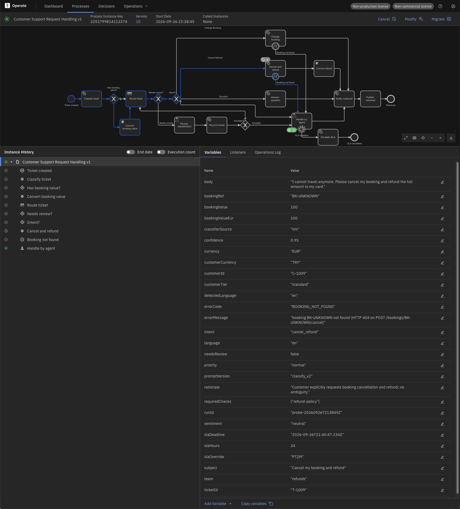
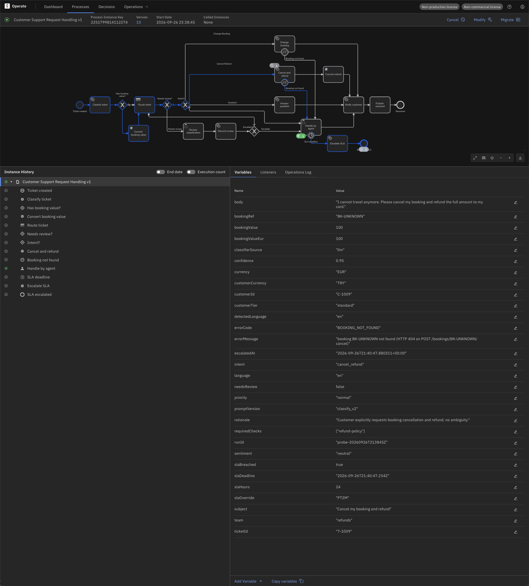
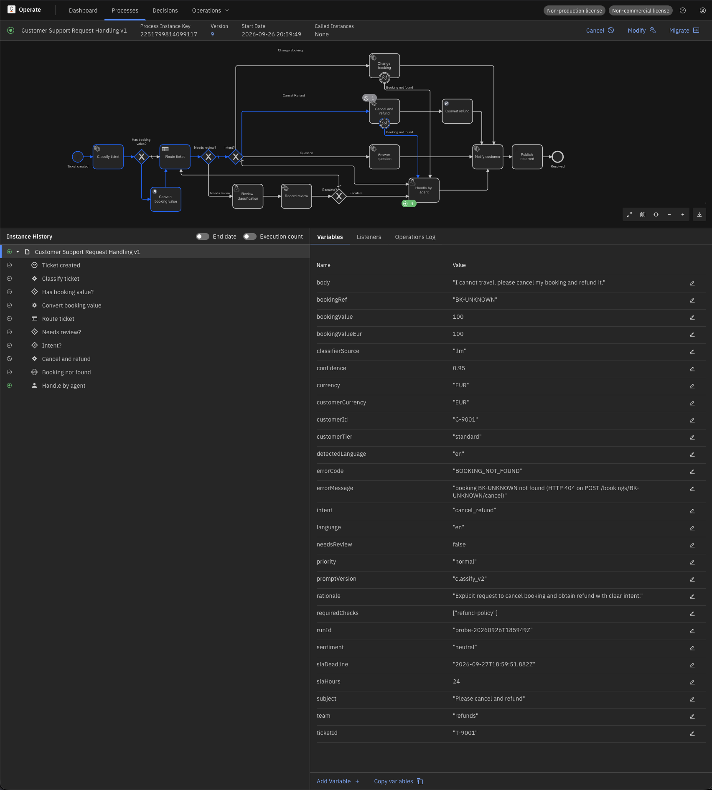
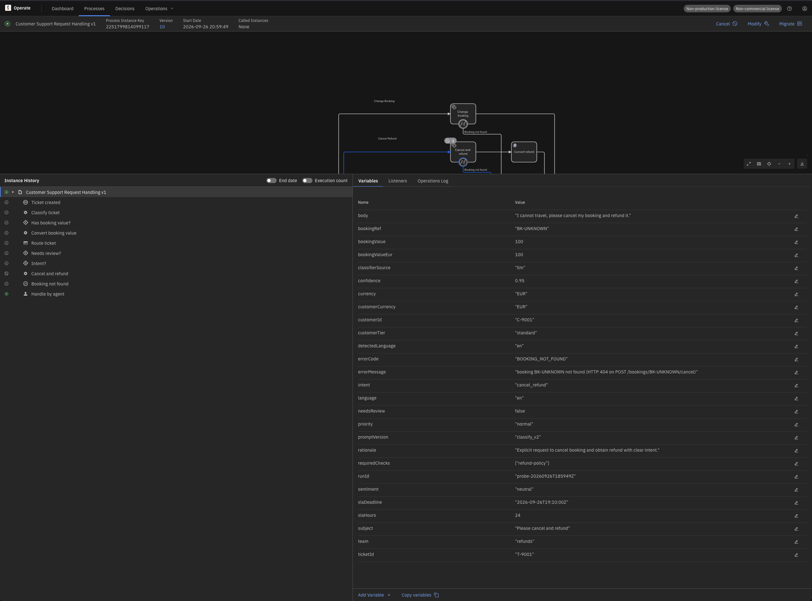
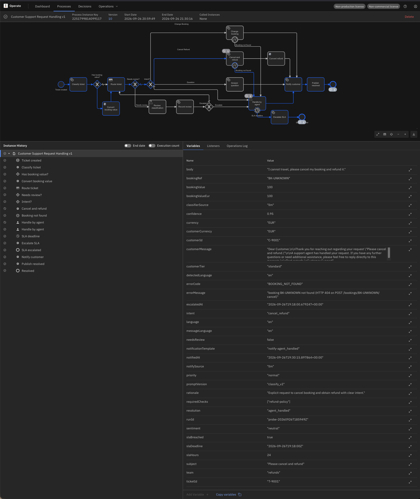
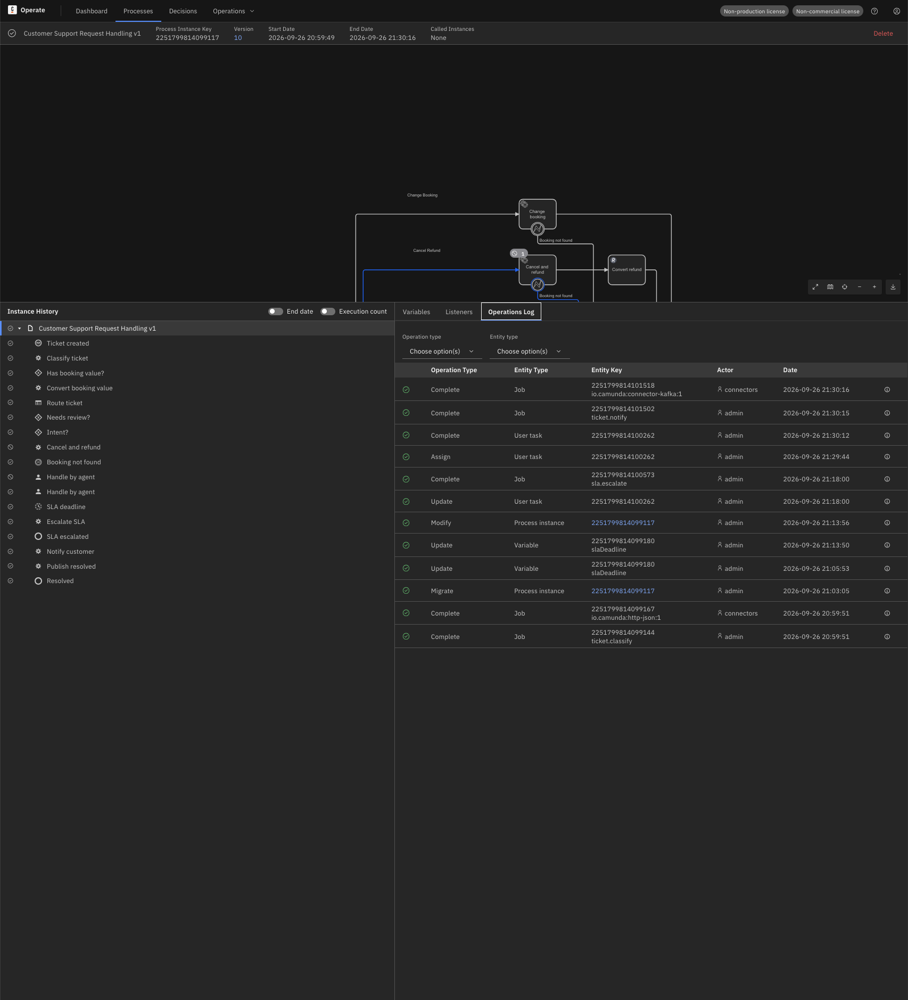
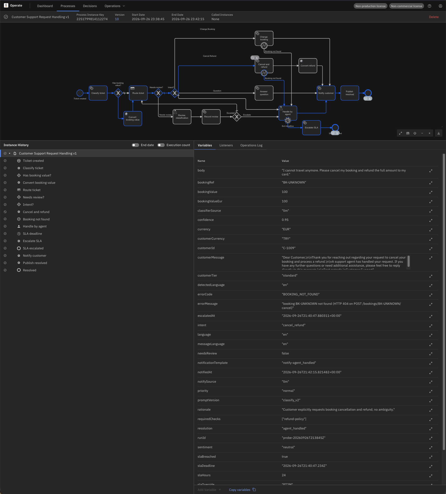

# Runbook: SLA escalation (process v10)

**Scope:** a ticket waits in `handle-by-agent` past its `slaDeadline`. Process v10 fires the
non-interrupting timer boundary event `sla-timer` and runs `escalate-sla` (job type
`sla.escalate`): the live agent task gets **priority 90** and candidate group
`supervisors`, the breach is recorded in `sla_escalation`, the instance carries
`slaBreached = true` and `escalatedAt`. The agent's task is neither reassigned nor cancelled
(D6-5); the agent still finishes the ticket. Design: `docs/design/operations-v1.md` §4,
D6-3, D6-5, D6-9; model: `docs/design/process-v1.md` (v9 → v10).

**Last run:** 2026-09-26 on the stand — `--probe-sla` on a clean v10 instance twice, and the
migration of a v9 instance waiting in `handle-by-agent` to v10 including the re-arm by
modification. Regression on v10: default run 8/8 plus the dedup probe, `--check` all PASS
(resolved topic 8/8, review row for T-1004).



*v10 — "SLA deadline" timer on Handle by agent → Escalate SLA → SLA escalated, next to the v9 "Booking not found" boundary events.*

## 1. Symptom

- **Tasklist:** the task shows priority **Critical** (90), candidate group `supervisors`,
  and the form's two banners — the escalation reason and "SLA breached — escalated at …".

  

  

- **Operate:** the instance stays Active with a completed `sla-timer` → `escalate-sla` →
  `end-sla-escalated` path next to the still-open `handle-by-agent`; Variables show
  `slaBreached = true` and `escalatedAt` at the process scope (`escalatedTaskKey` stays local
  to `escalate-sla` — no output mapping for it, D4-6, intended).

  

  

- **Database:** one `sla_escalation` row per fired timer — the record of the escalation
  (`outcome` = `escalated`, `already_escalated` or `no_open_task`). The worker logs one line
  per outcome as well (see `sla.py`); at the default log level the SDK's own polling lines
  drown it (backlog, Phase 7), so use the row.

## 2. How the timer fires

`sla-timer` is a non-interrupting timer boundary event with `timeDate = slaDeadline`,
**evaluated once, when the subscription is created** — on entering `handle-by-agent`, or on
migration into v10 (§4). `slaDeadline` comes from the `route-ticket` output mapping:
`now() + duration(slaOverride)` when the ticket carries `slaOverride`, else
`now() + PT<slaHours>H` from the DMN (D6-3). The timer does not cancel the task: a second
token runs `escalate-sla` and ends at `end-sla-escalated` while the agent task stays open.
A ticket completed before the deadline never fires the timer.

`slaOverride` is a test knob (`PT2M` in T-1009), not a business input; an unparsable value
yields `null` from `duration()`, so `slaDeadline` becomes `null` and the incident surfaces
where the time date is evaluated — expected, not verified in this phase.

## 3. Why priority, not reassignment (D6-5)

An SLA breach is an operational fact, not a change of ownership. Raising the priority and
adding `supervisors` as candidates makes the ticket visible at the top of every queue
without taking it away from the agent who has the context; analytics (Phase 7) count
breaches from `sla_escalation`, not from task assignments.

## 4. Existing instances: migration v9 → v10

Instances started on v9 have no timer. Migrating a v9 instance that waits in
`handle-by-agent` (`tests/ops/migrate-instance.sh <key> 10`, identity mapping of one
element, HTTP 204) creates the timer subscription **from the instance's current
`slaDeadline`** — observed on …099117 (T-9001): the DMN value, 24 h after routing, so the
timer was armed for the next day. The script prints this before asking.





**Order rule:** when a short timer is wanted on an existing instance, edit `slaDeadline`
**before** migrating. Editing it afterwards does not move the timer (§5).

## 5. Timer already armed with the wrong date

**Symptom.** `slaDeadline` was edited after the subscription existed (Operate → Variables,
or `PUT /v2/element-instances/{processInstanceKey}/variables` with `local = false`); the
deadline passes, nothing happens: same `userTaskKey`, no escalation, no `sla_escalation`
row. Observed on …099117 after editing the deadline to 19:10:00Z.

**Why.** `timeDate` is evaluated once, at subscription. A variable edit changes the
variable, not the armed timer.

**Fix: re-create the subscription by modification** — cancel the running `handle-by-agent`
element instance and activate a new one; the new task subscribes the timer from the
current (edited) `slaDeadline`.

- Operate UI: **Modify** → add a token on Handle by agent, cancel the running one → Apply.
- API:

  ```bash
  curl -sS -u "$CAMUNDA_USER:$CAMUNDA_PASSWORD" -X POST "$CAMUNDA_BASE_URL/v2/process-instances/<key>/modification" \
    -H 'Content-Type: application/json' \
    -d '{"activateInstructions":[{"elementId":"handle-by-agent"}],
         "terminateInstructions":[{"elementInstanceKey":"<old handle-by-agent element instance key>"}]}'
  ```

  Observed: 204; the old task disappears from Tasklist, a **new** `userTaskKey` (…100262)
  is created (19:13:56Z), its subscription took the edited `slaDeadline` 19:18:00Z, the
  timer fired at 19:18:00.68Z and the PATCH landed within about 0.8 s.

**Consequences.** A new `userTaskKey`, a new task in Tasklist, the **assignee is lost**
(re-assign by hand — backlog, Phase 7), and the instance history shows Handle by agent
twice: the terminated one and the new one. Every step is in the Operations Log.





## 6. Demo

```bash
tests/e2e/send-tickets.sh --probe-sla       # T-1009: slaOverride PT2M, waits ≤ 4 min, closes the task
```

Observed on a clean v10 instance (T-1009, run `probe-20260926T193046Z`): open task at
priority 50, `slaDeadline` 19:32:48.912Z → PASS priority 90 / `supervisors` /
`slaBreached = true`, `escalatedAt` 19:32:49.751Z — **0.84 s** after the deadline; row
`escalated | 50 | 90 | 2251799814101647 | 19:32:48.912Z | 19:32:49.751Z`; task completed by
the probe, instance COMPLETED. Second run for the screenshots (…112274, 21:38Z): deadline
21:40:47.234Z, `escalatedAt` 21:40:47.880Z, task completed by hand, Resolved 21:42:15.



## 7. Verify

```bash
# the task (workstation, e2e env)
curl -sS -u "$CAMUNDA_USER:$CAMUNDA_PASSWORD" -X POST "$CAMUNDA_BASE_URL/v2/user-tasks/search" \
  -H 'Content-Type: application/json' \
  -d '{"filter":{"processInstanceKey":"<key>","elementId":"handle-by-agent","state":"CREATED"}}' \
  | jq '.items[] | {userTaskKey, priority, candidateGroups}'

# the variables — slaBreached and escalatedAt twice (process scope + local scope of
# escalate-sla), escalatedTaskKey once (local only)
curl -sS -u "$CAMUNDA_USER:$CAMUNDA_PASSWORD" -X POST "$CAMUNDA_BASE_URL/v2/variables/search" \
  -H 'Content-Type: application/json' \
  -d '{"filter":{"processInstanceKey":"<key>"},"page":{"limit":100}}' \
  | jq '.items[] | select(.name | test("^(sla|escalated)")) | {name, value, scopeKey}'
```

```bash
# the audit row (on the stand host, in infra/)
docker compose exec -T postgres sh -c 'psql -q -U "$POSTGRES_USER" -d "$POSTGRES_DB" -c \
  "select ticket_id, outcome, previous_priority, new_priority, escalated_at from sla_escalation order by id desc limit 5"'
```

## 8. Failure modes

| What you see | Cause | Action |
|---|---|---|
| `JOB_NO_RETRIES` on `escalate-sla`, message "transport error" or "HTTP 5xx … retrying" | the user task API was unreachable or busy three times (10 s backoff) | Retry in Operate once the cluster answers — `incident-handling.md` |
| `JOB_NO_RETRIES` on `escalate-sla`, message "request rejected with HTTP 4xx (no retry)" | a bug in the request shape | fix the worker, deploy, Retry |
| `JOB_NO_RETRIES` on `escalate-sla`, message "sla escalation write failed" | PostgreSQL down or the table missing | `docker compose start postgres`, Retry (the worker creates the table at startup) |
| `slaBreached = true` but the task still at priority 50 | the task was completed between the timer and the job (`outcome = no_open_task`) | nothing — the breach is recorded, the ticket is done |
| deadline passed, nothing happened, same `userTaskKey` | the timer was armed with an older `slaDeadline` | §5 |

## 9. Observed limits

- **The timer is armed once.** Editing `slaDeadline` afterwards never moves it; only a
  modification (new element instance) re-subscribes — with a new task and a lost assignee.
- **Migration arms the timer from whatever `slaDeadline` holds at that moment.** Edit first,
  migrate second.
- **`escalatedTaskKey` stays local** to `escalate-sla` (no output mapping, D4-6).
- **The handler line is hard to find in the log**: the SDK's DEBUG polling (five job types,
  every ~11 s) dominates the classifier's output; the `sla_escalation` row is the record.
- **Cosmetic, fixed after the run:** `escalatedAt` was written with a `+00:00` suffix while
  `slaDeadline` uses `Z` (visible on the screenshots); the worker now emits `Z` with
  milliseconds.
