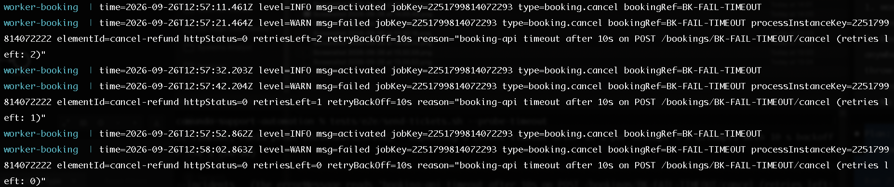
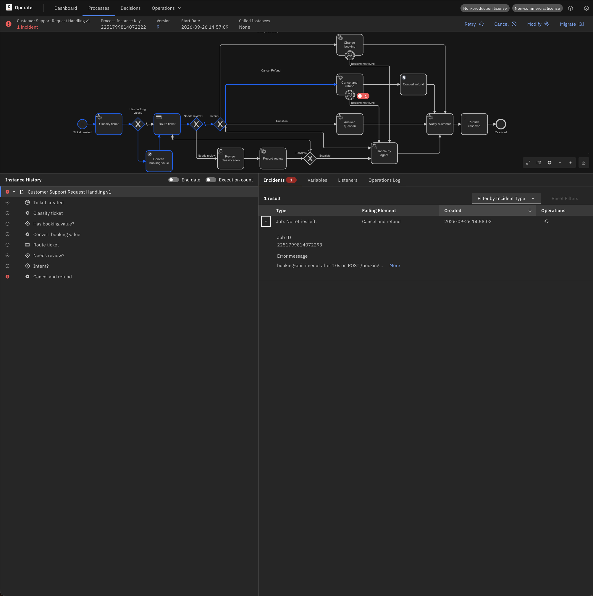
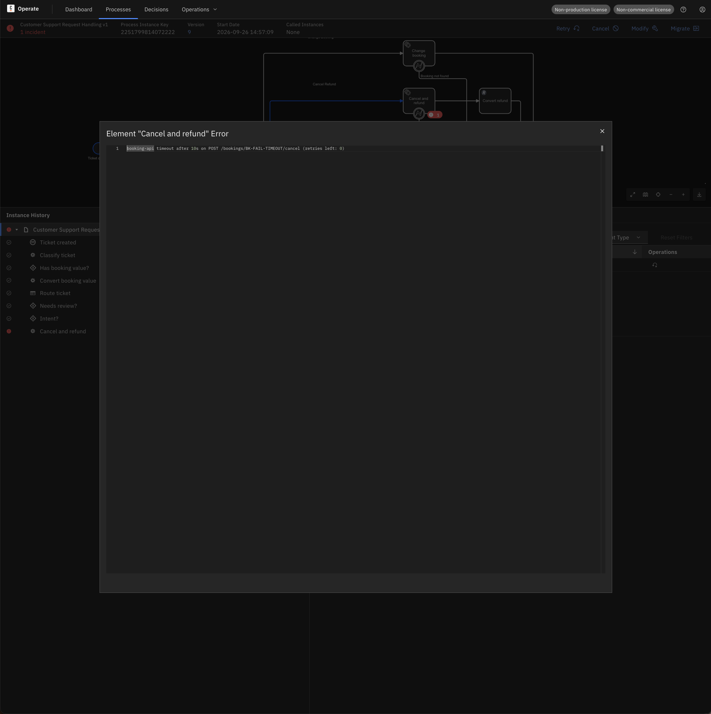
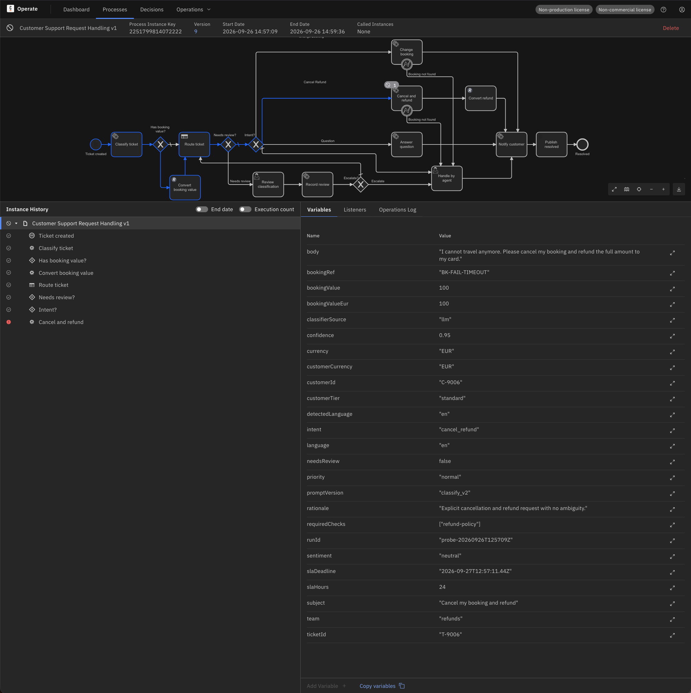

# Runbook: downstream timeout (scenario A, timeout variant)

**Scope:** the booking-api answers too slowly. The worker's client timeout fires, the job
fails with retries and backoff, and after the retries an incident appears. This is an
**infrastructure failure**, handled like a 5xx (`incident-handling.md`, A1/A2) — by design
not a BPMN error (D6-10, `docs/design/operations-v1.md`).

**Last run:** 2026-09-26 on the stand, v9, `tests/e2e/send-tickets.sh --probe-timeout`
(T-9006, `BK-FAIL-TIMEOUT`).

## 1. Symptom

Worker log (`docker compose logs --since 10m worker-booking | grep <processInstanceKey>` on
the stand host, in `infra/`): activations at T, T+21 s, T+41 s; each failure exactly 10 s
after its activation; `httpStatus=0`; `retriesLeft` 2 → 1 → 0.



```
12:57:11 activated  jobKey=…072293 bookingRef=BK-FAIL-TIMEOUT
12:57:21 failed     httpStatus=0 retriesLeft=2 retryBackOff=10s reason="booking-api timeout after 10s on POST /bookings/BK-FAIL-TIMEOUT/cancel (retries left: 2)"
12:57:32 activated
12:57:42 failed     retriesLeft=1
12:57:52 activated
12:58:02 failed     retriesLeft=0        → incident JOB_NO_RETRIES
```

Time to incident with the defaults: **3 × client timeout (10 s) + 2 × `RETRY_BACKOFF`
(10 s) ≈ 50 s** (observed 51 s from the first activation).

Operate: `Job: No retries left.` on Cancel and refund; the message is behind **More**:





```
booking-api timeout after 10s on POST /bookings/BK-FAIL-TIMEOUT/cancel (retries left: 0)
```

## 2. Diagnosis

| Signal | Timeout | 5xx (A1/A2) |
|---|---|---|
| `httpStatus` in the log | `0` (no response) | `500` / `503` |
| reason text | `timeout after 10s` | `HTTP 500` / `HTTP 503` |
| time to incident | ≈ 50 s | ≈ 20 s |

A timeout does not say whether the dependency is down or merely slow. Check the
dependency itself before deciding (on the stand host, in `infra/`):

```bash
docker compose ps booking-api                      # healthy = the process is alive
docker compose logs --since 5m booking-api         # does the request arrive? does it answer late?
```

`BK-FAIL-TIMEOUT` is the mock's deliberate 30 s delay: the service is alive and healthy,
the request arrives, the answer comes after the worker gave up. A real slow-but-alive
dependency looks exactly like this: healthy container, late responses, `httpStatus=0` at the
worker. A dead dependency shows `transport error: connection refused` instead (A2 with the
container stopped).

## 3. Decision

| Cause | Action |
|---|---|
| The dependency was slow and has recovered (load, GC pause, restart) | **Retry** in Operate; the same job runs again against the recovered service |
| The reference can never succeed (here: the id is defined to time out) | **Cancel** the instance, or edit `bookingRef` and Retry if it was a data error (A1) |
| The dependency is slow for good (capacity) | raise the client timeout or the backoff in the worker (`apiTimeout`, `RETRY_BACKOFF`) — an operations change, not an incident action |

In the run the reference was the mock's timeout id, so the instance was **cancelled**. The
cancelled instance keeps the incident marker on Cancel and refund in its history:



## 4. Why not a BPMN error (D6-10)

A BPMN error is final for the job: a `BOOKING_TIMEOUT` error caught by a boundary event
would send the ticket to an agent on the first slow response and drop the automatic retry
that heals a transient slowdown (A2 self-heal). The retry-with-backoff path costs at most
≈ 50 s before a human sees anything, and the incident message names the call. D4-1 is
unchanged.
